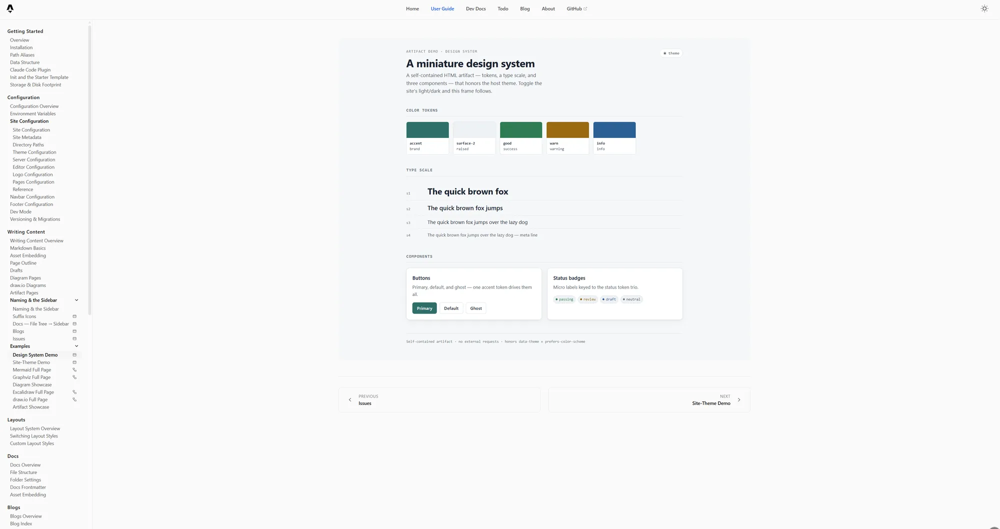
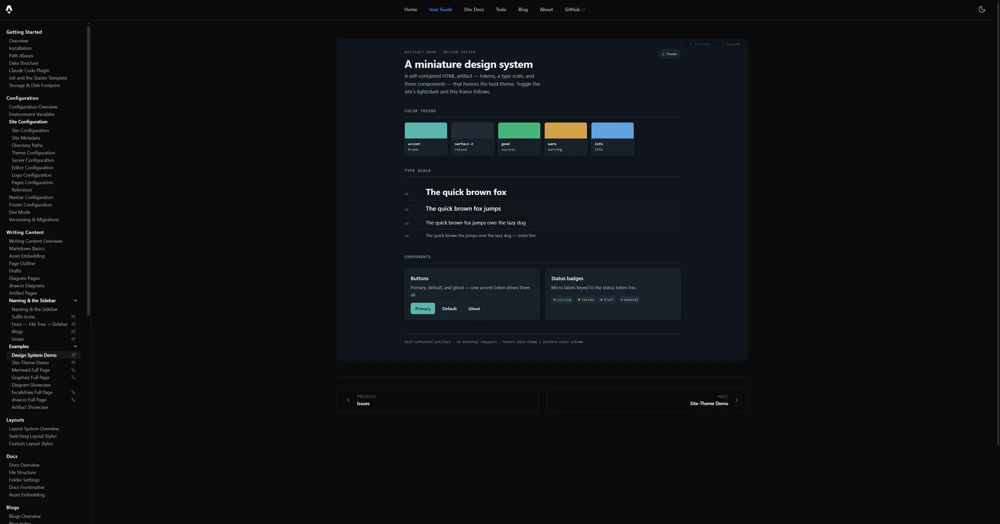

# agent-knowledge-system

[](https://github.com/sidhanthapoddar99/agent-knowledge-system/releases/latest)
[](./plugins/agent-ks)
[](./agent-ks-engine/CHANGELOG.md)
[](https://bun.sh)

<sub>Both version badges read live values — the **engine** from the latest release tag, the **plugin** from `plugin.json` on `main`. Neither is a number typed into this file, so neither can drift.</sub>

A **knowledge + task system designed for AI consumers**, with human-readable docs as a first-class output — modular Astro layouts, YAML configuration, a folder-per-issue tracker, and live editing via Yjs CRDT. Self-contained **HTML artifacts** and **Mermaid / Graphviz / Excalidraw / draw.io** diagrams are first-class pages, rendered natively with no external service. Ships its own Claude Code plugin (skills + the `agent-ks` CLI) so agents operate the whole system natively.

> Formerly *documentation-template* — that repo is retired and being archived (tracked in `2026-04-26-project-rebrand`). If you have an old checkout, point your remote here: `git remote set-url origin https://github.com/sidhanthapoddar99/agent-knowledge-system.git`.

## Built for agents, observable by humans

This platform is **agents-first**: the day-to-day operations — writing docs, filing and updating issues, executing subtasks, keeping logs — are performed by AI agents, with humans in the loop rather than at the keyboard. The rendered site is that loop's observability surface: the issue tracker turns the agents' thinking (brainstorms, notes, agent-logs, comments) into browsable pages, so a human can watch and steer the work without digging through files. The documentation itself serves a dual readership — humans read it to use the application; agents read it to load an overview of the whole system before acting on it.

## What it looks like

Every issue is a folder of plain markdown in your repo. The site is how a human reads it without opening a single file — here, one audit run with its summary open, and the whole issue anatomy in the left rail: brainstorms, notes, plans, subtasks, the agent log with its numbered slots, and the agent's own working memory.


The index groups issues by component and filters them by **lifecycle category** rather than by individual status — Active, In Progress, Review, Not Started, Closed — with subtask progress on every row.


## Artifacts and diagrams are pages, not attachments

Two things a docs folder normally cannot hold — an interactive HTML report, and a diagram you can actually edit — are **first-class pages here**. Both follow the same rule as everything else: it is a file on disk with an `NN_` prefix, and the app renders it.

### Artifacts — drop in an `.html` file, get a page

An **artifact** is a self-contained HTML document: a report, a dashboard, an interactive chart, a design-system showcase. Give it an `NN_` prefix, put it in a docs section, and it appears in the sidebar with a URL like any markdown page — embedded in the content area, or opened full-page at its own `/artifacts/` route.

**It inherits the site's theme.** The same file, the same commit — light and dark:

| Light | Dark |
|---|---|
|  |  |

The artifact reads the host theme's tokens, so it re-resolves its colours for a dark canvas instead of being filtered or inverted. Agents build these through the `agent-ks-artifacts` skill, which carries the token vocabulary and a verify gate.

### Diagrams — four formats, rendered natively, no external service

**Mermaid**, **Graphviz**, **Excalidraw** and **draw.io** all render in the browser from the source file. Nothing calls out to `mermaid.live`, `diagrams.net`, or anywhere else — the draw.io viewer is vendored, so a build has **zero third-party requests**.

Each works two ways:

```markdown
   ← embeds it in a page
[Request flow](./assets/request-flow.mermaid)    ← stays an ordinary link
```

```
15_writing-content/20_examples/
├── 05_mermaid-full-page.mmd          → its own page, sidebar entry, URL
├── 06_graphviz-full-page.dot         → same
├── 07_excalidraw-full-page.excalidraw → same
└── 08_drawio-full-page.drawio        → same
```

A prefixed diagram file **is** a page — no markdown wrapper, no shortcode. Both routes honour dark mode, take part in the shared slug pool, and accept an optional `.meta.json` sidecar for the title.

Written up in the user-guide: [Diagram Pages](https://github.com/sidhanthapoddar99/agent-knowledge-system/blob/main/default-docs/data/user-guide/15_writing-content/06_diagram-pages.md), [draw.io Diagrams](https://github.com/sidhanthapoddar99/agent-knowledge-system/blob/main/default-docs/data/user-guide/15_writing-content/07_drawio.md), [Artifact Pages](https://github.com/sidhanthapoddar99/agent-knowledge-system/blob/main/default-docs/data/user-guide/15_writing-content/08_artifact-pages.md).

## Quick start

Install the standalone toolkit first (Linux/macOS):

```bash
curl -fsSL https://raw.githubusercontent.com/sidhanthapoddar99/agent-knowledge-system/main/agent-ks-cli/install.sh | sh
export PATH="$HOME/.local/bin:$PATH"
agent-ks --help
```

The installer downloads a versioned binary from GitHub Releases, verifies its checksum, and adds PATH plus silent shell-startup updates with a five-hour cooldown. Use `agent-ks update` for an immediate update; ordinary commands do not check for updates. It requires a published `agent-ks-cli-vX.Y.Z` release. Windows assets, version pinning and source builds are described in the [CLI README](./agent-ks-cli/README.md).

Install the Claude Code plugin through [`sids-plugin-marketplace`](https://github.com/sidhanthapoddar99/sids-plugin-marketplace) — three commands to install, one to scaffold:

```
/plugin marketplace add sidhanthapoddar99/sids-plugin-marketplace
/plugin install agent-ks@sids-plugin-marketplace
/reload-plugins
/agent-ks-config
```

`/agent-ks-config` walks you through the scope and the site identity, copies the starter template, and patches `CLAUDE.md`. From the created documentation root, run `agent-ks` for an overview and `agent-ks start --detach` for the viewer. The latter clones the framework when missing and reports the server URL.

## What's in the plugin

| Surface | Use it for |
|---|---|
| **Skills (10)** — `agent-ks-config`, `agent-ks-docs`, `agent-ks-blog`, `agent-ks-issues`, `agent-ks-issue-logs`, `agent-ks-qna`, `agent-ks-artifacts`, `agent-ks-cli`, and two command skills | Trigger automatically on setup and config work, docs pages, blog posts, the issue tracker, agent logs, scoping a subtask by Q&A, and HTML-artifact building. Each carries its own reference files. |
| **Slash commands** — `/agent-ks-config`, `/agent-ks-config section <name>`, `/agent-ks-quick-idea-note`, `/agent-ks-index-check` | Bootstrap a new project; add a top-level section; capture a half-formed idea into the issue dump; check an index against its files. All interactive. |
| **CLI** — one `agent-ks` entrypoint on `PATH` | `agent-ks <group> <verb>` — issue tracker (`agent-ks issue …`), validators (`agent-ks check …`), docs/blog content, git metadata, theme tokens, cross-content search. Run `agent-ks help` for the live list. The Rust binary runs without Bun for content operations. |

The toolkit installs separately from the plugin. Pass `--help` to a group or command, or use `agent-ks help --json` for the machine-readable catalog.

## Release streams

The [release architecture](./RELEASING.md) keeps the monorepo's three products independent:

| Product | Tag | Committed notes | Published payload |
|---|---|---|---|
| Engine | `agent-ks-engine-vX.Y.Z` | [`agent-ks-engine/release-notes/`](./agent-ks-engine/release-notes/) | Note plus immutable commit and engine-tree metadata |
| Plugin / skills | `agent-ks-plugin-vX.Y.Z` | [`plugins/agent-ks/release-notes/`](./plugins/agent-ks/release-notes/) | Note plus immutable commit and plugin-tree metadata |
| Rust CLI | `agent-ks-cli-vX.Y.Z` | [`agent-ks-cli/release-notes/`](./agent-ks-cli/release-notes/) | Platform archives and `SHA256SUMS` |

Engine and plugin releases attach no custom source packages. Run `mise run release-check` to apply the [release-contract gate](./scripts/checks/check-release-contracts.mjs), which checks the namespaces, version declarations, notes, source metadata, and asset boundary without publishing anything.

## Manual setup (without `/agent-ks-config`)

The framework supports two operating modes — pick the one that matches your situation.

### Consumer mode (recommended for new projects)

Keep `config/`, `data/`, `assets/` and `themes/` in your documentation root. Its name does not matter: `docs`, `documentation`, a custom folder name, or the repository root all work.

```bash
cd <your-documentation-root>
# Run /agent-ks-config to scaffold content, or author config/site.yaml yourself.
agent-ks                           # overview using ./config
agent-ks issue list
agent-ks issue context <issue-id> --json
agent-ks find 'release' --context 2 --limit 20 --json
agent-ks start --detach             # clones the viewer if missing, installs its deps
```

The config selection order is `--config-dir PATH`, then the session environment variable `AGENTKS_CONFIG_FOLDER`, then `./config`. A missing config directory is an error. Relative paths are resolved from the working directory. The config's parent is the project root; there is no upward search into another project. An explicit `--tracker` selects an issue tracker independently.

```bash
export AGENTKS_CONFIG_FOLDER="$PWD/site-settings"
agent-ks resolve-context --json
agent-ks --config-dir ../other-docs/config overview
```

The viewer lives under `<documentation-root>/agent-knowledge-system/` and remains a vendored dependency. `agent-ks start` passes config through the environment without rewriting `.env`. It requires Node.js or Bun; cloning requires Git. The native content toolkit requires neither runtime.

### Dogfood / framework-dev mode (working *on* the framework itself)

This is what running this repo directly does — you're hacking on the framework, with `default-docs/` doubling as both the framework's own docs and the testbed:

```bash
git clone https://github.com/sidhanthapoddar99/agent-knowledge-system.git
cd agent-knowledge-system
mise run cli-build                # or: cd agent-ks-cli && cargo build --release --locked
cd default-docs
agent-ks
agent-ks start --detach
```

`./start` is a thin shim at the framework folder root over `scripts/start.mjs`: it detects `bun` (falls back to `npm`), installs dependencies on first run, occasionally checks upstream for updates and offers a fast-forward pull, then starts the dev server. It does **not** build — run `./start doctor` for that, before you publish. Skip the automatic check with `START_SKIP_UPDATE_CHECK=1`; `./start update` checks on demand regardless, and says why when it cannot.

On native Windows (cmd / PowerShell), use `.\start.cmd` with the same arguments — it execs the same `scripts/start.mjs` as every other platform. The leading `.\` matters: bare `start` is a cmd built-in. Git Bash and WSL use `./start` as-is.

For a deeper walkthrough (folder layout, what each path means, when to use which mode), see the user-guide: [Installation](https://github.com/sidhanthapoddar99/agent-knowledge-system/blob/main/default-docs/data/user-guide/05_getting-started/02_installation.md), [Environment Variables](https://github.com/sidhanthapoddar99/agent-knowledge-system/blob/main/default-docs/data/user-guide/10_configuration/02_env.md), [Init and the Starter Template](https://github.com/sidhanthapoddar99/agent-knowledge-system/blob/main/default-docs/data/user-guide/05_getting-started/06_init-and-template.md).

## Build commands

From the repo root, use the `./start` wrapper:

```bash
./start          # dev server with hot reload — the default
./start dev      # same thing, spelled out
./start build    # production build → agent-ks-engine/dist/
./start preview  # preview production build locally
./start doctor   # update + install + full build: the pre-publish check
./start update   # check upstream now and offer to pull — starts nothing
./start --help   # every command and flag
./start <script> # forward any package.json script
```

On native Windows, replace `./start` with `.\start.cmd` in all of the above.

Inside `agent-ks-engine/`, the usual `bun run dev` / `bun run build` / `bun run preview` still work directly.

## What's inside the repo

```
agent-knowledge-system/                 ← THIS repo (= framework folder)
├── start                               ← entrypoint shim → scripts/start.mjs
├── .env, .env.example                  ← bootstrap (CONFIG_DIR points at the active config dir)
├── agent-ks-cli/                      ← standalone Rust toolkit, installer, tests and release notes
├── plugins/
│   └── agent-ks/                       ← plugin source (skills + bundled templates) — distributed via sids-plugin-marketplace
├── agent-ks-engine/                     ← engine code — don't edit unless you're hacking on it
│   ├── src/                            ← Astro layouts, loaders, parsers
│   ├── migration/                      ← content-format migrations shipped with the engine
│   ├── CHANGELOG.md                    ← engine-only release index
│   ├── release-notes/                  ← engine release notes used by the engine-tag workflow
│   ├── astro.config.mjs
│   ├── package.json
│   └── tsconfig.json
└── default-docs/                       ← framework's BUNDLED content (this repo's docs + testbed)
    ├── config/                         ← site.yaml, navbar.yaml, footer.yaml
    ├── assets/                         ← static assets served at /assets/
    ├── themes/                         ← framework-bundled themes (full-width, minimal, …)
    └── data/                           ← user-guide, dev-docs, blog, todo (the framework's own docs)
```

`default-docs/` is the framework's **own** content — its user-guide, its dev-docs, its sample blog/issues, its bundled themes — packaged with the install. **Consumers don't edit it.** When you use the framework via consumer mode (clone as a subfolder), you write your content at YOUR project root (in `config/`, `data/`, `assets/`, `themes/` next to the framework folder), and `default-docs/` stays read-only as a vendored dependency. In dogfood mode (this repo), `default-docs/` doubles as both the framework's own docs and the live testbed for any framework changes.

The plugin in `plugins/agent-ks/` is distributed via [`sids-plugin-marketplace`](https://github.com/sidhanthapoddar99/sids-plugin-marketplace), which fetches it from this repo via a `git-subdir` source.

## Documentation

- **End-user docs** — `default-docs/data/user-guide/` (rendered at `/user-guide` in the live site). Setup, configuration, content authoring, themes, layouts, the issue tracker.
- **Developer docs** — `default-docs/data/dev-docs/` (rendered at `/dev-docs`). Architecture, layouts internals, loader pipeline, scripts, and the **Plugins** section explaining how Claude Code plugins work and how to author one.
- **CLAUDE.md** at the repo root — orientation for Claude Code sessions working in this repo.
- **[Engine changelog](./agent-ks-engine/CHANGELOG.md)** — every engine release, with the full notes in [`agent-ks-engine/release-notes/`](./agent-ks-engine/release-notes/) and on the [GitHub releases page](https://github.com/sidhanthapoddar99/agent-knowledge-system/releases).

Both doc sets are written *in* the framework and rendered *by* it — the user-guide below is this repo's own `default-docs/data/user-guide/`:


## What's coming

The framework currently ships via `git clone`. A planned refactor (`2026-04-25-framework-as-npm-package` issue) packages it as a published `bun add agent-knowledge-system` dependency, so each consumer becomes a thin shell over the engine instead of a full clone. Once that lands, `/agent-ks-config` will install the engine via npm/bun instead of asking you to clone.

## License

TBD — placeholder. Pick before public distribution.
