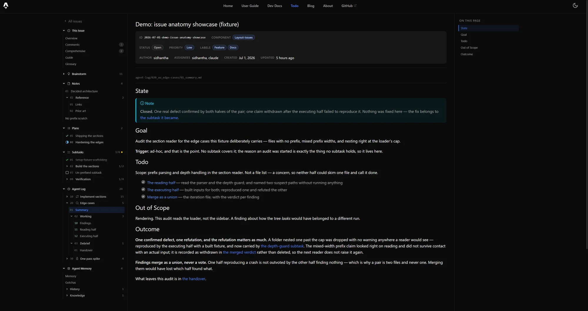
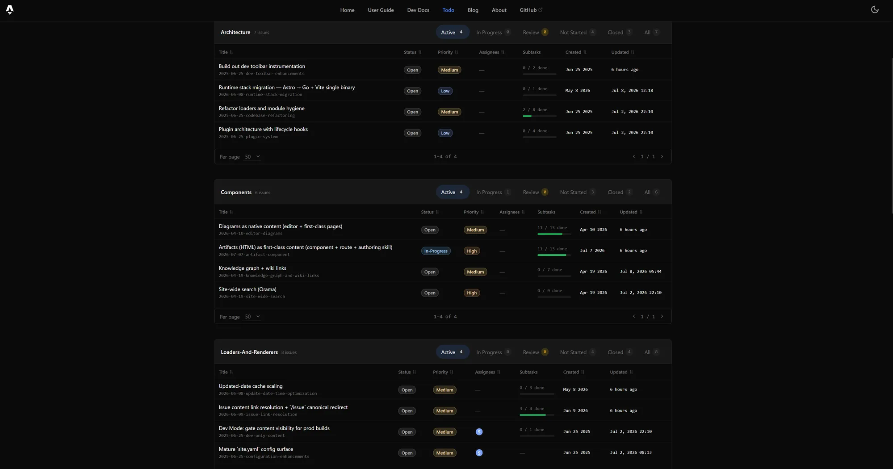
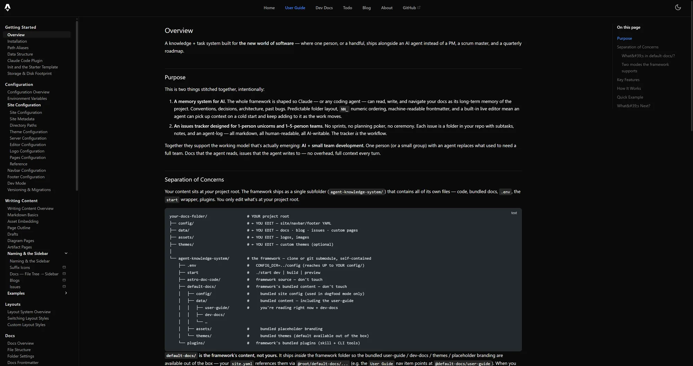

# agent-knowledge-system

A **knowledge + task system designed for AI consumers**, with human-readable docs as a first-class output — modular Astro layouts, YAML configuration, a folder-per-issue tracker, and live editing via Yjs CRDT. Ships its own Claude Code plugin (skills + the `agent-ks` CLI) so agents operate the whole system natively.

> Formerly *documentation-template* — that repo is retired and being archived (tracked in `2026-04-26-project-rebrand`). If you have an old checkout, point your remote here: `git remote set-url origin https://github.com/sidhanthapoddar99/agent-knowledge-system.git`.

## Built for agents, observable by humans

This platform is **agents-first**: the day-to-day operations — writing docs, filing and updating issues, executing subtasks, keeping logs — are performed by AI agents, with humans in the loop rather than at the keyboard. The rendered site is that loop's observability surface: the issue tracker turns the agents' thinking (brainstorms, notes, agent-logs, comments) into browsable pages, so a human can watch and steer the work without digging through files. The documentation itself serves a dual readership — humans read it to use the application; agents read it to load an overview of the whole system before acting on it.

## What it looks like

Every issue is a folder of plain markdown in your repo. The site is how a human reads it without opening a single file — here, one audit run with its summary open, and the whole issue anatomy in the left rail: brainstorms, notes, plans, subtasks, the agent log with its numbered slots, and the agent's own working memory.



The index groups issues by component and filters them by **lifecycle category** rather than by individual status — Active, In Progress, Review, Not Started, Closed — with subtask progress on every row.



## Quick start

The fastest path is via the Claude Code plugin distributed through [`sids-plugin-marketplace`](https://github.com/sidhanthapoddar99/sids-plugin-marketplace) — three commands to install, one to scaffold:

```
/plugin marketplace add sidhanthapoddar99/sids-plugin-marketplace
/plugin install agent-ks@sids-plugin-marketplace
/reload-plugins
/agent-ks-init
```

`/agent-ks-init` walks you through site name, first section, and patches `CLAUDE.md`. At the end it prints the framework-clone command tailored to your scope choice. Open `http://localhost:4321` and you have a docs site.

## What's in the plugin

| Surface | Use it for |
|---|---|
| **Skills (3)** — `agent-ks-docs`, `agent-ks-issues`, `agent-ks-artifacts` | Trigger automatically on docs/blog/config work, issue-tracker work, and HTML-artifact building respectively. Each triages to domain-specific reference files. |
| **Slash commands (3)** — `/agent-ks-init`, `/agent-ks-add-section`, `/agent-ks-quick-idea-note` | Bootstrap a new project; add a top-level section; capture a half-formed idea into the issue dump. All interactive. |
| **CLI** — one `agent-ks` entrypoint on `PATH` | `agent-ks <group> <verb>` — issue tracker (`agent-ks issue …`), validators (`agent-ks check …`), docs/blog content, git metadata, theme tokens, cross-content search. Run `agent-ks help` for the live list. Requires `bun`. |

The `agent-ks` entrypoint lands on your `$PATH` automatically after install — no path configuration. Pass `--help` to any command for the full flag list.

## Manual setup (without `/agent-ks-init`)

The framework supports two operating modes — pick the one that matches your situation.

### Consumer mode (recommended for new projects)

You have a project (a repo, a folder, anything) and you want docs alongside your code or content. Clone the framework as a **subfolder** named `agent-knowledge-system/`, write your own `config/`/`data/`/`assets/`/`themes/` next to it at the project root, and point `.env` (inside the framework folder) back up to your content.

```bash
cd <your-project>
git clone --depth 1 https://github.com/sidhanthapoddar99/agent-knowledge-system.git
# Author your config/, data/, assets/, themes/ at the project root
# (or run /agent-ks-init to scaffold them from the bundled template).
cd agent-knowledge-system
echo "CONFIG_DIR=../config" > .env
./start                            # http://localhost:4321
```

The framework folder is treated as a vendored dependency — you don't edit anything inside `agent-knowledge-system/`. Your content lives outside it.

### Dogfood / framework-dev mode (working *on* the framework itself)

This is what running this repo directly does — you're hacking on the framework, with `default-docs/` doubling as both the framework's own docs and the testbed:

```bash
git clone https://github.com/sidhanthapoddar99/agent-knowledge-system.git
cd agent-knowledge-system
cp .env.example .env               # CONFIG_DIR=./default-docs/config (dogfood default)
./start
```

`./start` is a thin wrapper at the framework folder root: it checks for upstream updates and offers a fast-forward pull (`Y/n`), detects `bun` (falls back to `npm`), installs dependencies on first run, runs a build sanity check, then starts the dev server. Skip the update check with `START_SKIP_UPDATE_CHECK=1`.

On native Windows (cmd / PowerShell), use `.\start.cmd` with the same arguments — it runs `start.ps1`, a full port of the bash wrapper. The leading `.\` matters: bare `start` is a cmd built-in. Git Bash and WSL use `./start` as-is.

For a deeper walkthrough (folder layout, what each path means, when to use which mode), see the user-guide: [Installation](https://github.com/sidhanthapoddar99/agent-knowledge-system/blob/main/default-docs/data/user-guide/05_getting-started/02_installation.md), [Environment Variables](https://github.com/sidhanthapoddar99/agent-knowledge-system/blob/main/default-docs/data/user-guide/10_configuration/02_env.md), [Init and the Starter Template](https://github.com/sidhanthapoddar99/agent-knowledge-system/blob/main/default-docs/data/user-guide/05_getting-started/06_init-and-template.md).

## Build commands

From the repo root, use the `./start` wrapper:

```bash
./start          # preflight (update check + install + build check) then dev server
./start dev      # dev server with hot reload
./start build    # production build → astro-doc-code/dist/
./start preview  # preview production build locally
./start <script> # forward any package.json script
```

On native Windows, replace `./start` with `.\start.cmd` in all of the above.

Inside `astro-doc-code/`, the usual `bun run dev` / `bun run build` / `bun run preview` still work directly.

## What's inside the repo

```
agent-knowledge-system/                 ← THIS repo (= framework folder)
├── start                               ← bash entrypoint (preflight + dev/build/preview/clean)
├── .env, .env.example                  ← bootstrap (CONFIG_DIR points at the active config dir)
├── plugins/
│   └── agent-ks/                       ← plugin source (skill + wrappers + commands + bundled template) — distributed via sids-plugin-marketplace
├── astro-doc-code/                     ← framework code — don't edit unless you're hacking on it
│   ├── src/                            ← Astro layouts, loaders, parsers
│   ├── astro.config.mjs
│   ├── package.json
│   └── tsconfig.json
└── default-docs/                       ← framework's BUNDLED content (this repo's docs + testbed)
    ├── config/                         ← site.yaml, navbar.yaml, footer.yaml
    ├── assets/                         ← static assets served at /assets/
    ├── themes/                         ← framework-bundled themes (full-width, minimal, …)
    └── data/                           ← user-guide, dev-docs, blog, todo (the framework's own docs)
```

`default-docs/` is the framework's **own** content — its user-guide, its dev-docs, its sample blog/issues, its bundled themes — packaged with the install. **Consumers don't edit it.** When you use the framework via consumer mode (clone as a subfolder), you write your content at YOUR project root (in `config/`, `data/`, `assets/`, `themes/` next to the framework folder), and `default-docs/` stays read-only as a vendored dependency. In dogfood mode (this repo), `default-docs/` doubles as both the framework's own docs and the live testbed for any framework changes.

The plugin in `plugins/agent-ks/` is distributed via [`sids-plugin-marketplace`](https://github.com/sidhanthapoddar99/sids-plugin-marketplace), which fetches it from this repo via a `git-subdir` source.

## Documentation

- **End-user docs** — `default-docs/data/user-guide/` (rendered at `/user-guide` in the live site). Setup, configuration, content authoring, themes, layouts, the issue tracker.
- **Developer docs** — `default-docs/data/dev-docs/` (rendered at `/dev-docs`). Architecture, layouts internals, loader pipeline, scripts, and the **Plugins** section explaining how Claude Code plugins work and how to author one.
- **CLAUDE.md** at the repo root — orientation for Claude Code sessions working in this repo.
- **[CHANGELOG.md](./CHANGELOG.md)** — every release, with the full notes in [`releases/`](./releases/) and on the [GitHub releases page](https://github.com/sidhanthapoddar99/agent-knowledge-system/releases).

Both doc sets are written *in* the framework and rendered *by* it — the user-guide below is this repo's own `default-docs/data/user-guide/`:



## What's coming

The framework currently ships via `git clone`. A planned refactor (`2026-04-25-framework-as-npm-package` issue) packages it as a published `bun add agent-knowledge-system` dependency, so each consumer becomes a thin shell over the engine instead of a full clone. Once that lands, `/agent-ks-init` will install the engine via npm/bun instead of asking you to clone.

## License

TBD — placeholder. Pick before public distribution.
