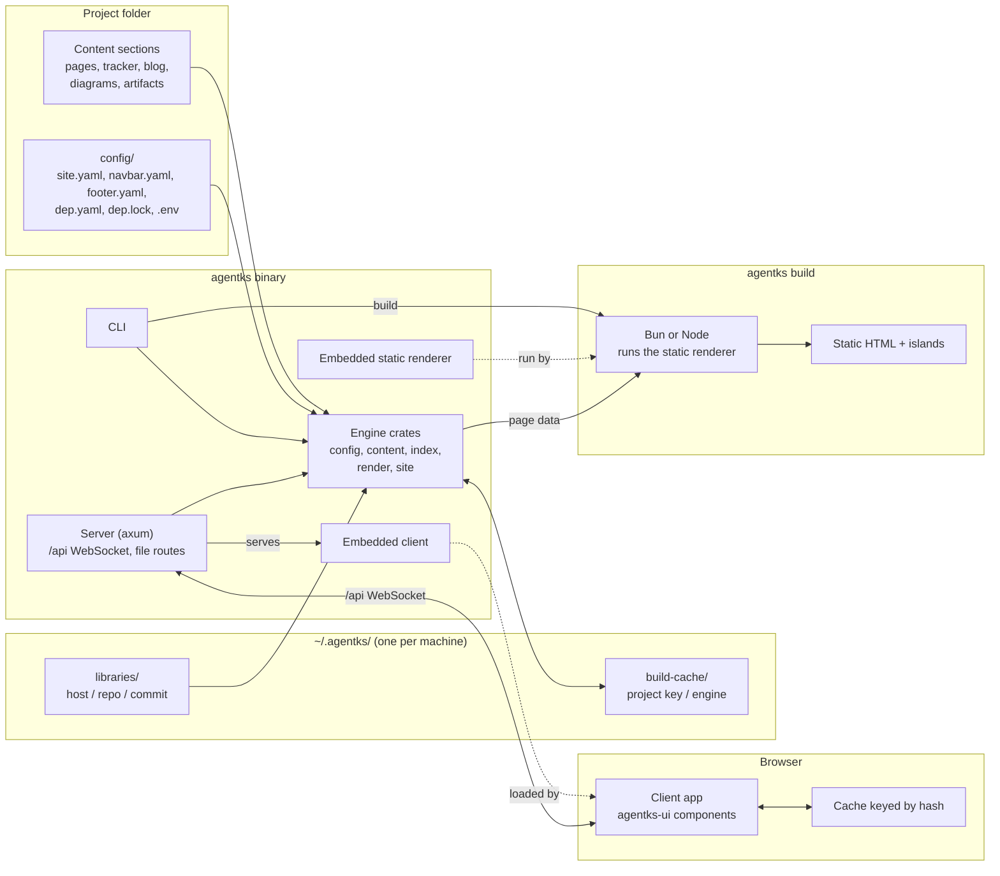

This page draws agentks at run time: the parts, what each owns, and the contracts between them. A contract here is a shape two parts agree on, such as the JSON of a page. When you change one side of a contract, the other side must change in the same release.

## The component map

| Component | Code | Owns |
|---|---|---|
| The engine | `apps/agentks-engine/crates/` below `server` | Config, the site index, markdown rendering, the tracker, theme CSS, libraries, caches, every derived value |
| The CLI | `apps/agentks-engine/crates/cli` | Every command, argument parsing, output and exit codes. It is the only part that prints |
| The server | `apps/agentks-engine/crates/server` | One local server per project: the `/api` WebSocket, the file routes, the file watcher |
| The shared UI package | `apps/packages/agentks-ui` | Every layout and component, written in Preact: data in, markup out |
| The client | `apps/agentks-client` | The single-page app: routing on real URL paths, the data connection, the browser cache |
| The static renderer | `apps/agentks-ssg` | Rendering every page to HTML once, for `agentks build` |

The binary carries two prebuilt bundles, compressed: the client, which the server sends to the browser, and the static renderer, which `agentks build` unpacks and runs with Bun or Node.

## What each side owns

| The Rust side (engine, server, CLI) | The browser side (UI package, client) |
|---|---|
| Loads config, resolves aliases and paths | Shows what it is given |
| Watches files; one watcher per project | Routes on real URL paths and `#heading` anchors |
| Builds the site index and its content hashes | Places the body HTML inside a layout |
| Renders markdown bodies to HTML, highlights code into CSS classes | Keeps UI state: open panels, scroll position, the theme toggle |
| Resolves every link and embed to a root-absolute href | Draws Mermaid, Graphviz, Excalidraw and draw.io diagrams |
| Computes order, URLs, heading IDs, sidebars, outlines, status categories, filter options | Shows artifacts and library elements in sandboxed frames |
| Loads and checks the issue tracker | Plays video artifacts |
| Compiles and caches the theme CSS | Loads the CSS it is served |
| Resolves, locks and installs libraries | Caches data by hash and refetches only what changed |
| Enforces the version gate | — |

The browser never strips a prefix, sorts a list, maps a status to a category or resolves a link. Each issue arrives with its category and each page with its order and URL.

## The contracts

| Contract | Between | Shape | Explained in |
|---|---|---|---|
| The content format | Files on disk and the engine | Markdown with a `title` in frontmatter, relative links and `[[path]]` embeds, `NN_` prefixes, a `settings.json` per folder, diagram and artifact pages with `.meta.json` sidecars | [Content: the format rules](../10_engine/25_content.md) |
| The project config | The project and the engine | A required `config/` folder: `site.yaml`, `navbar.yaml`, `footer.yaml`, `dep.yaml`, `dep.lock`, and `.env` for overrides such as the port | [Config: finding and loading a project](../10_engine/20_config.md) |
| The `/api` protocol | The server and the client | One WebSocket carrying requests, replies and pushes. Every reply carries the content hash it was built from | [Server and protocol](../15_server-and-protocol/01_overview.md) |
| The page data | The engine and the UI package | Typed JSON per page kind. The same objects feed the client and the static renderer | [Frontend](../25_frontend/01_overview.md) |

Two smaller contracts complete the set. The theme contract is the list of CSS variables every theme must define, plus the stable class and `data-part` hooks on layouts, because CSS is the only branding tool. The library manifest is the `manifest.json` every library carries.

The page data and the protocol are Rust types in the `agentks-api` crate. A generator writes them to `apps/agentks-engine/schema/api.schema.json`, and the UI package generates its TypeScript types from that file. Only data shapes cross over, never a rule.

## One data interface

The UI components never know where their data comes from. One small module sits between them and the data, with calls such as "the page at this URL" or "the sidebar of this section".

- When the client runs, the module answers through the WebSocket and the browser cache.
- When `agentks build` runs, it answers from page data the engine computed for the build, handed over directly.

A component that reaches past this module, for example to the WebSocket or to `window` while it renders, would break the static build. The UI package forbids it.

## Processes

| State | What runs |
|---|---|
| Using agentks | `agentks start` runs one server process per project, bound to localhost, on that project's own port. The CLI commands that read content (`find`, `issue …`, `check …`, `move`, `library …`) load the engine directly, answer and exit. They need no server |
| Publishing | `agentks build` runs once and exits. The engine computes every page's data, and the static renderer writes plain files. No agentks process runs where the site is hosted |
| Developing agentks | The engine runs from the working tree. The Vite dev server serves the client with hot reload and passes `/api` on to the engine |

## What lives where on a machine

| Place | Holds | Written by |
|---|---|---|
| The binary | The engine, CLI and server, the client bundle and the static renderer | The installer |
| `~/.agentks/build-cache/` | Each project's cached output: git dates, rendered pages, compiled CSS | The engine |
| `~/.agentks/libraries/` | Each library repository at each pinned commit, shared by every project | `agentks install`, `start` and `build` |
| The project's `config/` | The config, `dep.yaml`, `dep.lock`, `.env` | The user; `dep.lock` by agentks |
| The project's content folders | The documents | The user and agents |

Nothing in `~/.agentks/` is the only copy of anything, and nothing there is cleaned on a schedule. The [caching section](../20_caching/01_overview.md) describes every store in it.

## Related

- [How a request flows](./15_request-flow.md): these components in motion.
- [Engine](../10_engine/01_overview.md): the crates behind the Rust side.
