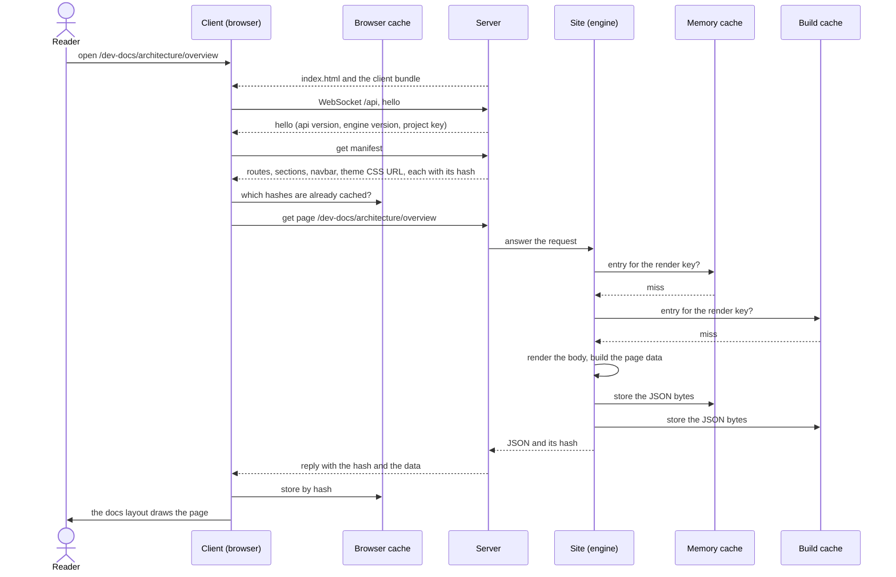

This page follows four things from start to end: starting a project, opening a page in the browser, a file changing on disk, and running a CLI command. Each step names the part that does it, so you can see where a responsibility sits before you read the code.

## Start a project

`agentks start` runs these steps in order. Any fatal problem stops the start before a port is bound, and the message names the file, the key and the fix.

1. **Find the project.** The CLI looks for the config folder: `--config-dir`, then the `AGENTKS_CONFIG_FOLDER` environment variable, then `./config`. The project root is the config folder's parent. The config crate owns this rule, and every command uses it.
2. **Load the config and run the version gate.** The config crate reads `site.yaml` and checks its `engine_version` first. Content outside the range this engine reads stops here, with `agentks migrate` or a mise pin as the fix. Then it reads `navbar.yaml`, `footer.yaml`, `config/.env` and checks that `dep.yaml` exists.
3. **Check libraries.** Every commit in `dep.lock` that the machine's library store lacks is fetched. No pin moves. A library that cannot be fetched is an error that names it. A page never renders with a blank where an element should be.
4. **Build the site index.** The index walks every content section once and records each file's path, hash, frontmatter, title, order, URL and references. It renders no page bodies.
5. **Load cached work.** The site reads expensive results from the build cache on disk when their keys match: the tracker's git dates and the compiled theme CSS.
6. **Serve.** The server binds to localhost on the project's port. It serves the embedded client, the project's files on a few fixed routes, and the WebSocket at `/api`. It starts the file watcher.

## Open a page

1. The server answers every path that is not one of its own routes with the client's `index.html`. The client reads the real URL path and routes on it.
2. The client opens the WebSocket and sends a hello. The server answers with its own hello before anything else. If the client bundle or the API version does not match the server's, the client reloads itself.
3. The client asks for the manifest. It lists every route with its data key and hash, and the URL of the compiled theme CSS, `/theme.<hash>.css`.
4. The client asks for the page. When it already holds a copy, it sends that copy's hash, and the server replies "unchanged" with no data.
5. The site answers from the memory cache, then from the build cache on disk, and renders only on a double miss. It stores the result in both. Every answer is the exact JSON bytes sent on the wire, with the hash it was built from.
6. The layout component draws the page. Diagrams and artifact frames render in the browser.

## A file changes on disk

An agent edits a markdown file, or someone saves in their own editor.

1. **Watch.** The server's watcher sees the change. It waits a moment so that an editor's write-then-rename, or a `git checkout` that touches hundreds of files, becomes one batch. It confirms each change by content hash, not by modification time.
2. **Update the index.** The site applies the batch. The index re-reads the changed files and re-hashes their chain of parent folders. It reports which pages changed: the file's own page, every page that embeds or links it, and the sections whose sidebar or issue list changed.
3. **Compute new hashes.** Each affected piece of data gets a new hash. Old cache entries are not deleted. Their keys simply stop being asked for.
4. **Push.** The server pushes the changed hashes to every connected client. A config change that does not load pushes the errors instead, and the last good config keeps serving.
5. **Refetch.** Each client refetches only the data it is showing or holding whose hash changed. The page updates in place and keeps its scroll position.

## A CLI command

Most commands never talk to a server. `agentks check issues`, for example:

1. finds the project and loads the config with the same functions `agentks start` uses;
2. runs the version gate;
3. calls the same content and tracker functions the issues page reads;
4. prints the problems, or one JSON document with `--json`, and exits with `0`, `1` or `2`.

Because the command and the page call one implementation, a problem `agentks check` reports is exactly a problem the page shows. A command that runs while a server is running shares the build cache on disk safely: every write is atomic, and an entry never changes once written.

## Publishing

`agentks build` reuses the same engine. It installs exactly the locked library commits, computes every page's data as it does for the WebSocket, applies the hosting path prefix to every href, then runs the static renderer with Bun or Node. The renderer draws each page with the same `agentks-ui` components the client uses and writes plain files. The [publishing section](../45_publishing/01_overview.md) covers it in full.

## Related

- [Components and contracts](./10_components.md): the parts named on this page.
- [Site: the engine as one object](../10_engine/45_site.md): the object that answers requests and applies changes.
- [Caching](../20_caching/01_overview.md): the memory cache, the build cache and their keys.
- [Server and protocol](../15_server-and-protocol/01_overview.md): the WebSocket messages and the watcher in detail.
