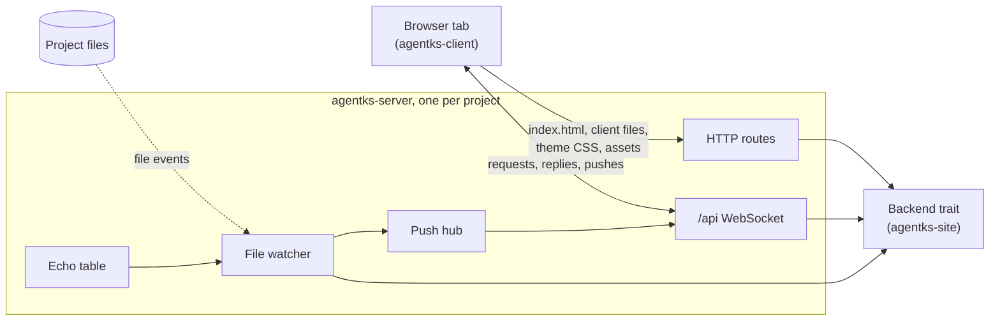

This section explains how the agentks local server is built. Read it before you change the server crate, or anything the client and the server say to each other.

## What the server is

`agentks start` runs one local server per project. The server is the crate `agentks-server`, at `apps/agentks-engine/crates/server/`. It is built on axum (a Rust web framework) and tokio (the async runtime). It has three jobs:

- It serves the client app, which is embedded in the binary, at every page path.
- It serves the project's files at a few fixed routes: the theme CSS, the framework assets, a page's own assets, artifacts and library elements.
- It carries everything else over one WebSocket at `/api`. The client asks for data by name, and the server pushes new hashes when files change.

**The server decides no rule.** Every answer comes from the engine, and the server only transports it. The server reaches the engine through one trait, `Backend`, in `apps/agentks-engine/crates/server/src/backend.rs`. `Site`, from the crate `agentks-site`, implements it. Tests implement it with hand-built answers, so the server is tested without a real project.

## Where the server runs

agentks runs in three states ([the overview](../05_overview/01_overview.md) explains them). The server plays a different part in each.

| State | Who serves the client | Where the data comes from |
|---|---|---|
| 1, developing agentks | The Vite dev server, with hot reload | Vite passes `/api` and the file routes through to the engine built from the working tree |
| 2, using agentks | The binary, from the client embedded in it | The same binary, over `/api` |
| 3, publishing | nginx, a static host or a CDN | Static HTML from `agentks build`. There is no server and no socket |

So nothing in this crate may be needed by what `agentks build` writes.

## The rules the server keeps

- **One server per project, one socket per tab.** There is no HTTP data API beside the socket.
- **Loopback only by default.** Network access needs `--share` and an access key ([collaboration](../30_collaboration/01_overview.md)).
- **One writer.** The server is the only thing that writes files on the user's behalf, and it writes only through one save path.
- **A broken config never kills the server.** The server keeps serving the last good config and pushes the errors to every tab.
- **Nothing blocks the socket.** Every engine call may read files or render, so the server runs it on the blocking thread pool.

## Where the code lives

| File in `apps/agentks-engine/crates/server/src/` | What it holds |
|---|---|
| `http.rs` | The route table and the one dispatch function |
| `files.rs`, `mime.rs` | File responses: streaming, ranges, ETags, the MIME allowlist |
| `client.rs` | The embedded client bundle |
| `ws.rs` | The `/api` socket: hello, requests, replies, keep-alive, roles |
| `push.rs` | The push hub and the filter each connection applies |
| `watcher.rs`, `hashes.rs` | The file watcher and its table of content hashes |
| `echo.rs` | The echo table that tells the server's own writes apart |
| `security.rs` | The `Host` and `Origin` checks, path decoding, headers, CSP |
| `serve.rs`, `run.rs`, `lifecycle.rs`, `probe.rs` | Binding, start, attach, detach, shutdown, run records, `ps` and `stop` |
| `ports.rs` | The stable port of each project |
| `app.rs` | The shared state and the `Limits` |

## Pages in this section

| Page | Explains |
|---|---|
| [HTTP routes](./05_http-routes.md) | Every route, its cache rule, the embedded client, file responses, the health probe |
| [The /api socket](./10_the-api-socket.md) | Frames, the hello, versioning, roles, limits and close codes |
| [Requests and replies](./15_requests-and-replies.md) | `get`, data keys, `have` and `unchanged`, the reply and error shapes |
| [Pushes and back-pressure](./20_pushes-and-back-pressure.md) | The push messages, who receives them, and slow clients |
| [The file watcher](./25_the-file-watcher.md) | From a change on disk to a pushed hash |
| [File writes and echo suppression](./30_file-writes.md) | `open` and `save`, conflicts, atomic writes, telling our own writes apart |
| [Server lifecycle](./35_server-lifecycle.md) | Start, attach, detach, shutdown, run records, `ps`, `stop` and logs |
| [Stable ports](./40_stable-ports.md) | Why each project keeps one port, and how it is chosen |
| [Security](./45_security.md) | The rules that keep the local server local |

## Related sections

- [The engine](../10_engine/01_overview.md) computes every answer the server sends.
- [Caching](../20_caching/01_overview.md) explains the in-memory cache the server answers from, and the git dates the watcher refreshes.
- [The frontend](../25_frontend/01_overview.md) is the other end of the socket.
- [Collaboration](../30_collaboration/01_overview.md) adds live documents, presence and access keys on the same socket.
- The commands that drive the server are in the user guide's [CLI reference](../../user-guide-2/65_cli-reference/01_overview.md).
