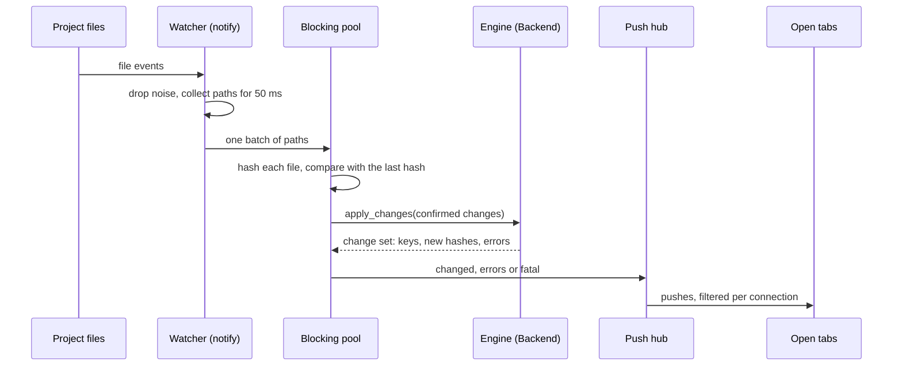

This page explains how a change on disk becomes a pushed hash in every open tab. The watcher must notice every real change, ignore every false one, and turn a burst of changes into one update.

## The path from disk to push

The watcher is `apps/agentks-engine/crates/server/src/watcher.rs`. It runs off the request path, so a reader never waits for it.

## What it watches

There is one `notify` watcher per project, recursive. It watches the folders the engine names through `Backend::watch_roots()`: the content sections, `config/`, the theme folders, the local libraries and the git refs. The default is the project root, plus the config folder when it lies outside the root. Noise is then dropped by path, because a missed change is worse than an extra event.

**It watches folders, not files.** Editors save by writing a temporary file and renaming it over the target. That replaces the file's inode, so a watch on the file itself would go quiet.

**The noise it drops:**

| Dropped | Why |
|---|---|
| Editor swap and backup files: `.swp`, `.swx`, `.swo`, a trailing `~`, `.#*`, `4913` | Editors write them while saving |
| Names containing `.tmp-` | The server's own temporary files during an atomic write |
| `node_modules`, `data/builds` | Not content |
| Everything under `.git/`, except `HEAD`, `packed-refs` and `refs/**` | Only the refs matter (below). Ref `*.lock` files are dropped too |
| Access events | The watcher's own hashing opens files |

## Batches, decided by content

1. **Debounce.** The watcher collects paths for about 50 ms, then processes them as one batch. An editor's save-then-rename, or a `git checkout` that touches hundreds of files, becomes one update and one push.
2. **Hash on the blocking pool.** The watcher hashes every path in the batch, in parallel, off the async threads.
3. **Compare with the last hash.** The watcher keeps the last content hash of every file, seeded by one walk at start. The same hash means nothing changed, as after a `touch`. A missing file is removed, and a removed folder removes every known file under it.
4. **Nothing lost at start.** The first batch after the seed walk counts every path in it as written, so a change made during the walk is not missed.

Change detection never uses modification times, because WSL reports them unreliably. Only content hashes decide.

## What happens to a batch

The confirmed changes go to the engine in one call, `Backend::apply_changes`. The engine and the server then take these steps, in this order:

1. **Config paths.** Config is reloaded and compared with the old one. If the new config is invalid, the server pushes `fatal`, keeps serving the last good config, and stops here. A config error never kills the server.
2. **Content paths.** The engine updates the index, the rolled-up folder hashes and the records of which page embeds which file.
3. **Keys.** The engine works out which data keys changed ([caching](../20_caching/01_overview.md)).
4. **Git refs.** A moved `HEAD` or branch ref runs the incremental git-date walk, so the issues' `updated` dates change.
5. **Echo check.** A file whose new hash matches one the server just wrote is the server's own save. It becomes a `saved` push, not an outside change ([file writes](./30_file-writes.md)).
6. **Live documents.** A changed file that is open in an editor is handed to the live-document merge ([disk and live document merge](../30_collaboration/15_disk-and-live-document-merge.md)).
7. **Push.** One `changed` with every affected key and its new hash, plus `removed` and `moved`, and an `errors` push for each file whose problems changed.

**A moved page.** When the same content hash disappears at one path and appears at another in the same batch, the engine knows the file moved. The `changed` push then carries the old key in `removed` and the new URL in `moved`, so the tab can offer the new page.

The editing and collaboration paths plug into steps 5 and 6 and add no watchers of their own.

## Git refs

git writes a ref by renaming a lock file over it, so the watcher watches `.git/HEAD`, `.git/packed-refs` and the folders under `.git/refs/`. When a commit or a checkout moves a ref, the watcher runs the git-date walk ([caching](../20_caching/01_overview.md)) and pushes the changed dates. Content changes in the same burst go first, so the pushed dates match the pushed pages.

## When events fail

| Situation | What the watcher does |
|---|---|
| The operating system's event queue overflows, or the watcher reports an error | It compares every file again and pushes `resync`. It never assumes that nothing changed |
| The project sits on a file system that sends no events, such as a WSL `/mnt/*` path, or native events fail | It polls every second, comparing content hashes, and logs once that it is polling |

## Also on every event

The HTTP layer caches each file's ETag by path. The watcher drops that entry on every event for the file, so the next request hashes it again ([HTTP routes](./05_http-routes.md)).
