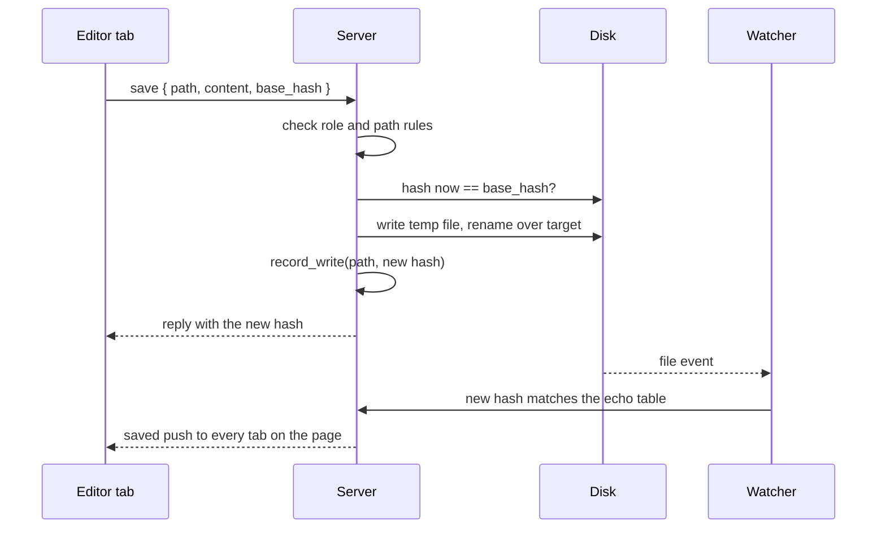

This page explains how the server writes a file when a person edits a page in place. It covers the `open` and `save` requests, the path rules, conflicts, the atomic write, and echo suppression, which stops the server's own save from coming back as an outside change.

## One writer

The server is the only thing that writes files on the user's behalf. Every write from the browser goes through one save path on the server: a person's `save`, a live document's autosave ([live documents](../30_collaboration/05_live-documents.md)) and the tracker operations ([tracker live edits](../30_collaboration/35_tracker-live-edits-and-attribution.md)). The client's word is never enough. The server checks every rule itself.

| Message | Direction | Job |
|---|---|---|
| `open` | request | Read a file's text and its hash, to start editing it |
| `save` | request | Write a file: `{ path, content, base_hash }` |
| `saved` | reply, and push | The file's new hash, sent to every tab showing that page |

`open` and `save` need the `edit` or `owner` role.

## The path rules

One function in the core checks a path for every writer. A path is writable only when all of these hold:

- It is relative to the project root, and it canonicalises inside a content section's data folder. A symlink that leads out of the folder is refused.
- The file already exists. People edit existing files. Creating, renaming and deleting files is the job of the AI and the CLI, so none of them happens over the socket.
- It is not under `config/` or `.git/`, and not in the library cache.
- It is not a structured metadata file such as a folder's `settings.json`. Those change only through the CLI's writers, which the tracker operations call.

A refused path gets `forbidden`.

## No lost writes

`base_hash` is the hash of the file the editor started from. Before writing, the server compares it with the file's hash on disk now.

- **They match.** The server writes.
- **They differ.** Someone changed the file since the editor read it. The server refuses with `conflict` and sends the disk text and its hash. It never overwrites a change the editor has not seen.

With live documents, a person rarely sees this. Outside changes merge into the open document first, and the next autosave writes against the new base ([disk and live document merge](../30_collaboration/15_disk-and-live-document-merge.md)).

## The atomic write

The server writes a temporary file in the same folder, with `.tmp-` in its name, flushes it to disk, and renames it over the target. A rename inside one folder is atomic, so a crash between the two steps leaves the original file whole. The watcher drops every `.tmp-` name as noise.

## Echo suppression

After a write, the watcher sees the file change like any other change. Without a rule, the server would push that change back to the editor that made it, as if someone else had edited the file.

**The echo table** in `apps/agentks-engine/crates/server/src/echo.rs` prevents that. Right after its atomic write, every write path calls `ServerHandle::record_write(path, hash)`. The table keeps the pair for 5 seconds.

When the watcher processes a batch, it checks each changed file against the table:

| The file's new hash | Means | The server |
|---|---|---|
| Matches an entry for that path | The server's own write | Consumes the entry, updates the index, pushes `saved` |
| Anything else | An outside change, by the AI, an editor or git | Pushes `changed` as usual, and merges into a live document if one is open |

**Why by hash, not by counting writes.** A counter of pending writes per file drifts when an outside write lands between the save and its event. A hash cannot be confused that way: the outside write has another hash, so it is never mistaken for the save. Each entry matches once.

## After every write

- The engine re-indexes the file, so every other tab and the reading view get the new page through the normal push.
- The server records who wrote the file, for the edit journal behind commit trailers ([tracker live edits and attribution](../30_collaboration/35_tracker-live-edits-and-attribution.md)).
