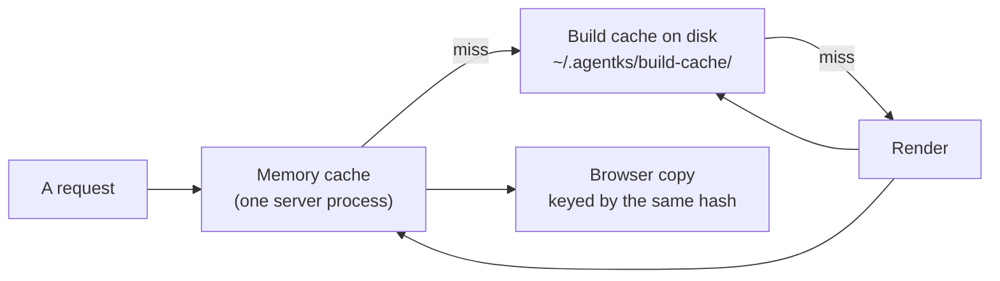

agentks caches derived data in several layers, so a page is rendered once and then served from memory, from disk, or from the browser's own copy. This section explains every layer: what it holds, how its key is built, and what makes an entry stop being used. Read it before you add a cached value, because a cache that answers "probably fine" is the easiest bug to ship and the hardest to find.

Most of the code lives in `agentks-cache` (layer 1). It knows nothing about pages: callers hand it keys and bytes. The site crate decides what to cache and when.

## The layers

| Layer | Holds | Keyed by | Invalidated by |
|---|---|---|---|
| Memory | Rendered pages, sidebars, indexes, the manifest, compiled CSS | The cache key of each value | A new key; the byte budget evicts old entries |
| Build cache on disk | Rendered pages, compiled CSS, highlighted code, the tracker's git dates | Project key, then engine build, then the cache key | A new key leaves the old entry unused; `cache reset`; `cache clean` |
| Library store | Each library repository at one commit | Host, repository path, commit | Never: a commit's content never changes. Only `cache clean` removes it |
| Git dates | The tracker's `updated` dates for one branch | Project key, engine build, branch | A moved branch ref (a walk of the new commits); a rewritten history (a full walk) |
| Browser | The manifest, pages, sidebars, indexes | The hashes the engine sends, and the project key | A pushed hash change |

The site index is not in this table on purpose. It is rebuilt at every start and kept only in memory.

## The rules

- **Keys are content hashes, never modification times.** Some file systems, WSL among them, report unreliable times. A key built from content changes exactly when the content does.
- **An embedded file is a dependency.** A page that embeds a file with `[[path]]` has that file's hash in its key, so editing the embedded file refreshes the page.
- **When unsure, rebuild.** An entry that is missing, corrupt, of another format or of another engine build is ignored and rebuilt. It is never read "best effort".
- **Cache what is expensive; re-derive the rest.** Git history walks, highlighting, rendering and theme compilation are cached. The index is not: rebuilding it takes milliseconds, and a stale index is the worst kind of wrong.
- **The server owns derived data.** A page is rendered once, on the server, and shared by every connection and tab. The browser copy only saves a round trip. It is never the source.
- **Nothing is cleaned automatically.** Old entries stay until the user runs a cleanup command. Losing any cache costs time, never content.
- **One implementation.** The CLI and the server call the same cache code.

## Pages in this section

| Page | Explains |
|---|---|
| [Keys and invalidation](./05_keys-and-invalidation.md) | How every key is built, and how a file or config change reaches exactly the values it affects |
| [The memory cache](./10_memory-cache.md) | The byte budget, eviction, resident values and single flight |
| [The build cache on disk](./15_build-cache.md) | The layout, the entry header, atomic writes, the project key and `build-cache.json` |
| [Format versions](./20_format-versions.md) | The format number in every store, and the read rule |
| [The library store](./25_library-store.md) | The global store of library commits: installed once, locked, read-only |
| [The git dates cache](./30_git-dates.md) | The tracker's `updated` dates: the walk, the cache file and the reconcile |
| [Cleanup and metrics](./35_cleanup-and-metrics.md) | `cache status`, `clean` and `reset`, and the counters behind the dev toolbar |

The browser layer is part of the client. The [frontend section](../25_frontend/01_overview.md) describes it; this section defines the hashes it relies on.

## Related

- [How a request flows](../05_overview/15_request-flow.md): the layers in the middle of a request.
- [Site: the engine as one object](../10_engine/45_site.md): the crate that orchestrates the layers.
