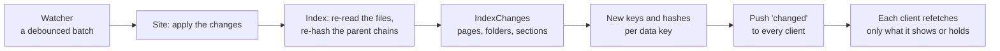

A cache is correct when each key changes exactly when its value would change. This page explains how agentks builds every key, and how a change on disk turns into new keys for exactly the values it affects. The key functions live in `agentks-cache`, in `apps/agentks-engine/crates/cache/src/keys.rs`. No layer builds a key by hand, and the browser caches by these same hashes.

## How keys are built

Every key is a BLAKE3 `Hash` built with `Hash::writer`:

- **A domain** names the kind of key (`"render-key"`, `"sidebar-key"` and so on), so two kinds of key built from the same parts never collide.
- **Every part is length-prefixed**, so parts cannot run into each other.
- **The engine build comes first.** It is the engine version, plus the commit for a development build. Two engine builds never share an entry, because they may render the same file differently.
- **Keys of values stored on disk carry that store's format version.** A format change then gives new keys everywhere, the browser's copy included.

## The key functions

| Function | Parts | Used for |
|---|---|---|
| `render_key` | Engine build, page format, the page's path, its hash, its settings fingerprint, and each embedded file with its hash | A page's data |
| `sidebar_key` | Engine build, the section folder's rolled-up hash, its settings fingerprint | A docs section's sidebar |
| `issues_index_key` | Engine build, the tracker folder's hash, its vocabulary's hash, the git-dates generation | A tracker's issue list |
| `manifest_key` | Engine build, the config's hash, every section's hash in section order | The manifest |
| `theme_key` | Engine build, CSS format, the theme settings, every theme input file's hash in merge order | The compiled theme CSS |
| `highlight_key` | Engine build, highlight format, the language, the code's hash, the highlight theme | One highlighted code block |

### Why the render key has these parts

- **The page's path.** Relative links resolve from the file's location, so a page moved to another folder may render differently even with the same bytes. A moved page is a new key.
- **Every embedded file, sorted.** The renderer returns each file the page embeds with its hash, and the key covers them. The pairs are sorted, so the order of the embeds does not change the key, but a changed, added or removed embed does. A diagram or artifact page's sidecar counts as a dependency the same way.
- **A missing embed.** An embed whose file does not exist is recorded with `absent_file_hash()`, a hash no real file can have, not even an empty one. When the file appears, the key changes and the page is rendered again.
- **The settings fingerprint.** Only the settings that shape this page, so an unrelated config edit leaves the key alone.

A newly added `[[path]]` needs no special case: adding it edits the page, whose own hash changes. There is no sweep of `assets/` folders to catch embeds.

## The settings fingerprint

```rust
pub fn settings_fingerprint(kind: &str, values: &[(&str, &str)]) -> Hash
```

The caller passes the dotted key and the canonical JSON value of each setting that shapes one kind of value (`"page"`, `"sidebar"`, `"theme"`). The function sorts them by key and hashes them, separated by kind. It knows nothing of the config types. Which settings to pass is decided by the `Affects` tag every setting carries in `agentks-config`: a navbar edit cannot move a page body's key, because navbar settings are never passed for a page.

## From a config change to cache work

A config change is loaded, validated and diffed against the old config. The diff returns the `Affects` tags of every changed setting, and the site crate maps the tags to work:

| Tag | Work |
|---|---|
| `identity` | Resend the manifest. No page is re-rendered |
| `chrome` | Resend the manifest's navbar and footer. No page is re-rendered |
| `routing` | Rebuild the site index, and everything derived from it: every URL and every page hash |
| `layout` | Resend that section's manifest entry and its page data |
| `theme` | Recompile the theme CSS and push its new URL in the manifest |
| `libraries` | Run the library sync check, then re-render pages that name library elements |
| `server` | Report that the change takes effect on the next start |
| `version` | Run the version gate again. Outside the range, push a fatal error with the migration message |

When a setting's effect is uncertain, it gets the wider tag, never a narrower one. The map from tags to work lives in `agentks-site`, not in the cache crate, because `agentks-config` and `agentks-cache` are both layer 1 and may not depend on each other.

A config change that fails to load keeps the last good config serving and pushes the errors instead.

## From a file change to new hashes



1. The watcher hands the site a batch of changed files, each confirmed by content hash.
2. The index re-reads them, re-hashes their chains of parent folders, and reports what changed: the file's own page, every page that embeds or links it, every folder whose hash moved, and every section whose sidebar or issue list changed.
3. The site computes the new key and hash of each affected data key.
4. The server pushes the new hashes. Each client refetches only the data it is showing or holding whose hash changed.

**Nothing is deleted.** Entries are keyed by content, so a change never has to find old entries. The new key simply misses, and the old entries stop being asked for. In memory the byte budget ages them out. On disk they stay until a cleanup.

## What an edit invalidates

| Edit | What gets a new key |
|---|---|
| A page's own text | That page |
| A file a page embeds, plainly or inside a fence | Every page that embeds it |
| A sidecar of a diagram or artifact page | That page |
| An unrelated file | Nothing |
| A navbar or footer item | The manifest only; no page body |
| A theme file | The theme CSS only |
| A page title, name or order | The page, its section's sidebar, and every page that links to a file whose URL changed |
| A tracker file | The issue's pages and the tracker's issue list |

## Related

- [The site index](../10_engine/30_index.md): the file and folder hashes behind every key.
- [Config: what each setting affects](../10_engine/20_config.md): the `Affects` tags.
- [Format versions](./20_format-versions.md): why keys carry a format number.
