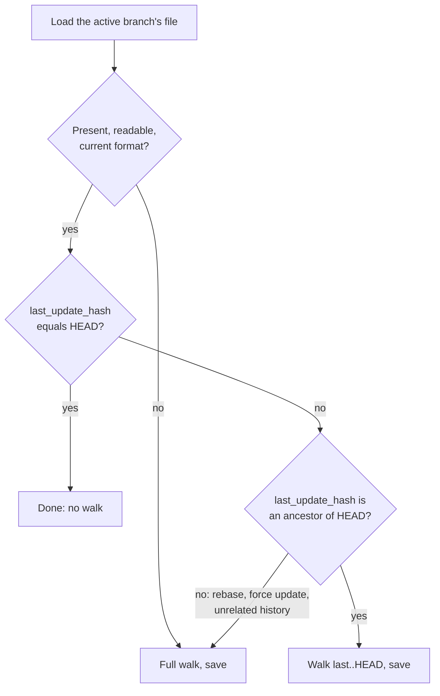

An issue's `updated` date is the author date of the newest commit that touched anything in its folder. Walking git history for every issue on every start would be slow on a large tracker, so agentks caches the dates per branch and, on each start or ref move, walks only the commits it has not seen. Reads never run git.

The walk itself is `agentks-git`'s `folder_dates`. The cache file lives in the build cache. The reconcile that ties them together belongs to the site crate, which runs it at start and whenever the watcher sees a ref move.

## The walk

```
git log --no-merges --full-history --no-renames --name-only -z [<since>..HEAD] -- <tracker>
```

- For each non-merge commit that touches the tracker, take its **author date** and its changed paths.
- Map each path to its first-level folder under the tracker, and keep the newest date per folder. Dates are compared as instants, because two dates with different time-zone offsets sort wrongly as text.
- **Merge commits are skipped.** A merge that only brings in another branch dates each issue by its original commit, which is what `updated` means.
- `--full-history` makes a walk of `<since>..HEAD` find exactly the commits a full walk would add, so an incremental walk and a full walk always agree.
- The walk returns `HEAD` even when it found nothing, so the reconcile can record how far it has read.

Which first-level folders are issues is a content rule, so the git crate returns every folder and the caller picks the issues.

## The cache file

One file per branch, in the project's build cache:

```
~/.agentks/build-cache/<project key>/<engine folder>/git-dates/<branch>.json
```

```json
{
  "format": 1,
  "branch": "main",
  "last_update_hash": "b9d2c20…",
  "issues": {
    "2026-04-10-issues-layout": "2026-05-08T03:20:41+05:30"
  }
}
```

A branch name with a `/` is encoded into one file name, reversibly: `feature/foo` becomes `feature%2Ffoo`. The file is written atomically and carries `GIT_DATES_FORMAT`. In memory, the site keeps only the active branch's map, so a read is a map lookup.

## The reconcile

At start, before the server accepts connections:



Two rules keep the incremental walk right:

- **Always overwrite.** Every commit an incremental walk reads is newer than the cache, so an issue it finds always takes the new date.
- **Always move `last_update_hash` to `HEAD`**, even when the walk found no tracker change. Otherwise the next walk would read the same range again.

**A rewritten history always falls through to a full walk.** The ancestor check, `git merge-base --is-ancestor`, spots a rebase or a force update. Being fast is never worth a wrong date.

## When a ref moves

The watcher follows the files where git records `HEAD` and the active branch: the worktree's own `HEAD`, and the active branch's ref in the repository's common folder, or its `reftable/`. `agentks-git`'s `ref_watch_paths` names them, and it handles linked worktrees, whose `HEAD` lives under `.git/worktrees/<name>/`.

- **A commit, a pull, a reset.** The same reconcile runs, and the server pushes the issues whose dates changed.
- **A branch switch.** The site saves the outgoing branch's file, loads the incoming one (or walks it fresh), reconciles it against `HEAD`, and follows the new branch's ref.
- **A detached `HEAD`.** There is no branch name to file the dates under, so they stay in memory only. Returning to a branch reloads its file.
- **A burst of ref events.** Events are coalesced over a short window, so an interactive rebase gives one refresh. Two walks never run at once: a request that arrives during a walk sets a flag, and the walk runs once more when it finishes.
- **`git fetch`.** It changes no local ref, so nothing fires. That is correct, because a fetch alone does not change the checked-out history.

## Cleaning up stale branch files

At start, the site lists the local branches and deletes the cached files of branches that no longer exist, one log line per file. This is stale state inside agentks's own cache, not user data.

## No git, or no commit yet

In a project outside git, or for an issue never committed, there is no date. The tracker shows the issue's `created` date, taken from its folder name, instead. A date is never invented.

## How the dates reach the issue list

Each reconcile bumps a generation counter. The counter is part of the issues-index key, so a changed date gives the issue list a new key and every client refetches it. The active branch's dates are one of the memory cache's resident values.

## Related

- [Git and migrate](../10_engine/50_git-and-migrate.md): the git crate that runs the walk.
- [The build cache on disk](./15_build-cache.md): where the files live.
- [Keys and invalidation](./05_keys-and-invalidation.md): the issues-index key.
