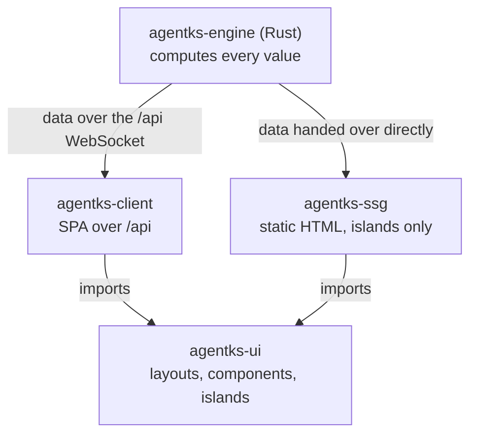

This section explains how the agentks frontend is built: the shared UI package that holds every layout, the client app that runs in the browser, the islands that carry the only JavaScript a published page ships, the WebSocket client and its cache, how components use the theme, and how the client stays fast. Read it before you add a layout, a component or an island, or change how the client talks to the server.

## The one rule

**Every rule lives in Rust. The frontend only displays.** Rust computes every URL, every order, every status category, every filter option list and every date. The frontend receives those results as data and decides only how they look and behave on screen.

The test for any helper in the frontend: could it give a wrong answer about the content? If it could, it is a rule, and Rust computes it.

## The three parts

```
apps/
  packages/
    agentks-ui/        every layout, component and island; component CSS; the data types
  agentks-client/      the single-page app: wires agentks-ui to live data over the WebSocket
  agentks-ssg/         the static renderer behind agentks build: draws agentks-ui once per page
  agentks-engine/      Rust: computes the data both builds feed to agentks-ui
```

| Part | What it is |
|---|---|
| `agentks-ui` | The shared UI package (`@agentks/ui`). Pure components: data in, markup out |
| `agentks-client` | The single-page app of the local tool. Built once with Vite, embedded in the binary, served on localhost |
| `agentks-ssg` | The static renderer that turns a project into a published site ([publishing](../45_publishing/01_overview.md)) |

The dependency runs one way. The client and the static renderer import the package. The package imports neither of them, and no Rust code. It knows the **shape** of the data it receives, and nothing about where the data came from.



## Three safeguards

Three rules keep the local tool and the published site from drifting apart:

1. **One data interface.** Every piece of data reaches the UI through one small interface, `DataSource`. The client implements it over the socket. The static renderer hands over data Rust already computed ([data interface and types](./10_data-interface-and-types.md)).
2. **Real URL paths.** The router uses `/dev-docs/architecture/overview`, never `/#/...`. A published page has the same URL ([the client and routing](./15_client-and-routing.md)).
3. **Pure shared components.** Every layout lives once, in `agentks-ui`, and only turns data into markup. No socket, no fetching, no browser-only objects while it renders ([the shared UI package](./05_the-shared-ui-package.md)).

## The stack

| Piece | Choice |
|---|---|
| UI framework | Preact 11, JSX with hooks |
| Build tool | Vite 8, with `@preact/preset-vite` |
| Server-side rendering | `preact-render-to-string` |
| Types | Generated from the engine's JSON Schema with `json-schema-to-typescript` |
| Package manager and test runner of the package | Bun (`bun test`) |
| Test runner of the client | Vitest with happy-dom |
| Lint | oxlint |

**Why Preact.** A measured comparison built the same docs layout in Preact, Solid and Svelte. All three met every hard requirement. Preact shipped the least JavaScript: 8.0 KiB gzipped for a static page with two islands, and 9.2 KiB for the single-page app's first load. Its hydration needs no markers in the HTML and no bootstrap script, so an island hydrates any markup wherever it was rendered. One compile serves the server and the browser. And JSX with hooks is the idiom AI agents write most reliably, which matters because the AI is the main author of changes.

**React-only components** such as Excalidraw and tldraw run on real React, in their own lazy chunk. Preact's React compatibility aliases stay off, so those components never run on a compatibility layer. They cost JavaScript only on the page that shows such a diagram.

## Pages in this section

| Page | Explains |
|---|---|
| [The shared UI package](./05_the-shared-ui-package.md) | What lives in `agentks-ui`, what purity means, the layout registry, the checks |
| [Data interface and types](./10_data-interface-and-types.md) | `DataSource`, the generated types, the page data kinds, body HTML from Rust |
| [The client and routing](./15_client-and-routing.md) | The client's parts, start-up, the manifest-driven router, the embedded build |
| [Islands](./20_islands.md) | Interactive parts: the contract, the registry, mounting and hydration |
| [The WebSocket client](./25_websocket-client.md) | The client's side of `/api`: hello, requests, reconnect, reload |
| [The browser cache and live updates](./30_browser-cache-and-live-updates.md) | The hash-checked data cache, UI state, redraws on pushes |
| [Theming in components](./35_theming-in-components.md) | Component CSS, theme variables, cascade layers, the public hooks |
| [Performance and offline](./40_performance-and-offline.md) | Code splitting, prefetch, long lists, redraws, the PWA |

## Related sections

- [Server and protocol](../15_server-and-protocol/01_overview.md) — the other end of the socket, and the routes the client never handles.
- [The engine](../10_engine/01_overview.md) — where every value the frontend shows is computed.
- [Collaboration](../30_collaboration/01_overview.md) — live documents and presence in the editor.
- [Publishing](../45_publishing/01_overview.md) — how the static renderer uses the same package.
- The user's side of layouts and themes is in the user guide's [themes and layouts](../../user-guide-2/45_themes-and-layouts/01_overview.md).
