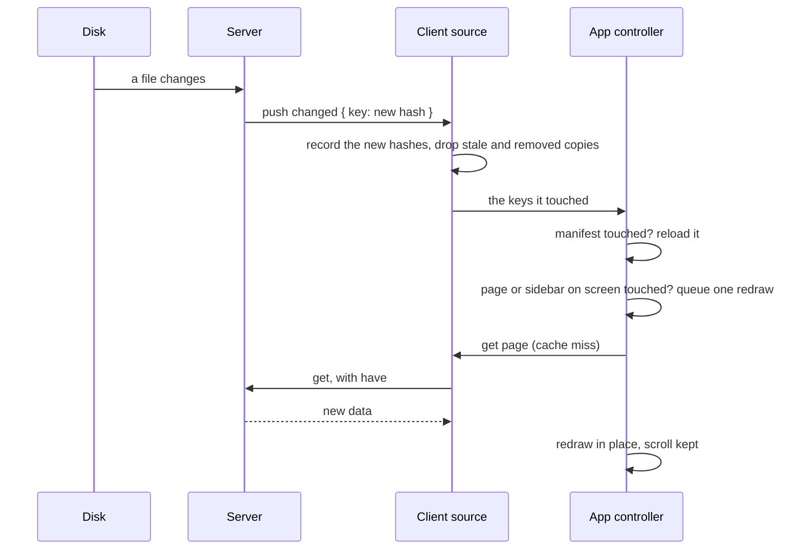

This page explains what the client keeps in the browser, how it knows a copy is still correct, and how a change on disk turns into a redraw of the page on screen. It also covers UI state, which is kept apart from data.

## The server owns the data

Rendering, git dates, compiled CSS and search are computed once, on the server, and shared by every user and tab ([caching](../20_caching/01_overview.md)). The browser's copy only saves a round trip. It is never the source, and it is never trusted without a hash check.

## The data cache

**What is stored:** the answers to `get`: the manifest, page data, sidebars and indexes. Each entry is `{ hash, data }`, keyed by its data key, such as `page:/dev-docs/a` or `sidebar:dev-docs`.

**Where:** in IndexedDB, so the copies survive a refresh and a revisit costs one `unchanged` reply instead of a full payload. `apps/agentks-client/src/data/cache.ts` defines the store as an async interface, `DataCache`, with `get`, `set` and `delete`. A memory store implements the same interface, so callers never depend on which store is behind it.

**One store per project and engine version.** The store name is `agentks:<project key>:<engine version>` (`cacheName`). So:

- two projects never share entries, even if a port were ever reused;
- an engine upgrade starts a fresh store, instead of reading data shaped by the old engine.

**Clearing.** The dev toolbar's browser-cache tool clears it, and so do the browser's own site-data controls.

## How a copy is checked

The source in `apps/agentks-client/src/data/source.ts` keeps, for every key, the last hash the server **announced**: from the manifest's route list, and from each `changed` push. For each request:

1. If the cached copy's hash equals the announced hash, the cache answers, with no round trip.
2. Otherwise the request goes to the server with the cached hash as `have`.
3. An `unchanged` reply returns the cached copy. A data reply replaces it.
4. Two callers asking for the same key while a request is open share that one request.

After a `resync` or a reconnect, the source **forgets** every announced hash. Every copy is then checked against the server once more, because pushes may have been missed.

A page's hash covers every file it embeds. So editing an embedded diagram changes the hash of every page that shows it, and none of them serves a stale copy.

## Live updates

1. The server's watcher sees a change and pushes `changed` with the new hashes ([pushes](../15_server-and-protocol/20_pushes-and-back-pressure.md)).
2. The source records the new hashes, drops the cached copies whose hashes changed, and deletes the removed keys.
3. If the manifest changed, the controller loads it again. The route table, the navbar and footer, and the head links follow. The theme stylesheet link changes only when its URL changed, so an unchanged theme is never fetched again.
4. If the page on screen, or its sidebar, changed, the controller queues a redraw. A burst of pushes, such as a `git checkout`, redraws once, on the next animation frame.
5. The redraw fetches the new data and draws it in place. It keeps the scroll position and open panels.
6. If the page on screen was removed, the client shows a notice. When the push says where the page moved, the notice links to the new URL. Otherwise it links to the section's first page.

Pages that are not on screen are fetched again only when someone visits them.

**Config errors.** A `fatal` push replaces the page with the list of config errors, each with its file, line and fix. The next `changed` push, after the config is fixed, redraws the page.

## UI state is separate

UI state is how one person left the client: which sidebar folders are open, the tracker filters, scroll positions, whether editing is on. It belongs to one person in one browser, so it lives in local storage only. It is never sent to the server and never shared between users.

- **Every key carries the project key,** so two projects never read each other's state.
- **One exception: the theme mode.** It is stored under the plain key `theme`, as `light` or `dark`. No entry means "follow the operating system". A script in the page head sets it as `data-theme` on `<html>` before first paint, so a dark page never flashes light. A `storage` listener applies a change made in another tab. The key is shared on purpose: the mode must carry from the agentks homepage to the docs on one origin, and the homepage has no project key. A person's colour preference is not project state, so sharing it is harmless.

How the theme toggle and the pre-paint script fit together is on [theming in components](./35_theming-in-components.md).
