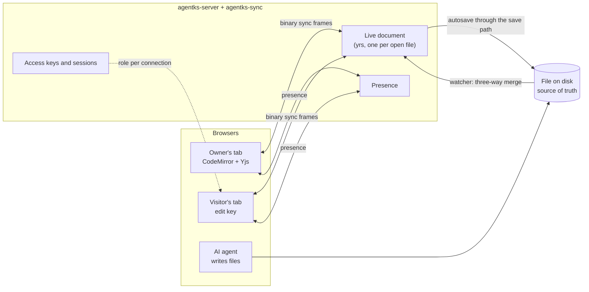

This section explains how agentks lets people edit a project together, and how the same machinery lets one person edit while an AI changes the same files on disk. It covers the live document the server holds for each open file, the sync protocol, merging disk changes into live documents, presence, access keys, network exposure, live tracker edits with git attribution, and diagrams. Read it before you change the editor's sync, anything under `apps/agentks-engine/crates/sync/`, or share mode.

## What collaboration is

Several people edit one project at once. Text and diagrams sync live. Everyone sees who else is on a page and where their cursor is. A status change or a new comment in the tracker appears for everyone at once. There is **no sign-in**: the project's owner grants access with an **access key**.

The sync runs on `yrs`, the Rust port of Yjs (a CRDT library: a data structure that lets several people edit at once and always converge on the same result). It runs inside the server, over the same `/api` socket as everything else ([server and protocol](../15_server-and-protocol/01_overview.md)).

## One protocol, from one editor to many

Single-user editing already runs on one live document per open file. The reason is the AI: it is the main author, so a file often changes on disk while a person has it open. With a live document, the AI's change merges into the open editor instead of clashing with it.

So multi-user editing adds no second sync path. It adds presence and access keys to the same documents, on the same socket. Multi-user sync ships in 1.0.0, as the stage right after single-user editing.

## The rules

- **The file on disk is the source of truth.** A live document is a working copy. It is never saved as CRDT state, and it never outlives its file.
- **No sign-in.** Access keys only. The server stores only hashes of keys, in the machine home, never in the project.
- **One protocol.** Multi-user adds presence and keys to the single-user sync. It never adds a second sync path, and it never opens a second socket.
- **Localhost stays the default.** Network access needs `--share` and a key.
- **People edit existing files.** The one structured exception is the tracker operations, and they call the CLI's own writers.
- **Sized for small teams.** The audience is one or two developers at a time, so the limits suit a small team, not a crowd.

## Where the code lives

| Part | Where |
|---|---|
| Live documents, the binary framing, presence, access keys, sessions, the edit journal | The crate `agentks-sync`, `apps/agentks-engine/crates/sync/`, layer 6 |
| The socket, the role checks, share mode | `agentks-server` ([server and protocol](../15_server-and-protocol/01_overview.md)) |
| The client's Yjs provider, remote cursors, the conflict notice | `apps/agentks-client/src/editor/` |
| `agentks share` and the commit trailers | The CLI crate |

`agentks-sync` is transport-agnostic. It takes and returns bytes and connection ids, and never touches a socket; the server does. That keeps it testable with a headless client.

## Pages in this section

| Page | Explains |
|---|---|
| [Live documents](./05_live-documents.md) | The server-held `yrs` document per open file: create, epochs, autosave, unload |
| [The sync protocol](./10_sync-protocol.md) | Binary frames on `/api`: join, sync steps, updates, awareness, reconnect |
| [Disk and live document merge](./15_disk-and-live-document-merge.md) | How an AI's edit on disk joins an open editor without losing anyone's work |
| [Presence](./20_presence.md) | Who is on a page, and where their cursor is |
| [Access keys and sessions](./25_access-keys.md) | Keys, roles, hashed storage, cookie sessions, revocation |
| [Network exposure](./30_network-exposure.md) | `--share`: binding, accepted hosts, TLS through a tunnel or proxy |
| [Tracker live edits and attribution](./35_tracker-live-edits-and-attribution.md) | Status, labels and comments from the page, and who edited what in commits |
| [Diagram documents](./40_diagram-documents.md) | Excalidraw, tldraw, Mermaid, Graphviz and draw.io, edited together |

## How it is proven

Live collaboration fails in ways a demo never shows: two edits at the same instant, a laptop that sleeps mid-edit, a file the AI changes while three people type, a key revoked during a session. So convergence is checked by a **randomised property test**, not only by examples. Several clients apply random inserts and deletes with random delays. When they settle, every client's text, the server's document and, after autosave, the file on disk must be identical. A headless Rust client speaks the same protocol as the browser, so most tests need no browser. The tests use temporary projects and a temporary machine home, never the developer's own `~/.agentks`.

## Related

- The user's side of editing and sharing is in the user guide's [editing and sharing](../../user-guide-2/50_editing-and-sharing/01_overview.md).
- [File writes and echo suppression](../15_server-and-protocol/30_file-writes.md) — the one save path every live document writes through.
