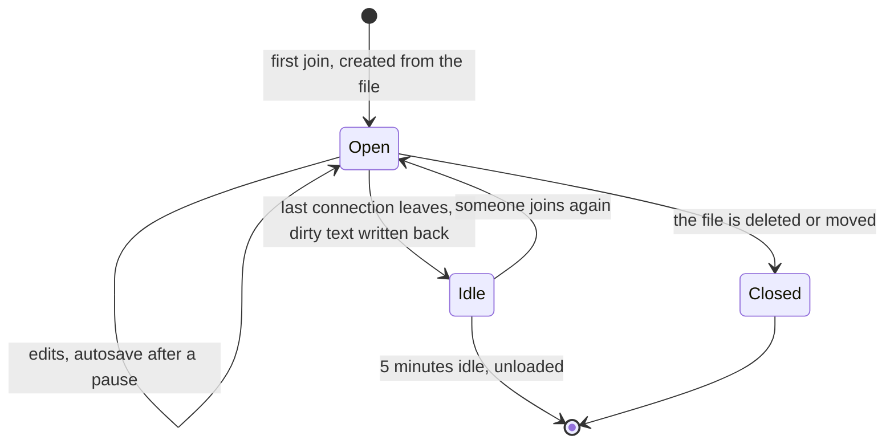

This page explains the live document: the copy of a file the server holds in memory while anyone edits it. You get what a live document holds, how it is created, how epochs stop duplicated text, how it writes back to disk, and when it is unloaded. The type is `DocManager` in `apps/agentks-engine/crates/sync/src/docs.rs`.

## Why the server holds the document

When a file is opened for editing, the server creates a live document for it with `yrs`, and every editor of that file syncs with it. The server does this even for one person, for two reasons:

- **An AI's change on disk merges into the open editor** instead of clashing with it ([disk and live document merge](./15_disk-and-live-document-merge.md)). The person sees the change appear where it happened, and nobody loses work.
- **A second person joins the same document.** Multi-user editing adds only presence and access keys; sync already works.

## What a live document holds

`DocManager` keeps one live document per open file, in a map from the file's path relative to the project root.

| Part | Holds |
|---|---|
| The `yrs` document | The shared state. A text file is one `Y.Text` named `content`. A diagram uses its own shape ([diagram documents](./40_diagram-documents.md)) |
| The epoch | A random id created with the document (below) |
| The base | The text and hash last read from disk or written to it |
| The connections | Every connection that joined it |
| The dirty flag | Whether it holds typing not yet written to disk |

A document's kind is `text` or `diagram` (`DocKind`).

## Created on first join

The first connection that joins a file creates its document. The server reads the file through the index, puts its text into the document, and sets the base. Later joiners sync with the existing document.

A connection with the `read` role may join too. It watches live changes and appears in presence, but the server rejects its updates ([access keys and sessions](./25_access-keys.md)).

## Epochs stop duplicated text

A document rebuilt from disk, for example after a server restart, starts a new CRDT history. A browser that synced with the old document still holds the old history. If the server merged that old state into the new document, every character would appear twice, because the CRDT sees two unrelated insertions of the same text.

So every document carries an **epoch**, a random id created with it:

1. The client's join names the epoch it holds, or none.
2. The join reply carries the document's epoch.
3. If the two differ, the client throws away its local document and syncs fresh from the server.
4. It then re-applies its own unsaved text as a plain diff, so the person's typing survives.

An old epoch's state is never merged into a new document.

## Writing back: autosave

The person never presses save.

1. Edits flow into the server's document as they are typed.
2. About one second after typing pauses, the server writes the document's text to disk through the one save path ([file writes](../15_server-and-protocol/30_file-writes.md)), with the base's hash as `base_hash`.
3. On success, the written text becomes the new base, and the echo table makes sure the write does not come back as an outside change.
4. Changes that came from disk do not mark the document dirty, so they never trigger a write-back of their own.

Every write-back uses the save path's path rules, conflict check, atomic write and echo suppression. A live document has no private way to disk. The timings are constants in the code; config has no keys for them.

## Leaving and unloading

- When the last connection leaves, the server writes the document back if it is dirty.
- After 5 minutes with no connection, it unloads the document. The file on disk is the source of truth, so keeping a document longer gains nothing.
- It unloads only after a successful write-back. If the write-back fails, the document stays, and the next person who joins is told about the error.
- If the file is deleted or moved while open, the document closes, and its editors are told ([disk and live document merge](./15_disk-and-live-document-merge.md)).

## Limits and shutdown

- **A cap on open documents.** `DocManager` holds at most a set number of documents. Beyond the cap, a new join is refused with a clear error. The server never evicts a dirty document to make room, because that would lose typing.
- **Shutdown writes everything back.** Before the server exits, `flush_all` writes back every dirty document ([server lifecycle](../15_server-and-protocol/35_server-lifecycle.md)).
- **Heavy work stays off the async threads.** Diffs and serialisation run on the blocking pool, so a large file never stalls the socket.
