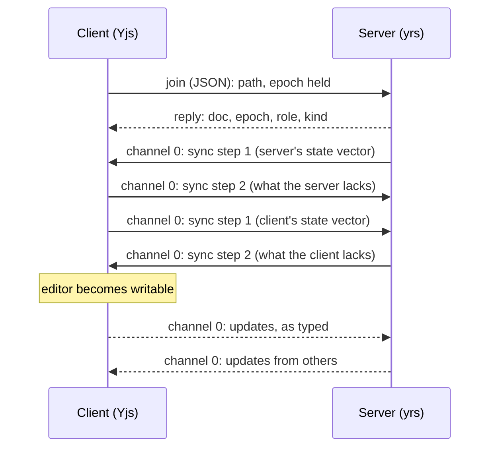

This page explains how a live document syncs over `/api`: how a client joins and leaves a document, the binary frame format, the order of the first sync, how updates fan out, and what happens on reconnect. Live documents use the standard Yjs sync and awareness messages inside a small frame of our own, so the browser uses the stock `yjs` and `y-protocols` packages unmodified.

## Two kinds of frame, one socket

| Frame | Carries |
|---|---|
| Text (JSON) | Control: joining and leaving a document, through the normal request router, with an `id` and a reply |
| Binary | CRDT data: Yjs sync messages and Yjs awareness messages |

Everything shares the tab's one WebSocket. There is no second socket for sync.

## Joining and leaving

A client joins a document with a JSON request that names the file's path, relative to the project root, and the epoch it already holds, or none. The reply carries:

| Field | Meaning |
|---|---|
| `doc` | A small number for this document on this connection, so binary frames need not repeat the path |
| `epoch` | The document's epoch. When it differs from the client's, the client discards its local state and syncs fresh ([live documents](./05_live-documents.md)) |
| `role` | What this connection may do in the document |
| `kind` | `text` or `diagram` |

The reply type is `JoinReply` in `apps/agentks-engine/crates/sync/src/docs.rs`. Leaving takes the document number. When the last connection leaves, the document writes back and starts its idle timer.

Joining needs `edit` or `owner` to change the document. A `read` connection may join to watch.

## The binary frame

```
[ u8 channel ][ varuint doc ][ payload ]
```

| Part | Meaning |
|---|---|
| `channel` | `0` for Yjs sync (step 1, step 2, update), `1` for Yjs awareness (cursors and selections) |
| `doc` | The document number from the join reply, as an unsigned LEB128 varuint, the way `lib0` (the Yjs encoding library) writes it |
| `payload` | The Yjs message, byte for byte as `y-protocols` writes it |

The type is `SyncFrame` in `apps/agentks-engine/crates/sync/src/frames.rs`, with `decode` and `encode`. An empty frame, an unknown channel, or a document number that is truncated or too large is a bad frame. The server then closes the connection with `4400`.

## The first sync



A state vector says how much of each writer's history a side already has. Step 2 answers it with only the missing updates. So a first sync sends the whole document once, and a resync after a short drop sends only what is missing.

**The editor stays read-only until the first sync completes.** Typing into a document that has not synced yet would create edits on an empty history, which then merge badly.

## Updates and fan-out

- An update from one connection is applied to the server's document, then forwarded to every other connection joined to it.
- An update from a `read` connection is dropped, and the connection gets one error. Its awareness is still relayed, so others can see it.
- Each connection's outgoing queue is bounded, as for pushes ([pushes and back-pressure](../15_server-and-protocol/20_pushes-and-back-pressure.md)). When it overflows, the server forces a resync of that document for that connection.

## Reconnect

A client that reconnects sends its hello again, then joins again with the epoch it holds.

| Epoch | What happens |
|---|---|
| The same | The normal step 1 and step 2 exchange sends only what is missing |
| Different, because the server rebuilt the document | The client discards its local document, syncs fresh, and re-applies its own unsaved text as a diff |

## Versioning

The hello's `api_version` covers this framing too. There is no separate sync version. A change to the framing bumps `api_version`, and an old client reloads ([the /api socket](../15_server-and-protocol/10_the-api-socket.md)).

`yrs` and the JavaScript `yjs` must agree on the update encoding, version 1. Both are pinned, and a cross-language test fails if either side changes.

## Liveness and timing

There are no ping or timing messages inside the sync protocol. WebSocket pings on the socket handle liveness, and every timing is a constant in the code.

## The client side

The client speaks this protocol through a small TypeScript provider in `apps/agentks-client/src/editor/`. It binds CodeMirror's Yjs document to the frames above, over the tab's existing socket.
