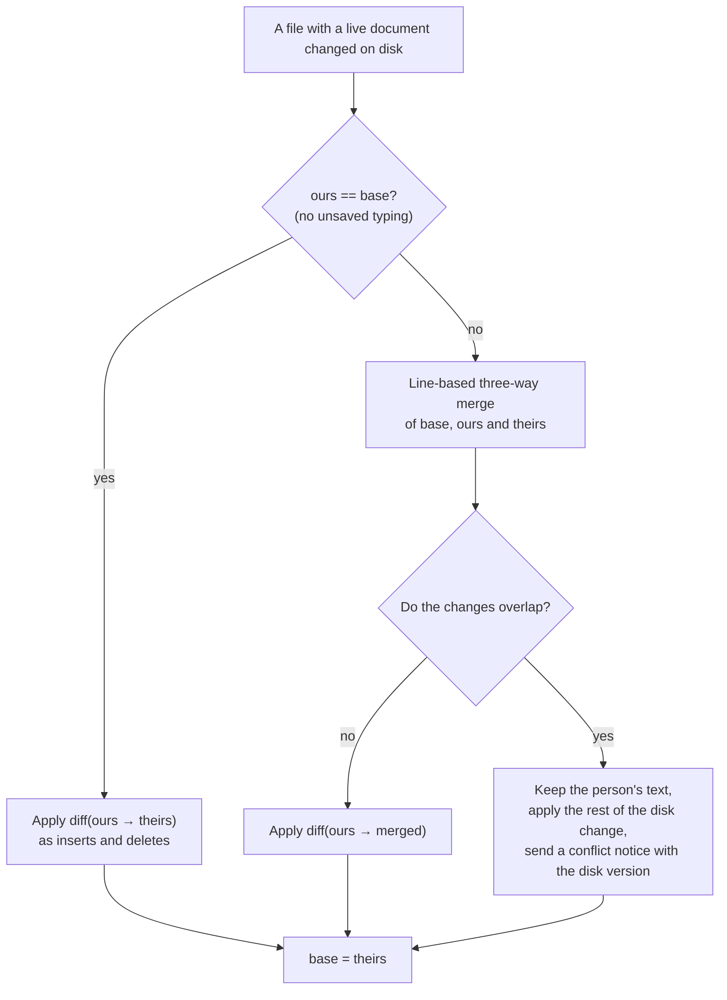

This page explains what happens when a file changes on disk while someone has it open in an editor. The AI is the main author, so this is the normal case, not an edge case. The outside change merges into the live document as an ordinary edit: the person sees it appear where it happened, their own unsaved typing stays, and nobody's work is overwritten. This works from the first single-user editor onwards.

## Where the merge hooks in

The file watcher processes each batch of changes in fixed steps ([the file watcher](../15_server-and-protocol/25_the-file-watcher.md)). One step checks each changed file:

1. Is it the server's own write? The echo table decides ([file writes](../15_server-and-protocol/30_file-writes.md)). If so, nothing merges.
2. Is it open as a live document? If so, the watcher calls `merge_from_disk(path, new text, new hash)` on `DocManager`.

The merge returns the frames to send to the document's editors. It runs on the blocking pool, so a large file never stalls the socket.

## The three-way merge

The merge compares three texts:

| Name | Is |
|---|---|
| `base` | The text last read from disk or written to it |
| `ours` | The live document's text now, including unsaved typing |
| `theirs` | The new text on disk |

1. **No unsaved typing** (`ours` equals `base`). The server applies the difference from `ours` to `theirs` to the document's text, as insert and delete operations, in one transaction tagged with the origin `disk`.
2. **Unsaved typing.** The server runs a line-based three-way merge. Changes that do not overlap, such as the person typing in paragraph 1 while the AI edits paragraph 5, merge cleanly. The server applies the difference from `ours` to the merged text, the same way.
3. **Overlapping changes.** The server keeps the person's text in the document and applies the rest of the disk change. It marks the document as in conflict and sends its editors a notice with the disk version, so they can take the disk version or keep theirs.
4. In every case, the new disk text becomes the base. The next write-back then writes against the new disk hash, so it never gets a `conflict` for a change it already merged.

**When unsure, the person's text wins, and they are told.** Typed text is never lost.

## No write-back for a disk change

A transaction with the origin `disk` does not mark the document dirty. If nothing else changed, no autosave follows. The server never writes the merged result to disk just because a merge happened. Only real typing triggers a write-back.

Without this rule, every AI edit would come straight back to disk as a "save" by the person who had the file open.

## A deleted or moved file

When the open file is deleted or moved, the server closes its live document and tells its editors. When the index knows the new path, the notice says "the file was moved to …"; otherwise it says the file was deleted. The client keeps the person's unsaved text on screen so they can copy it. The server never recreates the file.

## Formats that are not text

A diagram document merges by its own rules ([diagram documents](./40_diagram-documents.md)):

| Format | Disk merge |
|---|---|
| Mermaid, Graphviz | As text, exactly as above |
| Excalidraw, tldraw | Element by element: the server compares the old and new file and applies only the elements that changed |
| draw.io | Whole-file replace, with a conflict notice |

## A trap: offsets

A diff computed on lines is applied as character offsets. `yrs` counts in UTF-8 bytes by default in Rust, and the JavaScript side counts in UTF-16 units. The merge must use one counting consistently with `yrs`, and the tests include emoji and non-Latin text so that a mismatch fails loudly.

## What the tests prove

- With no unsaved typing, an outside edit appears in the document and no save follows.
- With typing in one paragraph and an outside edit in another, both survive, and the next autosave writes both.
- Overlapping edits raise the conflict notice and keep the typed text.
- Deleting the open file closes the document with a notice.
- End to end: a script appends a section while a person types elsewhere, and the file on disk ends with both, with no conflict shown.
