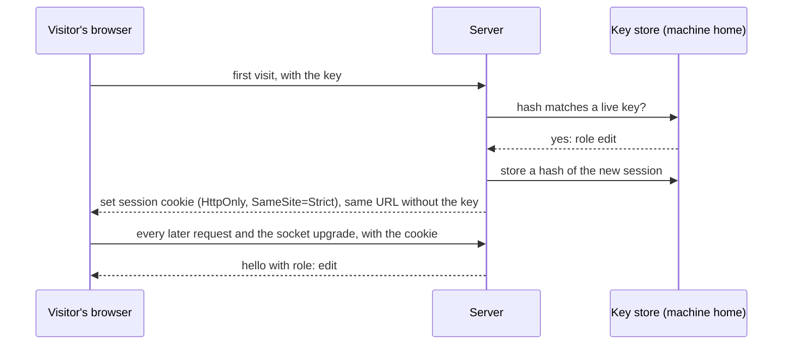

This page explains how other people get into a project's server: access keys, the roles they carry, how the server stores them, how a key becomes a browser session, and how revoking a key cuts people off at once. There are no accounts and no sign-in. The owner creates a key and hands it over. How the owner does that is in the user guide's [editing and sharing](../../user-guide-2/50_editing-and-sharing/01_overview.md).

## The key

| Property | Value |
|---|---|
| Secret | `aks_` followed by 26 base32 characters, from at least 128 random bits from the operating system. The prefix makes a leaked key easy to spot in a paste |
| Id | A short public id, used to list and revoke the key. It is not the secret |
| Role | `read` or `edit` |
| Label | Free text that tells keys apart, such as the name of a team. Used in git attribution |

`agentks share create` creates a key with a role and a label, and prints its secret once. The secret is never stored and never shown again. The other commands of the group are `share list`, `share revoke` and `share log`. The types are `AccessKeys`, `KeyInfo` and `NewKey` in `apps/agentks-engine/crates/sync/src/keys.rs`.

## Where keys live

Keys live in the machine home, in `~/.agentks/share/<project key>.json`:

- **Hashes only.** The file holds a hash of each key, with its id, role, label, and when it was created, last used and revoked. The secret is never written anywhere.
- **Owner-readable only,** and written atomically.
- **Never in the project,** and never in `config/.env`. A key must not end up in a git repository.

A presented key is checked against the stored hashes in constant time, so the check leaks nothing through its timing.

## From a key to a session

A visitor presents a key once, either through a link that carries it or through the key prompt in the client.

1. The server checks the key and starts a session with a new random id.
2. It sets a session cookie that is `HttpOnly` (page scripts cannot read it) and `SameSite=Strict` (the browser does not send it on requests started by other sites). When the server is reached over HTTPS, the cookie is also `Secure`.
3. It sends the browser to the same URL without the key. So the key does not stay in the address bar, the history or any log.
4. From then on, every request and the WebSocket upgrade carry the cookie. The session's role goes into the connection, and the hello reports it as `role` ([the /api socket](../15_server-and-protocol/10_the-api-socket.md)).

**Sessions survive a restart.** Sessions are stored hashed in the same file, so restarting the server does not log everyone out. **A session dies with its key.**

**One cost of `SameSite=Strict`.** The browser does not send the cookie on the first navigation from a link on another site. A link that carries the key still works, because the key is in the URL. But a person with a session who opens the site from a link in, say, a chat app sees the key prompt once.

## Share mode: every request needs a session

Without `--share`, the server listens on loopback only and needs no key: the owner is the only person who can reach it. Every connection is `owner`.

With `--share`, **every request needs a valid session, loopback included.** A reverse proxy on the same machine makes every request look local, so "local" can no longer mean "the owner". `agentks start --share` therefore creates a one-run owner key and prints the owner's link in the terminal.

Without a session, the server serves only the key prompt and what it needs. The WebSocket closes with `4401`, and the client stops reconnecting and shows the prompt ([the WebSocket client](../25_frontend/25_websocket-client.md)).

## What each role may do

| Role | May |
|---|---|
| `owner` | Everything |
| `edit` | Read, edit pages, change live documents, use the tracker operations |
| `read` | Read, watch live documents and appear in presence. Never `open`, `save`, document updates or tracker writes |

The request router checks the role once, for every request ([the /api socket](../15_server-and-protocol/10_the-api-socket.md)).

## Revoking

`agentks share revoke` marks a key revoked and drops its sessions. The server watches its key store file, so the revocation takes effect live: it closes every open socket of that key with `4401`. The client then shows the key prompt.

## What is never logged

Keys, session ids and cookies never appear in a log, and a `key=` parameter is removed from any logged URL. A search of the server log after the tests finds no `aks_` string and no session id.

Failed key attempts are rate-limited per remote address, so a key cannot be guessed by brute force.
