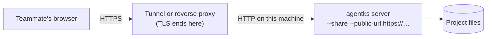

This page explains share mode: what changes when the owner starts the server with `--share` so that teammates on other machines can reach it, and what stays exactly as strict as on localhost. The set-ups a user can choose, such as a LAN, Tailscale or a tunnel, are in the user guide's [editing and sharing](../../user-guide-2/50_editing-and-sharing/01_overview.md).

## The default: nobody else can reach the server

Without `--share`, the server listens on `127.0.0.1` and `::1` only, accepts only a loopback `Host`, and treats every connection as the owner ([security](../15_server-and-protocol/45_security.md)). Nothing on the network can reach it, so it needs no key.

## What --share changes

Share mode changes exactly three things:

| What | Without `--share` | With `--share` |
|---|---|---|
| Where the server listens | Loopback only | Beyond loopback. `--bind ADDR` limits it to one address, such as the machine's Tailscale address |
| Which `Host` and `Origin` it accepts | Loopback names with its port | Also the address it is bound to, the machine's host name, and the host of `--public-url` |
| What a request needs | Nothing: every connection is the owner | A valid access-key session, loopback included ([access keys and sessions](./25_access-keys.md)) |

Everything else in [security](../15_server-and-protocol/45_security.md) stays on: the path rules, the MIME boundary, the headers, the write rules, the limits. **Share mode adds checks and removes none.**

Leaving share mode is a restart without `--share`. The run record carries `share: true` while it lasts, so `agentks ps` shows which servers are shared ([server lifecycle](../15_server-and-protocol/35_server-lifecycle.md)).

## TLS comes from in front of the server

agentks does not terminate TLS itself. Over anything other than a trusted LAN, TLS comes from a tunnel or a reverse proxy in front of the server.

- **`--public-url URL`** names the address people use through the tunnel or proxy, for example `https://docs.example.ts.net`. The server accepts that host in `Host` and `Origin`, and marks session cookies `Secure` when the URL is `https`.
- **Forwarded headers are trusted only from a proxy on this machine.** The server honours `X-Forwarded-Proto` and `X-Forwarded-Host` only when the connection comes from a loopback address and `--public-url` is set. From anywhere else, it ignores them, so a remote client cannot claim to be something it is not.
- **Plain HTTP over a network is allowed, and flagged.** Listening on a non-loopback address without TLS prints a warning at start that keys and content travel unencrypted.

This is also why share mode needs a session even for loopback requests. Behind a proxy on the same machine, every request arrives from loopback, so "local" no longer means "the owner".

## Limits in share mode

- A cap on connections per remote address.
- The request size and frame caps every server has ([the /api socket](../15_server-and-protocol/10_the-api-socket.md)).
- A rate limit on failed key attempts per remote address.

## What agentks never does

- It never opens ports on a router.
- It never registers with a tunnel service.
- It never sends anything to a third party.

Reaching the server from outside is always the owner's own set-up, in front of agentks.

## The installable app over plain HTTP

A browser runs a service worker only on `localhost` or over HTTPS. A visitor who reaches a shared server over plain HTTP on a LAN therefore has no installable-app features. Everything else works ([performance and offline](../25_frontend/40_performance-and-offline.md)).
