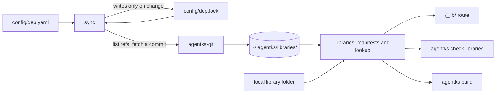

This section explains how agentks handles libraries from the inside: how the engine reads `config/dep.yaml`, pins each library to a commit in `config/dep.lock`, fetches it once per machine, reads its manifest, finds an element by name and serves it to the browser. Read it before you change the `agentks-library` crate, the `/_lib/` route or any command that installs libraries.

To use libraries in a project, read the user guide's [libraries section](../../user-guide-2/40_libraries/01_overview.md) instead.

## Terms

| Term | Meaning |
|---|---|
| **Library** | A folder of reusable files with a `manifest.json` at its root. It lives in a git repository, optionally in a subfolder, or in a local folder of the project |
| **Element** | One file a library offers, such as an SVG icon, an image or an HTML widget. The manifest names it and gives it a description |
| **Alias** | The key of a `dep.yaml` entry. Artifacts name an element as `alias:element`, so two libraries never clash |
| **Selector** | What version a git entry asks for: a `tag` (exact or a range), a `commit`, a `branch`, or nothing, which means the latest release |
| **Pin** | The exact commit `dep.lock` records for a git entry |
| **Sync** | The one algorithm that brings the lock and the machine's store in line with `dep.yaml` |
| **Store** | `~/.agentks/libraries/`: one read-only copy of each repository at each pinned commit, shared by every project on the machine |
| **Catalog** | `library.json` in the library repository: the libraries and templates agentks offers for quick install |

## Who owns what

The rules live in one crate. Everything else reaches them through it.

| Piece | Code | Owns |
|---|---|---|
| `agentks-library` (layer 2) | `apps/agentks-engine/crates/library/` | `dep.yaml` and `dep.lock`, selector resolution, the sync, manifests, the `alias:element` lookup, `/_lib/` URLs and their response headers, the catalog, the decisions behind the `library` commands |
| `agentks-git` (layer 1) | `apps/agentks-engine/crates/git/` | Listing a remote's tags and branches, and fetching one commit's tree |
| `agentks-cache` (layer 1) | `apps/agentks-engine/crates/cache/` | `LibraryStore`: the store folders on disk, written once and read-only afterwards |
| `agentks-server` | `apps/agentks-engine/crates/server/` | The HTTP route that answers `/_lib/` requests |
| `agentks-cli` | `apps/agentks-engine/crates/cli/` | `install`, `library …`, `check libraries` and `cache clean`, which call the crate and print its results |

The library crate must not store files (the store does), serve them (the server does), move a pin during `agentks start`, or guess a version when none matches. It reaches git and the store through two traits, `GitRemote` and `CommitStore`, so the sync runs the same code against the network and against test fakes.

## How the pieces fit

1. `agentks start`, `agentks install` and `agentks library add` all run the same sync. It reads both files, resolves new or changed entries, fetches missing commits into the store and writes the lock.
2. `Libraries` loads every library at its pin, or reads a local library in place. It checks each manifest and each library's engine range.
3. The `/_lib/` route, `agentks check libraries` and `agentks build` all look elements up through `Libraries`, so they agree on what exists.

## Design rules

- **Libraries are downloaded, never bundled.** The binary stays small. The engine knows only the catalog's address and depends on no element being present.
- **The list is flat.** A library cannot depend on another library.
- **One version per library.** Changing any element is a new library version. Elements have no versions of their own.
- **Starting never moves a pin.** Only `agentks install --update` re-resolves a branch, a range or a latest entry.
- **The commit is the integrity check.** Git checks every object it fetches against the commit, so the lock stores no separate hash.
- **Elements appear only in video artifacts and artifact pages.** A markdown page never names an element, so its body stays plain markdown that opens anywhere.

## Pages in this section

| Page | Explains |
|---|---|
| [dep.yaml and dep.lock](./05_dep-files.md) | Parsing, validation, the lock's shape, and how commands edit `dep.yaml` |
| [Resolution and the sync](./10_resolution-and-sync.md) | Selectors to commits, the sync step by step, fetching and the store |
| [Manifests and element lookup](./15_manifests-and-lookup.md) | `manifest.json`, the category folders, local libraries, finding an element, `check libraries` |
| [Search and the catalog](./18_search-and-catalog.md) | The one ranking behind `library find` and `library search`, and `library.json` |
| [The /_lib/ route and the sandbox](./20_lib-route-and-sandbox.md) | Element URLs, response headers, the sandbox and the trust model |

## Related sections

- [Caching](../20_caching/01_overview.md): the store among the other caches, and `agentks cache clean`.
- [Engine](../10_engine/01_overview.md): the crate layers the library crate sits in.
- [Versioning](../50_versioning/01_overview.md): library engine ranges and library migrations.
- [Publishing](../45_publishing/01_overview.md): how a build installs libraries and copies elements.
