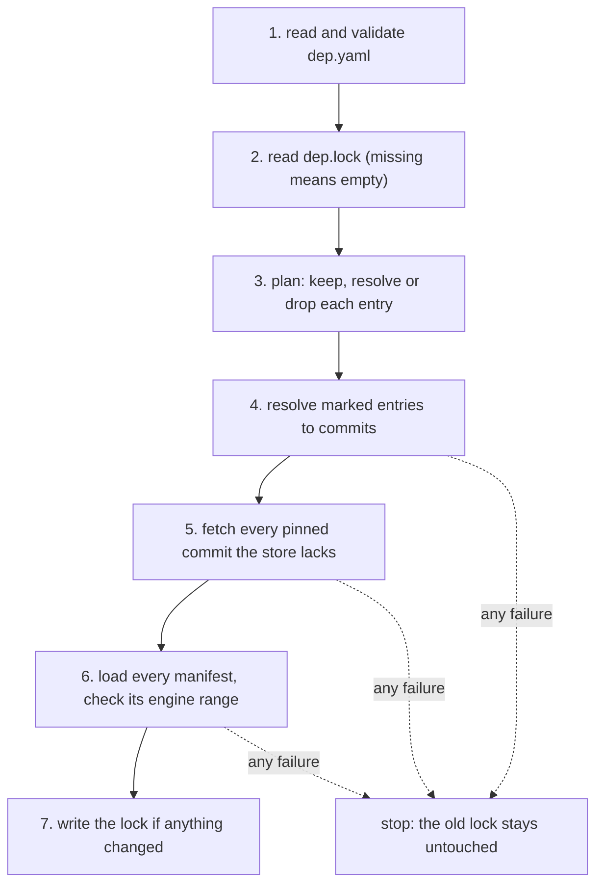

This page follows a library from a line in `dep.yaml` to a read-only folder on the machine. It covers selector resolution (`apps/agentks-engine/crates/library/src/resolve.rs`), the sync (`apps/agentks-engine/crates/library/src/sync/`), the git calls (`apps/agentks-engine/crates/git/`) and the store (`apps/agentks-engine/crates/cache/src/library_store.rs`).

## From selector to commit

`select` applies a selector to a remote's refs, the tags and branches that `agentks-git` lists. It never guesses. When nothing matches, it returns an error that names what the repository does have.

| Selector | Resolves to |
|---|---|
| none (`Latest`) | The newest version tag that is not a pre-release |
| `tag: 1.4.0` or `tag: v1.4.0` | That version's tag. The only way to get a pre-release such as `2.0.0-beta.1` |
| `tag: ^1.4`, `~1.4.2`, `>=1.2.0 <2.0.0` | The newest version tag the range matches, skipping pre-releases |
| `commit: <40 hex characters>` | That commit, as given. No listing is needed |
| `branch: main` | The branch's current head |

- **A version tag** is a tag named `x.y.z` or `vx.y.z`. `version_of_tag` ignores every other tag, and also a tag with build metadata (`1.0.0+x`), so two builds of one version never compete.
- **Ranges** use the Rust `semver` crate's rules. `parse_tag_spec` also accepts the space-separated form people write (`>=1.2.0 <2.0.0`) by joining the comparators with commas first.
- **Two tags for one version** on different commits, such as `1.4.0` and `v1.4.0`, are an error naming both.
- **No version tags at all** is an error that asks for a `branch` or a `commit`.
- **The newest match needing another engine** fails and names both versions. The resolver does not fall back to an older tag, so what gets installed is never a surprise.

`Selector::follows_updates` says which pins `agentks install --update` may move: a branch, a range and latest. An exact tag and a commit never move.

## The sync

`start`, `install`, `library add` and `init` run one algorithm, `sync`. It takes an `UpdateMode`:

| Mode | Caller | Which pins may move |
|---|---|---|
| `Keep` | `agentks start` | None. Only new or changed entries resolve |
| `All` | `agentks install --update` | Every branch, range and latest entry |
| `Only(aliases)` | `agentks install --update <alias>...` | Those aliases only. An alias that is not a git entry is an error |

1. **Read** `dep.yaml` and validate it. Stop on any error.
2. **Read** `dep.lock`, or treat it as empty.
3. **Plan** (`sync/plan.rs`). An entry keeps its pin when its source, `path` and `requested` text match the lock and it is not being updated. A new or changed entry is marked for resolution. An alias that is in the lock but no longer in `dep.yaml` is dropped.
4. **Resolve** each marked entry. The sync lists each repository once, even when several entries share it. It collects every failure before it stops.
5. **Fetch** every pinned commit the store does not have, once per repository and commit.
6. **Load** every library through `Libraries::load_with`. It checks each manifest, each element file and the manifest's `engine` range against the running version. The lock's `version` field comes from the manifest. A version tag that disagrees with the manifest gives a warning.
7. **Write** the lock only when its bytes change, and return a `SyncReport`: what was added, removed or moved from one commit to another, how many commits were fetched, and the warnings.

A failure in steps 4 to 6 returns before the lock is written. Pages never render against a half-updated set of libraries.

`sync` runs `sync_with` against the real network and store. `sync_with` takes a `GitRemote` and a `CommitStore`, so the tests in `apps/agentks-engine/crates/library/tests/sync.rs` drive the same code with a fake remote and a folder store.

## Fetching through git

`agentks-git` runs the machine's `git` program. It does not use a Rust git library.

- **The machine's credentials work unchanged.** SSH keys and credential helpers reach private repositories with no extra code.
- **`list_remote`** reads `git ls-remote` output and peels annotated tags to their commits.
- **`fetch_commit`** fetches exactly one commit, shallow, into a scratch bare repository, and checks out its tree. It writes symbolic links as plain files, so a fetched tree cannot point outside itself.
- **Only `https`, `ssh` and local addresses** pass. The address is checked first and passed after `--`, so an option can never reach git as a URL.
- **Without `git` installed**, every call returns `GitError::ProgramMissing`, never an empty answer.

When a fetch fails, the message names both likely causes, the network or a missing sign-in, and the fix, `agentks install`. When a branch's pinned commit is gone because someone rewrote the branch, the message says so and names `agentks install --update <alias>`.

## The store

`LibraryStore` in `agentks-cache` owns `~/.agentks/libraries/<host>/<repository path>/<commit>/`. The library crate reaches it only through the `CommitStore` trait.

- **Keyed by host, repository path and commit**, never by alias. Projects pinned to the same commit share one folder, and a repository that holds several libraries is stored once per commit.
- **Written once.** An install writes into a temporary folder, marks it complete last, makes it read-only and renames it into place, so a half-written commit never looks installed.
- **Never cleaned automatically.** `agentks cache clean` removes commits that no scanned project's lock still needs.

The [caching section](../20_caching/01_overview.md) covers the store's install lock, its format marker and cleanup in full.

## Related

- [dep.yaml and dep.lock](./05_dep-files.md): the files the sync reads and writes.
- [Manifests and element lookup](./15_manifests-and-lookup.md): what step 6 checks.
