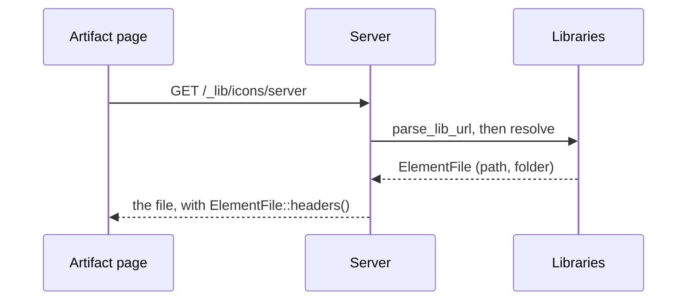

This page explains how a library element reaches the browser. An artifact page loads an element by a fixed URL, `/_lib/<alias>/<element>`. The engine turns that URL into a file and sends it with headers that keep third-party code away from the site. The URL rules and the headers live in `apps/agentks-engine/crates/library/src/url.rs` and `elements.rs`. The HTTP route itself belongs to the [server](../15_server-and-protocol/01_overview.md).

## The URL

```
/_lib/icons/server                   the element server of the library aliased icons
/_lib/icons/server?theme=dark        the same element, with an input
/_lib/team/checkout-flow/app.js      a file beside a folder element's index.html
```

`parse_lib_url` reads a decoded path into a `LibUrl`: the `ElementRef` (alias and element) and, for a folder element, the file beside its `index.html`. It ignores the query and the fragment. A trailing `/` names the element itself. It returns `None` for a path outside `/_lib/`, or for a name that breaks the rule `^[a-z][a-z0-9-]*$`.

`_lib` is one of the reserved first segments in `agentks-core` (`RESERVED_SEGMENTS`, beside `api`, `client`, `assets`, `content-assets` and `artifacts`). No content URL may start with it, so no section can shadow the route.

`lib_urls_in` finds every `/_lib/` URL in a text, with its line number. `agentks check libraries` uses it to report an element that does not resolve, and `agentks build` uses it to know which elements to copy into the output.

## Serving an element



The server parses the URL and asks `Libraries` for the file. `resolve` finds the alias through the lock or the local folder, then the file through the manifest. `resolve_sibling` handles a file beside a folder element. Both return canonical paths that must stay inside the library, or inside the element's folder.

`ElementFile::headers()` returns every header a `/_lib/` response carries:

| Header | Value | Why |
|---|---|---|
| `Content-Type` | From the file's extension (`content_type_of`) | An unknown extension is `application/octet-stream`, which browsers download rather than run |
| `X-Content-Type-Options` | `nosniff` | The browser never guesses a type the engine did not send |
| `Content-Security-Policy` | `sandbox allow-scripts`, for `.html`, `.htm` and `.svg` only | Third-party markup gets its own opaque origin |

The list lives in one function so that the local server and the configuration of a published site's host cannot drift apart.

## Why library HTML is sandboxed

A project's own artifacts are first-party code, so they run unsandboxed on `/artifacts/`. A library is third-party code, so the engine treats it differently.

The `sandbox` policy makes the browser give the element an opaque origin, even when someone opens its URL directly. The element can run its own scripts, but it cannot read the page around it, the site's cookies or its storage. SVG gets the same header, because an SVG file can carry script too.

Because the origin is opaque, a page talks to an HTML element only through its URL and through messages. The default library follows this contract, and the user guide teaches it to library authors.

| Message | Direction | Does |
|---|---|---|
| `{ type: "agentks:element:data", data }` | page to element | Sends input data, such as the rows of a table |
| `{ type: "agentks:element:theme", mode, tokens }` | page to element | Switches to `light` or `dark`, optionally with the site's theme values |
| `{ type: "agentks:element:ready" }` | element to page | Says the element is listening, so the page can send |

Messages go through `postMessage` with the target `"*"`, because an opaque origin has no name to target. The element checks the shape of each message and ignores anything else. Inputs in the query string that are URLs resolve against the element's own address, so the page passes full URLs.

## The trust model

- **No library arrives unseen.** agentks installs only what `dep.yaml` lists. `agentks library add` prints the repository and the manifest summary before it installs. `agentks start` never adds an entry.
- **Git verifies the content** of every fetch against the pinned commit.
- **An HTML element loads nothing on its own.** It inlines its CSS, scripts and images, makes no network request and uses no storage. The one exception is a screen frame, which loads the one URL the page passes it.
- **A library script that a project's own artifact loads** runs with that artifact's rights. The artifact's author chose to load it, and the review happens when the library is added to `dep.yaml`.
- **Private repositories** use the machine's git credentials, because `agentks-git` runs the `git` program.

## On a published site

`agentks build` copies each element that a page or artifact uses into the output, at the same `/_lib/<alias>/<element>` path, so a published site needs no library at run time. There is no agentks server there, so the static host must send the same headers. The [publishing section](../45_publishing/01_overview.md) covers the build.

## Related

- [Manifests and element lookup](./15_manifests-and-lookup.md): how `resolve` finds the file.
- [Libraries in the user guide](../../user-guide-2/40_libraries/01_overview.md): using elements in an artifact, and writing a library.
