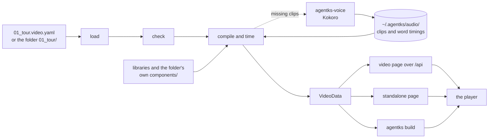

This section explains how agentks plays a video artifact. A video is a small set of YAML files that holds slides, the items on each slide, and narration with one-line actions. Rust reads the files, checks them and computes every time. A small TypeScript program, the player, draws the result live in the browser. A separate helper program speaks the narration. No video file is ever made. Read this section before you change the video crate, the player, the voice helper, or anything that serves a video.

To write a video, read the user guide's [videos section](../../user-guide-2/28_videos/01_overview.md) instead.

## The pipeline at a glance

| Step | Owner | Does |
|---|---|---|
| Load | The video crate | Reads a single file or a video folder into one model, with the file, line and column of every node |
| Check | The video crate | The JSON Schema, then the meaning checks. Every problem names the file to change |
| Compile | The video crate | Resolves component names, expands templates, inlines what the video uses, highlights code and computes every time |
| Voice | The voice helper, run by the server or the CLI | Speaks each beat into a clip with word timings. The video crate joins the clips into one audio stream |
| Serve | The server and `agentks build` | Send the video page, the standalone page and the audio stream |
| Play | The player | Lays out the slides, fits text, animates with the browser's Web Animations API, keeps the clock and reports layout problems |

## Who owns what

| Part | Folder | Owns | Must not |
|---|---|---|---|
| The video crate, `agentks-video-compiler` | `apps/agentks-engine/crates/video/` | The loader, the checks, name resolution, the SVG allowlist, templates, the timeline, `VideoData`, the clip keys, the stream join, the standalone page and the transcript | Measure text, print, or run anything a video contains |
| The player, `agentks-video` | `apps/packages/agentks-video/` | Layout on the grid, text fitting, drawing, animation, the clock, captions, controls, layout diagnostics and the review sheet | Parse YAML, resolve a name, compute a time, or depend on any package |
| The voice helper, `agentks-voice` | `apps/agentks-voice/` | Pronunciation, running the Kokoro voice model, and clips with word timings | Guess how a word sounds, or be compiled by the engine's gate |
| The video page and its island | `apps/packages/agentks-ui/` | The page frame, the transcript, and the island that mounts the player | Hold any player logic |

## The rules behind the design

- **A video is data, never code.** A JSON Schema can check every file before anything plays, and the files stay small. Looks come from library components, and no component runs code.
- **Rust compiles; the player plays and measures.** Rust computes every value it can compute without a browser. Only the browser knows which font it draws, so the player owns layout, text fitting and overlap. A Rust estimate of text width would be a wrong answer that looks right.
- **Narration drives the clock.** An action starts at its beat's start or on a spoken word, so rewording a sentence never breaks the sync.
- **Any moment is a function of time.** Every animation sits on one timeline, so seeking is exact and costs the same anywhere in the video.
- **Unsure means an error.** An unknown name, an anchor that matches no whole word, or a word the voice cannot say is an error with a file and a line. It is never a blank or a guess.
- **Nothing generated enters the project.** Git holds the YAML and its images. Audio lives in a machine-wide store, and there is no MP4 anywhere.

## Terms

| Term | Meaning |
|---|---|
| **Single-file video** | `NN_<slug>.video.yaml`: a header, then `slides:` |
| **Video folder** | `NN_<slug>/` with `settings.json` saying `"kind": "video"`, `controller.yaml` for the header, and one scene file per slide |
| **Beat** | One or two sentences of narration and the actions during them. Each beat becomes one audio clip |
| **Component** | A look from a library (`alias:name`) or from a video folder's own `components/` (`self:name`). A bare name is a player built-in |
| **Clip** and **stream** | A clip is one beat's audio. A stream is a video's clips joined into one Ogg Opus file |

## Pages in this section

| Page | Explains |
|---|---|
| [Where the code lives](./05_where-the-code-lives.md) | The video crate in the crate layers, the player package and the helper's workspace |
| [The loader](./10_the-loader.md) | Reading a single file or a video folder into one model |
| [The schema and the error record](./15_schema-and-the-error-record.md) | The three check layers, the JSON Schema, and how a failure becomes a record |
| [The meaning checks](./20_the-meaning-checks.md) | Every error and warning kind, and how to add one |
| [The compiler](./25_the-compiler.md) | Name resolution, templates, inlining and highlighting |
| [The SVG allowlist](./27_the-svg-allowlist.md) | How inlined SVG is made safe, and the per-category SVG contracts |
| [The timeline](./30_the-timeline.md) | How every time is computed, and `agentks video info` |
| [VideoData](./35_video-data.md) | The contract between the video crate and the player |
| [The player](./40_the-player.md) | How a slide is built, how a moment is drawn, seeking and the clock |
| [Diagnostics, the review sheet and size](./45_diagnostics-sheet-and-size.md) | Layout diagnostics, player errors, `?sheet`, the size budget and on-demand chunks |
| [The voice helper](./50_the-voice-helper.md) | Kokoro through ONNX Runtime, pronunciation, the wire protocol and installing |
| [Clips, streams and the audio store](./55_clips-streams-and-the-store.md) | Clip format, the packet-copy join, the store and when audio is made |
| [Serving and publishing](./60_serving-and-publishing.md) | How a video reaches the local client and a published site |
| [Tests](./65_tests.md) | What each suite proves and where it runs |

## Related sections

- [Crate layers](../10_engine/05_crate-layers.md): the rule the video crate's place follows.
- [Libraries](../35_libraries/01_overview.md): the resolver that finds `alias:name` components.
- [Islands](../25_frontend/20_islands.md): how the video page mounts the player.
- [Publishing](../45_publishing/01_overview.md): the build a video joins.
