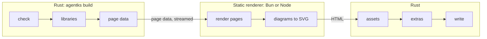

This section explains how `agentks build` turns a project into a static site: plain files that nginx, any static host or a CDN can serve, with no agentks server running. Read it before you change the build step in the engine, the static renderer `apps/agentks-ssg`, or a component that must render on a published page.

To publish a site, read the user guide's [publishing section](../../user-guide-2/55_publishing/01_overview.md) instead.

## The idea in one paragraph

The build uses static site generation (SSG): every page is rendered once, ahead of time, not on each request. Rust computes each page's data with the same code that serves the local client over the WebSocket. The static renderer, `apps/agentks-ssg`, renders that data with the same layout components the client uses, from `apps/packages/agentks-ui`, into finished HTML. Pages are not hydrated as a whole, and no page loads its content as JSON. Only interactive parts, called **islands**, ship JavaScript. A page with no island ships none.

## Why it is built this way

| Choice | Reason |
|---|---|
| One component tree for the client and the build | A layout exists once. The local tool and the published site cannot drift |
| Rust computes the data | Every rule stays in Rust. The published page shows exactly what the local tool shows |
| HTML once, per page | Nothing is computed per request, so the output is CDN-friendly and search engines read full pages |
| Islands instead of full hydration | A reader downloads code only for the parts that need it |
| A JavaScript runtime on the build machine | The components are JavaScript. An engine embedded in the binary would add size to every install and build more slowly. Writing the HTML in Rust would mean every layout existing twice |

This works because of three rules the whole frontend keeps from the start: one data interface for every component, real URL paths in the router, and pure shared components with no WebSocket and no browser-only objects while rendering. The [frontend section](../25_frontend/01_overview.md) explains them.

## The pipeline at a glance

| Step | Owner | Does |
|---|---|---|
| Check | Rust | `config/` exists, the version gate passes, `dep.lock` is present |
| Libraries | Rust | Installs the commits `dep.lock` pins |
| Data | Rust | Builds the site index and computes every page's data |
| Render | Static renderer | Renders each page with `agentks-ui` into HTML |
| Diagrams | Static renderer | Renders diagrams to SVG |
| Assets | Rust | Copies page assets, artifacts and the library elements pages use |
| Extras | Rust | The sitemap, `robots.txt`, `404.html` and the search index |
| Write | Rust | Replaces the output folder in one step |

A build fails on any error the engine would show locally: a broken link, an unknown library element, a missing embed, a diagram that does not render. A published site never ships with a known defect.

## Pages in this section

| Page | Explains |
|---|---|
| [The build pipeline](./05_build-pipeline.md) | The command, each step in order, libraries during a build, and failure |
| [The static renderer](./10_static-renderer.md) | `apps/agentks-ssg`: the runtime, how it ships, how it renders pages and islands, diagrams |
| [What the output holds](./15_output.md) | The files a build writes, their URLs, and what the host must do |

## Related sections

- [Frontend](../25_frontend/01_overview.md): the shared UI package and the island contract.
- [Engine](../10_engine/01_overview.md): how page data is computed.
- [Libraries](../35_libraries/01_overview.md): the lock a build installs from.
- [Caching](../20_caching/01_overview.md): the build cache the renderer is unpacked into.
