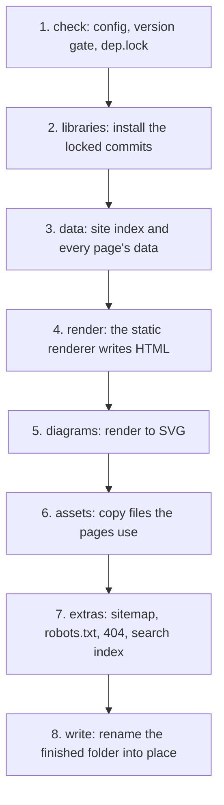

This page walks through `agentks build` step by step: what each step does, which part of agentks runs it, and what makes it fail. The command lives in `apps/agentks-engine/crates/cli/`. It opens the project through `agentks-site` in build mode, `SiteMode::Build`, which renders every route once and leaves drafts out.

## The command

```bash
agentks build                                   # into dist/, beside config/
agentks build --out /srv/site --base /docs      # another folder, served under /docs
agentks build --site-url https://docs.example.com --json
```

| Flag | Meaning |
|---|---|
| `--out <DIR>` | The output folder. Default: `dist/` beside `config/` |
| `--base <PATH>` | The hosting prefix, such as `/docs`. Default: `site.yaml`'s `base_path`, else `/` |
| `--site-url <URL>` | The site's public address, used for the sitemap |
| `--json` | One JSON document on stdout, as every command gives |

The exit codes follow the CLI's contract: `0` success, `1` a failed build, `2` wrong usage. The build needs `bun` or `node` on the path, and the network for any locked library commit the machine does not have yet.

## The steps



### 1. Check

The build loads `config/` like every other command. Config loading runs the version gate right after it reads `engine_version`, so content outside the engine's supported range stops the build with the migration message and nothing else. The build also needs `config/dep.lock` when the project uses a git library.

### 2. Libraries

The build installs exactly the commits `dep.lock` pins, the way `npm ci` installs from a lockfile. It fetches any commit the machine's store lacks and reuses the ones it has. A Docker build can mount a cache for `~/.agentks/libraries/`, so a rebuild does not fetch again.

### 3. Data

Rust builds the site index and computes every page's data with the same code that answers the local client over the WebSocket. The build does not reach into the loaders directly. It asks for page data through the same interface the server uses, so the local tool and the published site cannot disagree. Drafts and dev-only content are left out.

URLs in page data are root-absolute and carry no hosting prefix. The prefix, a `BasePath` from `agentks-core`, is added once, when an href is written. So one computed page serves both `/` and `/docs`.

### 4. Render

Rust starts the static renderer as a child process and streams page data to it. The renderer renders each page with the shared components and returns the HTML. The data is handed over directly. It is never written out for a browser to fetch. The [static renderer page](./10_static-renderer.md) covers this step.

### 5. Diagrams

Mermaid and Graphviz fences and embeds render to inline SVG. They show without JavaScript, and search engines can read their text. Excalidraw and draw.io scenes render to SVG with their own export functions. A diagram page gets its SVG in the page body. A diagram that fails to render fails the build, naming the file and line.

### 6. Assets

Rust copies what the pages use into the output: each page's colocated assets, the artifact pages, the compiled theme CSS, the island bundles, and each library element a page or artifact uses. `lib_urls_in` from the library crate finds the `/_lib/` URLs in artifact HTML, so only elements in use are copied.

### 7. Extras

Rust writes the files a static site needs beside its pages: `sitemap.xml`, `robots.txt` and `404.html`. It also builds the static search index with Pagefind, so search works on a site with no server.

### 8. Write

The build writes everything into a temporary folder and renames it over the output folder at the end. A failed build never leaves half a site, and the previous output stays untouched.

## Failure

A build fails on any error the engine would show locally:

- a broken link or a missing embed;
- an unknown library alias or element;
- a diagram that does not render;
- a missing JavaScript runtime.

Each error carries the file and the line. A published site never ships with a known defect. Warnings do not fail the build.

## Related

- [What the output holds](./15_output.md): the files this pipeline writes.
- [Libraries](../35_libraries/01_overview.md): how the engine fetches locked commits into the machine's store.
