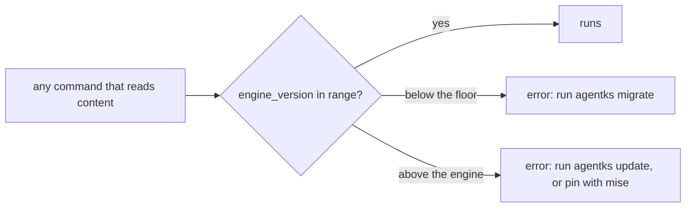

This section explains how agentks keeps content and engine in step. The binary carries one version. Every project states the engine version it targets. A check called the **version gate** refuses to run content outside the range the engine supports. When a release changes the content format, a **migration** script brings content forward. Read this section before you change a format, add a migration script or prepare a release.

To upgrade a project as a user, read the user guide's [upgrading section](../../user-guide-2/60_upgrading/01_overview.md) instead.

## What carries a version

| Thing | Version | Where it is written |
|---|---|---|
| The binary: engine, CLI, client and static renderer | One x.y.z for all of them | `[workspace.package] version` in `apps/agentks-engine/Cargo.toml`. The release tag is `vX.Y.Z` on the main repository |
| A project's content | The engine version it targets | `engine_version` in `config/site.yaml` |
| A library | Its own x.y.z series | `version` in its `manifest.json`, and its repository's tags |
| What a library needs | A range of engine versions | `engine` in its `manifest.json`, for example `>=1.0.0 <2.0.0` |
| Each AI plugin | Its own x.y.z | The plugin's manifest |

The engine and the client ship in one binary, so they share one version and one release. The plugins and the default library version on their own.

## Reading a version number

A version is read by position, because "minor" and "patch" mean different places to different readers.

| Place | Moves for |
|---|---|
| x | Reserved: 0 is beta, 1 and above is production. A breaking release moves it |
| y | Major upgrades |
| z | Small additions and fixes |

1.0.0 is the first production release.

## The three mechanisms

| Mechanism | Does | Lives in |
|---|---|---|
| The version gate | Refuses content whose `engine_version` is below the engine's floor or above the engine | `apps/agentks-engine/crates/config/src/gate.rs` |
| Docs migrations | Bring a project's content up to the engine's version. The project's user runs them with `agentks migrate` | `apps/agentks-engine/crates/migrate/` (the runner) and `apps/agentks-engine/migrations/docs/` (the scripts) |
| Library migrations | Bring a library up to a new engine. The library's owner runs them and tags a new library version | `apps/agentks-engine/migrations/library/` |

## The rules

- **Migrations are forced.** The engine supports current content only. A user who does not want to migrate pins an older agentks per project with mise.
- **The gate never needs the network.** It is plain code in the binary and works offline, on a machine that has never run a migration.
- **Scripts are not in the binary.** `agentks migrate` downloads the ones it needs from the official repository, at the installed binary's own release tag.
- **Users never migrate a library.** Libraries sit read-only in the machine's store. The owner publishes a new version, and users move their pin.
- **One release.** The only release artifact is the compressed installer.

## Pages in this section

| Page | Explains |
|---|---|
| [The version gate](./05_version-gate.md) | The two constants, the check, its messages, and when the floor moves |
| [agentks migrate](./10_migrate-runner.md) | The runner, step by step, and its safety rails |
| [The script contract](./15_script-contract.md) | How a migration script is named, called and tested, and how to write one |
| [Library migrations](./20_library-migrations.md) | Engine ranges, what happens when an engine outgrows a library, and the owner's migration |
| [Releases](./25_releases.md) | The one release stream, release notes, and the checklist for a format change |

## Related sections

- [Libraries](../35_libraries/01_overview.md): how the engine checks a library's `engine` range during a sync.
- [Contributing](../55_contributing/01_overview.md): the gate ladder and tests every change passes before a release.
