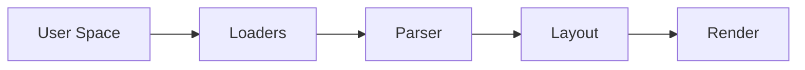
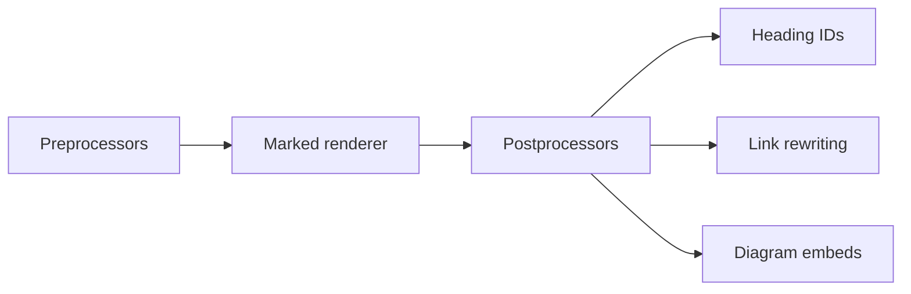
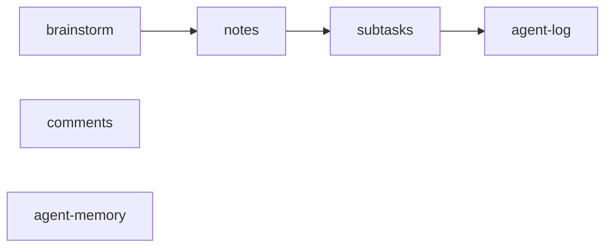

# Architecture Tour

This is a five-minute tour of how agent-knowledge-system works. We start with the one idea the whole project rests on. Then we follow a markdown file from the disk all the way to the page in your browser.

## The filesystem is the document

Every page in this project is a plain file on disk. The site is not the source of truth. The folder of markdown is.

- Obsidian
- cat and grep
- Your editor
- An AI agent
- The rendered site

That means the same file has to read well everywhere. It should read well in **Obsidian**, and in **cat and grep** at the terminal.

It should also read well in **your editor**, and to **an AI agent** walking the folder tree. Agents are the main audience here, so this matters more than it would for a normal docs site.

**The rendered site** is just one more reader. If a relative link is correct on disk but breaks on the site, the renderer has the bug. We fix the renderer. We never bend the content to suit it.

## Five layers



The engine is an Astro app built as five layers. Each layer hands its output to the next one, from left to right.

**User Space** is everything you own. That means your config files, your markdown, your themes and your images.

**Loaders** read that user space. **Parser** turns markdown into HTML. **Layout** wraps the HTML in a page, and **Render** serves the finished page to the browser.

## Loaders and configuration

```yaml
engine_version: "0.3.10"
paths:
  data: "../data"
  assets: "../assets"
theme: "full-width"
```

Everything starts with one file, site dot yaml. The loaders read it first, before any content.

The **engine_version** line says which engine version this content was written for. If the content is too old or too new, the engine refuses to start. It never guesses. Migration scripts move old content forward.

The **paths** section defines aliases. Each key becomes an at-sign alias, like at-data or at-assets, and resolves to a real folder on disk.

And **theme** picks the active theme by name. The loaders find it, merge it with the theme it extends, and hand one stylesheet to the layouts.

## The parser pipeline



Every markdown file goes through the same pipeline, in three stages.

**Preprocessors** work on the raw markdown. They pull in embedded files and protect code blocks, so nothing later touches them by accident.

The **Marked renderer** turns markdown into HTML. It highlights code, and it leaves diagram blocks as empty containers for the browser to draw.

**Postprocessors** then clean up the HTML. They add **heading IDs** for the outline. They handle **link rewriting**, so relative links on disk become working site links. And they turn **diagram embeds** into live Excalidraw and draw.io canvases.

## Layouts and routing

| Content type | Routes | Entry files |
|---|---|---|
| Docs | One page per file | Layout |
| Blog | Index and posts | IndexLayout, PostLayout |
| Issues | Index and detail | IndexLayout, DetailLayout |
| Custom | One free page | Layout |

One catch-all route handles every URL. It finds the page, reads its content type, and picks a layout for it.

**Docs** pages get a sidebar, an outline and pagination. **Blog** posts get an index page and one page per post.

**Issues** are the tracker. Each issue is a folder, with its metadata in a settings file. **Custom** pages cover anything else, like the home page.

Layouts never hard-code a colour or a font size. They only read variables from the theme contract, so any theme can restyle any layout.

## Themes

```css
:root {
  --color-text-primary: #1f2328;
  --color-brand-primary: #0969da;
  --ui-text-body: var(--font-size-sm);
  --content-body: var(--font-size-base);
}
```

A theme is a folder with a theme file and some CSS. It can extend another theme and override only what it needs.

Colours come in roles, not raw values. A layout asks for **color-text-primary** or **color-brand-primary**, and the theme decides what those look like in light and dark mode.

Type sizes work the same way, in two tiers. Page chrome like buttons and tables uses **ui-text-body**. Rendered prose uses **content-body**. The names carry the intent, so a redesign of one never shrinks the other by accident.

## The issue tracker



The tracker lives in the same content folder, and it follows the same rule. Each issue is a folder of plain files.

Work moves from **brainstorm**, where ideas are argued out, to **notes**, where decisions are written down. Then come **subtasks**, the plan, and the **agent-log**, the record of what a run actually did.

Alongside those sit **comments**, the history of how the issue changed, and **agent-memory**, the working state an AI needs to pick the issue back up next session.

## Three stages

| Stage | Who | Tooling |
|---|---|---|
| Development | A maintainer | Repo scripts and the engine |
| Writing | An AI or a human | The agent-ks CLI and skills |
| Host | Nobody | None, it is a static site |

The project is used in three stages. Each stage belongs to different people, so each gets different tools.

**Development** is where a maintainer works on the engine itself. Its tools need the source code and a running server, so they never ship.

**Writing** is where an agent or a person edits content. Its tool is the agent-ks command line, a single Rust binary that needs nothing but the files.

**Host** is the built site, served as static pages. Nothing runs there at all.

## Wrapping up

So, to recap. Files are the source of truth. Five layers turn them into pages. And each stage gets exactly the tools it needs, and nothing more.

This video is itself a markdown page. Scroll down and you will find its transcript, which is the whole source. Each heading is a scene, each paragraph is spoken, and each bold phrase is what the camera looks at.
