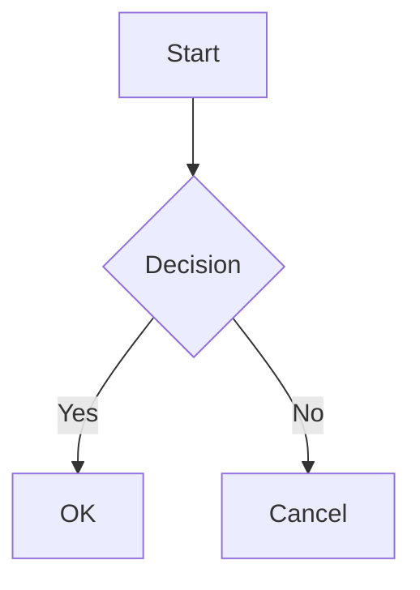
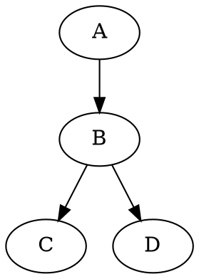
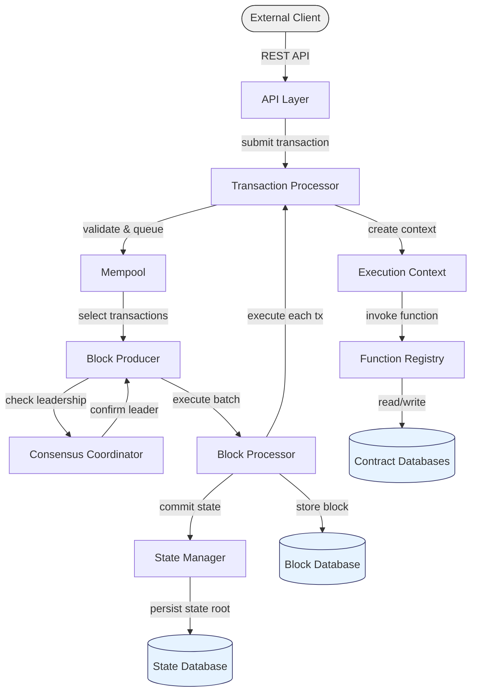

# Diagrams Script

**File:** `src/scripts/diagrams.ts`

Renders `mermaid`, `dot`, and `graphviz` fenced code blocks and `.excalidraw` references into SVG diagrams. Libraries are lazy-loaded from npm (Vite code-splits them) — pages without diagrams load zero extra JavaScript.

## How It Works

1. The markdown renderer (`marked.ts`) converts diagram code blocks into `<div class="diagram diagram-{type}">` containers with the raw source text; the excalidraw-embed postprocessor emits the same container with a `data-src` URL instead of inline source
2. This script finds those containers and renders them into SVGs using the appropriate library

```
Build time:    ```mermaid ... ```           →  <div class="diagram diagram-mermaid">source</div>
                  →  <div class="diagram diagram-excalidraw" data-src="…?v=<mtime>">
Browser:       <div class="diagram …">      →  <svg>...</svg>
```

## Supported Sources

| Source | Renderer | Library |
|---------------------|----------|---------|
| ` ```mermaid ` fence | Mermaid | `mermaid` (npm) |
| ` ```dot ` / ` ```graphviz ` fence | Graphviz | `@hpcc-js/wasm-graphviz` (npm) |
| `.excalidraw` reference (embed or page) | Excalidraw `exportToSvg` | `@excalidraw/excalidraw` (npm) |

## Excalidraw Rendering

`renderExcalidraw()` is the reference-based branch — nothing is inlined or
baked at build time:

1. `fetch(data-src, { cache: 'no-cache' })` — the scene JSON is fetched
   fresh on every page view; `no-cache` forces revalidation, and the dev
   asset route answers with a cheap ETag 304 when the file is unchanged.
   The URL's `?v=<mtimeMs>` param busts long-lived caches on static
   production hosts.
2. `exportToSvg({ elements, appState, files })` converts the scene in the
   browser; the SVG replaces the placeholder's content.
3. A caption is appended: the `data-title` plus an *open file ↗* anchor to
   the raw scene URL (click is stopped from propagating so it doesn't
   trigger the lightbox).

Fetch failures, non-OK responses, and malformed JSON all mark the div
`.diagram-error` with a readable message.

**Dependency gotchas:** `exportToSvg` ships in the main
`@excalidraw/excalidraw` package (the `@excalidraw/utils` npm package is a
stale test release — never use it). Excalidraw pins `clsx@1.x` (CJS); the
framework keeps a direct `clsx@^2.1.1` dependency so bun doesn't hoist the
CJS version over Astro's ESM import — removing it breaks the static build.

## Usage

````markdown



````

## Example




## Dark Mode

Diagrams are always rendered with Mermaid's `default` (light) theme. Dark mode is handled entirely via CSS using `filter: invert(1) hue-rotate(180deg)` on the rendered SVG container.

**Why CSS instead of Mermaid's dark theme?**

Mermaid diagrams support inline `style` directives (e.g., `style Client fill:#f0f0f0,stroke:#333`). These user-defined colors override Mermaid's theme — so switching to `theme: 'dark'` changes the text color to white but leaves the fill as-is, resulting in white text on a light background (invisible).

The CSS filter approach inverts **all** colors uniformly — fills, strokes, and text — so contrast is always preserved regardless of inline styles.

```css
[data-theme="dark"] .markdown-content .diagram-rendered {
  filter: invert(1) hue-rotate(180deg);
}
```

| Filter | Effect |
|--------|--------|
| `invert(1)` | Flips all colors (light → dark, dark → light) |
| `hue-rotate(180deg)` | Rotates hues back so colors stay recognizable (blue stays blue, not orange) |

This also works for Graphviz and Excalidraw diagrams — no special handling
needed, except the excalidraw caption: it's regular UI text inside the
inverted container, so `markdown.css` counter-inverts it
(`.diagram-caption { filter: invert(1) hue-rotate(180deg) }` under
`[data-theme="dark"]`) to keep it theme-colored.

## CSS

Diagram styles are in `src/styles/markdown.css`:

```css
/* Container before rendering */
.markdown-content .diagram {
  text-align: center;
  margin: var(--spacing-lg) 0;
  padding: var(--spacing-md);
  background-color: var(--color-bg-secondary);
  border-radius: var(--border-radius-md);
  border: 1px solid var(--color-border-light);
  overflow-x: auto;
}

/* After rendering — remove container styling */
.markdown-content .diagram-rendered {
  background: none;
  border: none;
}

.markdown-content .diagram svg {
  max-width: 100%;
  height: auto;
}

/* Dark mode — invert all diagram colors uniformly */
[data-theme="dark"] .markdown-content .diagram-rendered {
  filter: invert(1) hue-rotate(180deg);
}
```

## Events

| Event | Direction | Purpose |
|-------|-----------|---------|
| `diagrams:rendered` | Dispatches | Notifies other scripts (lightbox) that SVGs are ready |
| `diagrams:render` | Listens | Re-renders unprocessed diagrams (used by live editor) |
