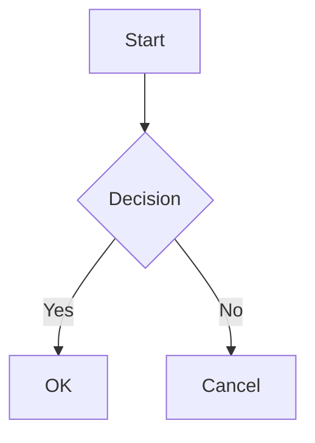
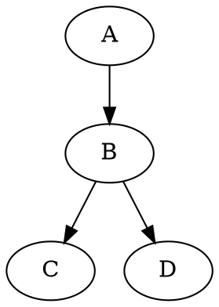
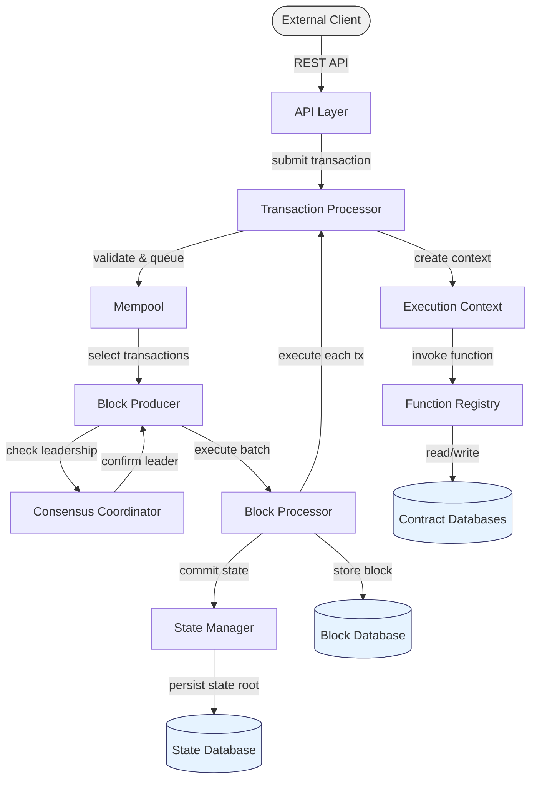
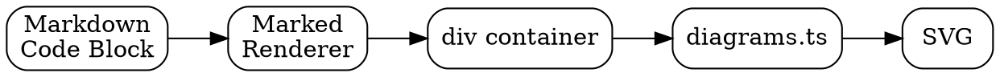

# Diagrams Script

**File:** `src/scripts/diagrams.ts`

Renders `mermaid`, `dot`, and `graphviz` fenced code blocks and `.excalidraw` / `.drawio` references into SVG diagrams. Renderers are lazy-loaded (Vite code-splits them) — pages without diagrams load zero extra JavaScript. Three of the four come from npm; draw.io is vendored, for the reason given in [draw.io Rendering](#drawio-rendering) below.

## How It Works

1. The markdown renderer (`marked.ts`) converts diagram code blocks into `<div class="diagram diagram-{type}">` containers with the raw source text; the diagram-embed postprocessor emits the same container with a `data-src` URL instead of inline source
2. This script finds those containers and renders them into SVGs using the appropriate library. For Mermaid/Graphviz the original fence text is preserved on the container as `data-diagram-source` before rendering — the lightbox reads it for its *copy source* action. Mermaid is initialized with `htmlLabels: false` (pure `<text>` labels, no `<foreignObject>`) so exported SVGs stay self-contained and rasterizable — foreignObject taints the canvas in Chromium, which would break the lightbox *copy as image* action

```
Build time:    ```mermaid ... ```           →  <div class="diagram diagram-mermaid">source</div>
                  →  <div class="diagram diagram-excalidraw" data-src="…?v=<mtime>">
                        →  <div class="diagram diagram-drawio"     data-src="…?v=<mtime>">
Browser:       <div class="diagram …">      →  <svg>...</svg>
```

## Supported Sources

| Source | Renderer | Library |
|---------------------|----------|---------|
| ` ```mermaid ` fence | Mermaid | `mermaid` (npm) |
| ` ```dot ` / ` ```graphviz ` fence | Graphviz | `@hpcc-js/wasm-graphviz` (npm) |
| `.excalidraw` reference (embed or page) | Excalidraw `exportToSvg` | `@excalidraw/excalidraw` (npm) |
| `.drawio` reference (embed or page) | draw.io `GraphViewer` | vendored — `src/vendor/drawio/` |

## Excalidraw Rendering

`renderExcalidraw()` is the reference-based branch — nothing is inlined or
baked at build time:

1. `fetch(data-src, { cache: 'no-cache' })` — the scene JSON is fetched
   fresh on every page view; `no-cache` forces revalidation, and the dev
   asset route answers with a cheap ETag 304 when the file is unchanged.
   The URL's `?v=<mtimeMs>` param busts long-lived caches on static
   production hosts.
2. `exportToSvg({ elements, appState, files })` converts the scene in the
   browser; the SVG replaces the placeholder's content.
3. A caption is appended: the `data-title` plus an *open file ↗* anchor to
   the raw scene URL (click is stopped from propagating so it doesn't
   trigger the lightbox).

Fetch failures, non-OK responses, and malformed JSON all mark the div
`.diagram-error` with a readable message.

**Dependency gotchas:** `exportToSvg` ships in the main
`@excalidraw/excalidraw` package (the `@excalidraw/utils` npm package is a
stale test release — never use it). Excalidraw pins `clsx@1.x` (CJS); the
framework keeps a direct `clsx@^2.1.1` dependency so bun doesn't hoist the
CJS version over Astro's ESM import — removing it breaks the static build.

## draw.io Rendering

**File:** `src/scripts/drawio.ts` — dynamically imported by `diagrams.ts`
only when a `.diagram-drawio` container is on the page, so neither the
viewer nor the theme observer that module installs reaches other pages.

### Why the renderer is vendored

draw.io publishes **no npm package**. Its renderer — `GraphViewer` — ships
only inside the webapp, as `src/main/webapp/js/viewer-static.min.js`. The
alternatives were each rejected for a concrete reason:

| Option | Rejected because |
|---|---|
| A CDN `<script>` from `viewer.diagrams.net` | A built site would stop rendering offline, and every reader would hit a third party |
| Build-time export via `drawio-headless` | Needs a platform-native binary; a consumer could no longer build with `bun install` alone |
| Rendering the mxGraph XML ourselves via `mxgraph` | Only partial fidelity — draw.io's shape catalogue is far larger than the base library's |

So the file is committed at `src/vendor/drawio/viewer-static.min.js`
(Apache-2.0, 3.0 MiB raw / 0.81 MiB gzipped) with its `LICENSE` and a
`README.md` carrying the upstream version, SHA-256 and upgrade procedure.
Read that README before bumping it.

### Loading it

It is a UMD bundle that installs globals rather than exporting anything, so
it cannot be `import`ed for its value. `drawio.ts` imports it with Vite's
`?url` suffix — emitted as a content-hashed asset, never parsed into the
main bundle — and injects it as a `<script>` tag on first use.

**Six globals must be set before that script executes.** Its first statement
claims each with `window.X = window.X || "<remote>"`, all six pointing at
`viewer.diagrams.net`:

```
PROXY_URL · STYLE_PATH · SHAPES_PATH · STENCIL_PATH · DRAW_MATH_URL · GRAPH_IMAGE_PATH
```

`drawio.ts` overwrites all six and blanks `DRAWIO_LOG_URL`, because a built
site must make no third-party request when a reader opens a page. It also
claims `window.onDrawioViewerLoad`, which the bundle calls *instead of*
`GraphViewer.processElements()` — we construct every viewer ourselves, so the
global scan for `.mxgraph` elements is suppressed rather than left to run.

The six split across two routes, by who owns the files:

| Global | Points at | Owner |
|---|---|---|
| `STENCIL_PATH` · `STYLE_PATH` · `SHAPES_PATH` · `GRAPH_IMAGE_PATH` · `PROXY_URL` | `/assets/drawio/…` | the **project** — a consumer can populate these without touching code |
| `DRAW_MATH_URL` | `/vendor/drawio/math` | the **framework**, served from `public/` |

`DRAW_MATH_URL` is the odd one out because it is the only path fetched
eagerly: the bundle calls `Editor.initMath()` at load and unconditionally
appends `${DRAW_MATH_URL}/startup.js`. Left pointing at a project path it
404s on every page with a diagram, so `public/vendor/drawio/math/startup.js`
is a deliberate no-op that resolves the request. MathJax itself is not
bundled — it is large, and only matters for diagrams saved with `math="1"`,
which queue and never typeset (the graceful path drawio takes when
`window.MathJax` is undefined).

If an upstream bump adds a seventh remote path, it has to be overridden too —
that is the one thing the vendored README asks you to re-check on upgrade.

### What is not bundled

draw.io's code-defined shapes (default palette, flowchart, UML, ER, arrows,
containers) are compiled into the bundle. Its **stencil libraries** — the
AWS / Azure / GCP / Cisco icon sets — are ~21 MB of separate XML and are not.
A diagram using one renders the fallback shape. `STENCIL_PATH` already points
at `/assets/drawio/stencils`, so a project that needs them drops the upstream
tree into its asset directory; no code change.

### Rendering a container

1. `fetch(data-src, { cache: 'no-cache' })` — same revalidation and `?v=`
   cache-busting contract as the excalidraw branch.
2. The XML is stashed on `data-diagram-source` for the lightbox *copy
   source* action, then `mxUtils.parseXml` + `new GraphViewer(host, doc, cfg)`
   renders it.
3. GraphViewer owns a **child** `.drawio-host` div, not the container itself,
   so the caption and the hover toolbar `lightbox.ts` appends as siblings
   survive a re-render.
4. A caption is appended, identical in shape to the excalidraw one.

A file with more than one `<diagram>` gets `toolbar: 'pages'` so the extra
pages are reachable; a single-page file gets no chrome. GraphViewer's own
lightbox is disabled (`lightbox: false`) — `lightbox.ts` owns expand and copy
for every diagram format.

## Usage

````markdown

```mermaid
graph TD
    A[Start] --> B{Decision}
    B -->|Yes| C[OK]
    B -->|No| D[Cancel]
```


```dot
digraph G {
    A -> B -> C;
    B -> D;
}
```
````

## Example


```mermaid
flowchart TD
    Client([External Client]) -->|REST API| API[API Layer]
    API -->|submit transaction| TP[Transaction Processor]
    TP -->|validate & queue| MP[Mempool]
    MP -->|select transactions| BP[Block Producer]
    BP -->|check leadership| CC[Consensus Coordinator]
    CC -->|confirm leader| BP
    BP -->|execute batch| BProc[Block Processor]
    BProc -->|execute each tx| TP
    TP -->|create context| EC[Execution Context]
    EC -->|invoke function| FR[Function Registry]
    FR -->|read/write| DB[(Contract Databases)]
    BProc -->|commit state| SM[State Manager]
    SM -->|persist state root| SDB[(State Database)]
    BProc -->|store block| BDB[(Block Database)]

    style Client fill:#f0f0f0,stroke:#333
    style DB fill:#e6f3ff,stroke:#336
    style SDB fill:#e6f3ff,stroke:#336
    style BDB fill:#e6f3ff,stroke:#336
```


```dot
digraph DiagramFlow {
    rankdir=LR;
    node [shape=box, style=rounded];

    md [label="Markdown\nCode Block"];
    marked [label="Marked\nRenderer"];
    div [label="div container"];
    script [label="diagrams.ts"];
    svg [label="SVG"];

    md -> marked -> div -> script -> svg;
}
```

## Dark Mode

**Two mechanisms, split by format.** Mermaid, Graphviz and Excalidraw are
colour-inverted in CSS. draw.io is not — it renders a native dark palette.
The split is deliberate and the selectors enforce it: every invert rule in
`markdown.css` carries `:not(.diagram-drawio)`.

| Format | Mechanism | Why |
|---|---|---|
| Mermaid · Graphviz · Excalidraw | `filter: invert(1) hue-rotate(180deg)` | Line diagrams where every colour is a stroke or fill; inversion preserves contrast whatever the author wrote |
| draw.io | GraphViewer's own dark palette | Files routinely carry raster icons and screenshots, which a filter turns into negatives; and the dark version ends up in the SVG itself rather than over it |

### The inverted formats

Diagrams are always rendered with Mermaid's `default` (light) theme. Dark mode is handled entirely via CSS using `filter: invert(1) hue-rotate(180deg)` on the rendered SVG container.

**Why CSS instead of Mermaid's dark theme?**

Mermaid diagrams support inline `style` directives (e.g., `style Client fill:#f0f0f0,stroke:#333`). These user-defined colors override Mermaid's theme — so switching to `theme: 'dark'` changes the text color to white but leaves the fill as-is, resulting in white text on a light background (invisible).

The CSS filter approach inverts **all** colors uniformly — fills, strokes, and text — so contrast is always preserved regardless of inline styles.

```css
[data-theme="dark"] .markdown-content .diagram-rendered {
  filter: invert(1) hue-rotate(180deg);
}
```

| Filter | Effect |
|--------|--------|
| `invert(1)` | Flips all colors (light → dark, dark → light) |
| `hue-rotate(180deg)` | Rotates hues back so colors stay recognizable (blue stays blue, not orange) |

This also works for Graphviz and Excalidraw diagrams — no special handling
needed, except the excalidraw caption: it's regular UI text inside the
inverted container, so `markdown.css` counter-inverts it
(`.diagram-caption { filter: invert(1) hue-rotate(180deg) }` under
`[data-theme="dark"]`) to keep it theme-colored.

### draw.io, and why it opts out

Inverting a draw.io diagram is wrong for two reasons, and note that *hue
shift is not one of them* — `invert(1) hue-rotate(180deg)` roughly preserves
hue (green stays green, it just flips lightness), which is exactly why the
filter is a good trade for the other three formats.

What it cannot handle is **raster content**: the filter applies to the whole
container, so embedded icons, logos and screenshots become negatives.
draw.io files carry those far more often than a mermaid fence does. And the
filter is a *presentation* trick — the SVG underneath is still light, so
anything that leaves the page (download, copy-as-image, print) carries the
light version, and every non-diagram child of the container needs a
counter-filter to stay readable.

GraphViewer instead re-resolves the palette for a dark canvas: dark
background, light default strokes, and author-set colours mapped to dark-canvas
equivalents that keep their identity.

Two flags have to agree, and they live at different levels:

| Flag | Level | Governs |
|---|---|---|
| `graphConfig['dark-mode']` (`'dark'` / `'light'` / `'auto'`) | per viewer | container chrome and background |
| `Editor.darkMode` (boolean) | global | shape fill/stroke resolution at validation time |

Set only the first and the canvas goes dark while the strokes stay black.

**On a theme toggle the viewer is rebuilt, not re-themed.** GraphViewer
supports an in-place flip (`darkMode` + `darkModeChanged()`), but shape fills
were already resolved against `Editor.darkMode` when the graph was validated,
so anything already drawn keeps stale colours. A full rebuild costs a few
milliseconds on an action a reader takes rarely, and is correct by
construction. The rebuild preserves the `.diagram-tools` node, because
`lightbox.ts` binds each container once and skips any it has already seen — a
toolbar destroyed here would never come back.

The toggle dispatches no custom event; it flips `data-theme` on the root
element, so `drawio.ts` watches it with a `MutationObserver` — the same
approach `scripts/artifacts.ts` uses.

The lightbox needs the same carve-out: an opened draw.io SVG is cloned with a
`lightbox-svg-themed` marker class, and the overlay's invert rule is
`.lightbox-svg:not(.lightbox-svg-themed)`.

### The SVG has to carry its own scheme, or it goes light when detached

GraphViewer writes colours as `light-dark(<light>, <dark>)` in **inline
`style` attributes**, and picks the branch from the *inherited*
`color-scheme` — which it sets on the container it owns, **not** on the
`<svg>`. So the dark rendering only holds while the SVG is still inside that
container. Detach it and every `light-dark()` falls back to light.

Two consumers detach it, and both were affected:

| Consumer | What it does |
|---|---|
| `lightbox.ts` | `svg.cloneNode(true)` into the overlay — no dark ancestor, so the expanded view came out light while the page was dark |
| `diagram-actions.ts` | serialises a clone into a standalone `image/svg+xml` blob, after `removeAttribute('style')` — a downloaded SVG was always the light one |

Fixed at the source rather than in each consumer: `stampColorScheme()` in
`drawio.ts` writes the scheme into the SVG itself, as a `<style>` **child**
so it survives both `cloneNode` and `removeAttribute('style')`.

**The selector is class-scoped, and must stay that way.** A `<style>` inside
*inline* SVG is not scoped to that SVG — its rules apply to the whole
document — so a bare `svg { color-scheme: dark }` would reach every other
diagram on the page. The rule emitted is
`svg.drawio-scheme-dark{color-scheme:dark}` with the matching class on the
root element, which also makes it correct once serialised standalone.

### PNG export is withheld, not attempted

draw.io renders labels as `<foreignObject>`. Chromium taints a canvas that an
SVG image containing one is drawn onto, so `toBlob` throws
`SecurityError: Tainted canvases may not be exported` — every PNG action
fails outright, in either theme.

`ActionTarget.rasterizable: false` (set for `.diagram-drawio`) drops the PNG
entries from the dropdown and hides the split button's primary half in both
the viewer toolbar and the inline hover toolbar. *Download SVG*, *copy
source* and *download source* are unaffected.

**We do not take the `htmlLabels: false` trade here**, the one Mermaid takes
a few sections up. Mermaid labels are plain text by nature; draw.io labels
legitimately carry rich HTML, and degrading how a diagram *renders* to enable
a secondary export is the wrong way round.

The way to have both would be to re-render the stored XML offscreen with
`mxClient.NO_FO = true` at export time and serialise *that* — display stays
faithful, export rasterizes. It is maybe 25 lines plus a second render per
export, and is recorded as a follow-up rather than built on spec.

## CSS

Diagram styles are in `src/styles/markdown.css`:

```css
/* Container before rendering */
.markdown-content .diagram {
  text-align: center;
  margin: var(--spacing-lg) 0;
  padding: var(--spacing-md);
  background-color: var(--color-bg-secondary);
  border-radius: var(--border-radius-md);
  border: 1px solid var(--color-border-light);
  overflow-x: auto;
}

/* After rendering — remove container styling */
.markdown-content .diagram-rendered {
  background: none;
  border: none;
}

.markdown-content .diagram svg {
  max-width: 100%;
  height: auto;
}

/* Dark mode — invert all diagram colors uniformly, except draw.io,
   which resolves its own dark palette */
[data-theme="dark"] .markdown-content .diagram-rendered:not(.diagram-drawio) {
  filter: invert(1) hue-rotate(180deg);
}
```

## Events

| Event | Direction | Purpose |
|-------|-----------|---------|
| `diagrams:rendered` | Dispatches | Notifies other scripts (lightbox) that SVGs are ready |
| `diagrams:render` | Listens | Re-renders unprocessed diagrams (used by live editor) |
