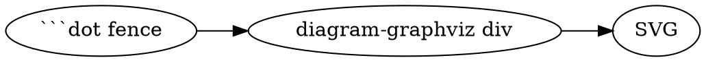

# Diagram embeds — canonical syntax + live verification

This note is the verification artifact for `subtasks/10_embeds/10_mermaid.md`
and `20_graphviz.md`: every diagram below must render on this page. The two
source files live in this issue's `assets/` (which never appears in the
sidebar). These are the **canonical embed forms** the skills and user-guide
teach.

## Inline fence — mermaid

```mermaid
flowchart LR
  fence["```mermaid fence"] --> div[.diagram-mermaid div] --> svg[rendered SVG]
```

## Inline fence — graphviz



## By reference — mermaid (`[[./../assets/embed-test.mmd]]` inside the fence)

```mermaid
[[./../assets/embed-test.mmd]]
```

## By reference — graphviz (`[[./../assets/embed-test.dot]]` inside the fence)

```dot
[[./../assets/embed-test.dot]]
```

Resolution rules (verified against `src/parsers/preprocessors/asset-embed.ts`
and `src/parsers/content-types/issues.ts`):

- **Inside a code fence, the path MUST start with `./`** — anything else
  (bare names, `../…`) is deliberately skipped so documentation examples
  don't get expanded (`asset-embed.ts:154`).
- Paths resolve relative to the markdown file itself. From `issue.md`:
  `[[./assets/name.mmd]]`. From a file in `notes/`:
  `[[./../assets/name.mmd]]`. Same rule in docs/blog pages.
- The bare-name → `assets/` shorthand only applies *outside* fences (image
  embeds etc.), not to in-fence content embedding.
