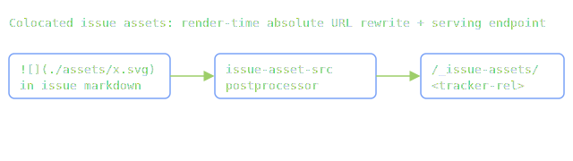

Colocated assets don't work anywhere in issues content: an image at `<issue>/assets/x.svg` referenced as `` 404s on every issue route, and `[[path]]` content embeds are silently inert (the preprocessor was never registered for `IssuesParser`). Docs/blog have the embed preprocessor; no content type rewrites ``.

Two halves, same class of fix as subtask 03 (render-time absolute URLs, browser-position-independent):

- [x] **Wire `asset-embed` into `IssuesParser`** with the issue-folder resolver (`./`/`../` file-relative, bare name → `<dir>/assets/<name>` — the until-now-dead `getAssetPath()`). `[[path]]` content embeds then work in issue.md, subtasks, notes, agent-logs.
- [x] **`issue-asset-src` postprocessor** (issues pipeline only): rewrite relative `` (rendered `` and raw ``) to absolute `/issue-assets/<path-relative-to-tracker-root>`. Absolute / external / `data:` srcs untouched. Depth-proof for the detail-URL collapse and the Comprehensive-panel embeds.
- [x] **`/issue-assets/[...path]` endpoint**: serve non-markdown, non-`settings.json` files from inside any configured issues tracker's data dir (mirrors `pages/assets/[...path].ts` — first-match-wins across trackers, mime + ETag/304; `getStaticPaths` enumeration for static builds). Astro excludes `_`-prefixed page dirs from routing, so the prefix is unprefixed; the static segment outranks the `[...slug]` catch-all.

Verified: `./start build` clean (479 pages, asset emitted into `dist/issue-assets/…`); dev-server GET 200 with `image/svg+xml` + 404 for `settings.json` / `.md` / traversal; image renders on the sub-doc page **and** inside the detail page's Comprehensive panel; `[[../assets/…]]` embed inlines file content on a notes page. One literal `[[Skills]]` heading in `2025-06-25-claude-skills` notes now needed escaping (`\[[…]]`) — done.

Dogfood: this very subtask embeds a colocated image — it should render below on `/…/subtasks/colocated-issue-assets`:

Related: `2026-04-19-knowledge-graph-and-wiki-links/subtasks/01_unified-pipeline-and-graph.md` — the eventual unified-pipeline/URL-registry home for this; this subtask is the narrow bug fix. URL shape stays centralized in the postprocessor so the registry can swap it later.
