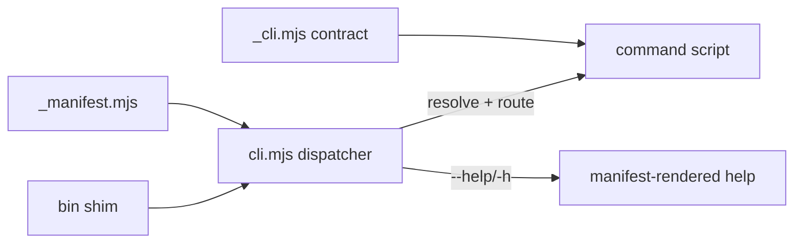

# Milestone 1 — Foundation: contract, manifest, dispatcher, help, harness

> Consolidates the original subtasks 01, 14, 02, 03, 04, 05.

## Goal
Stand up the shared substrate every command would ride on — one arg/contract layer, one command registry, one dispatcher, discoverable help — and a self-test harness to measure progress, before adding any new features.

## Approach
- **01 — naming model:** chose model **B + flat aliases** (`docs <group> <verb>` ≡ flat `docs-*`); recorded in `notes/03`.
- **14 — harness first:** `_selftest.mjs`, manifest-driven, run under **bun** (node can't resolve `gray-matter`). Established the true baseline.
- **02 — `_cli.mjs`:** lifted `parseArgs` / `printHelp` / `emitJson` / `die` / `usageError` into one shared contract module (behavior-preserving).
- **03 — `_manifest.mjs`:** single source of truth — one entry per command `{ bin, group, verb, category, script, runtime, summary, flags }`; `resolveCommand()` powers routing.
- **04 — `help`:** manifest-generated `docs help` + `docs help <cmd>` + `docs help --json` (help can't drift from reality).
- **05 — uniform contract:** global `--help`/`-h` interceptor in `cli.mjs`; `--json` on validators; uniform exit codes.

## Result
- Single dispatcher live; every command reachable as `docs <group> <verb>` and the flat alias.
- Harness **green at every step** through this milestone (the contract rollout closed Category 0 entirely).
- Help is generated from the manifest, so docs and reality can't diverge.

## Next
Correctness pass — wire orphaned validators, fix latent bugs, de-duplicate copy-pasted logic.
