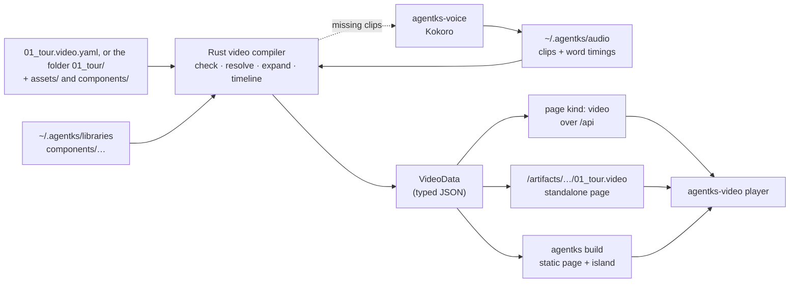

**Rust compiles, the player plays, and the files on disk stay the source.** A new video compiler crate in the Rust engine reads a video, one `.video.yaml` file or a video folder, through one loader. It checks it, resolves its library components, computes the timeline and emits typed video data. The first thing it serves is the independent artifact: a standalone player page at `/artifacts/<path>.video`, also written by `agentks video preview` with no server. Then the server sends the same data as a page of kind `video`, and the shared UI package mounts the player as an island. Audio streams are served at `/_audio/`. `agentks build` writes the same pages as static files, with the audio beside them. Nothing new is needed in markdown: a later embed uses the existing `[[./path]]` form.

## 01 The path of one video



## 02 The Rust side

### The video compiler

A new crate, `apps/agentks-engine/crates/video` (package `agentks-video-compiler`, so it is never confused with the player package). It sits above the core and uses the render crate's highlighter and the libraries crate's resolver.

| Step | Does |
|---|---|
| Detect | The site index treats `NN_*.video.yaml`, or an `NN_` folder whose `settings.json` says `"kind": "video"`, in a docs section or a tracker `notes/` or `brainstorm/` folder, as page kind `video`. The slug drops the prefix, and `.video.yaml` for a file |
| Load | One loader reads either form into one model: a single file's header and slides, or a folder's `controller.yaml` and its scene files in prefix order, with `components/` mounted as the `self` library. It checks the folder's shape (the controller, the scene names and prefixes, no stray file). It is the only step that knows the form ([the format](./03_artifact-format.md#06-how-it-is-checked)) |
| Parse | YAML with the file, line and column of every node |
| Check | The JSON Schema, then the meaning checks ([the format](./03_artifact-format.md#06-how-it-is-checked)) |
| Resolve | Each `alias:name` through the project's libraries to a pinned file and its category; each `self:name` through the same resolver to the folder's own `components/`; each bare name to the built-in pack; each `./assets/…` path to a file on disk |
| Sanitize | Every SVG through the allowlist, with ids prefixed per use ([library components](./08_library-components.md#svg-safety-an-allowlist)) |
| Pronounce | Each beat's text with the pronunciation entries that apply to it, from `config/video.yaml` and the video's `pronounce:`; with the helper installed, the unknown-word check |
| Expand | Slide templates into items and actions; the style's defaults into every slide |
| Inline | The presets, transitions, layouts, chart templates and SVG the video uses |
| Highlight | Code items, with the same highlighter as pages, into CSS classes |
| Time | Every beat, word anchor and action ([the timeline](./04_scenes-and-timeline.md#06-the-timeline)), from clip metadata when it exists, else from the estimate |
| Join | When every beat has a clip, the video's audio stream, by copying packets ([the voiceover](./07_voiceover.md#07-one-stream-per-video)) |
| Emit | `VideoData`, a serde struct. Its JSON Schema, written by `schemars`, generates the player's TypeScript types, the same way as every other page kind. Each item carries its source line, so the player's diagnostics can name it |
| Shell | The standalone page's HTML. One function writes it for the server route, `video preview` and `agentks build` |
| Transcript | The narration as HTML, grouped by slide heading, for the page body: readable with JavaScript off and indexed by site search |

**The render hash** of a video page covers the video's own bytes (the single file, or every file in the folder through the index's rolled-up folder hash), every library component it uses, every image it names, its style, the engine version and the audio state of each beat. So editing one scene, updating a library pin or finishing a clip each gives the page a new hash, and the client refetches it.

### Audio

The compiler lists every beat's clip key. The server, or a CLI command that needs audio, keeps a queue for the `agentks-voice` helper, generates missing clips first-slide-first when a video page is opened, and pushes the page's new hash when they land ([the voiceover](./07_voiceover.md#09-when-audio-is-generated)).

### The server

| Route | Serves |
|---|---|
| `/api` | The page, as `kind: "video"` page data |
| `/_audio/<key>.opus` | A video's audio stream (or, in the per-beat fallback, a clip) from `~/.agentks/audio/`. Only names of the form `<64 hex>.opus`, with range requests. Reserved, like `_lib` |
| `/artifacts/<path>.video` | The standalone player page, a shell the engine writes. `<path>` is a single file's path without `.video.yaml`, or a video folder's path, so both forms get the same address. It is engine HTML, not author HTML, so it adds nothing to the `/artifacts` trust question. `?sheet` shows the review sheet; `?theme=light` or `dark` sets the mode |
| `/_lib/<alias>/<element>` | Library images a video shows. Unchanged |

### The CLI

| Command | Does |
|---|---|
| `agentks check video [path]` | Checks one video (a `.video.yaml` file, a video folder, or any file inside one) or every video under a folder, with the error record. On a scene file it prints that scene's errors and the controller's in full and counts the rest. Exit 1 when the video has an error |
| `agentks video info <video> [--slide <n or id>]` | The timeline: every slide, beat and action with its time and its file, and pacing warnings. A scene file shows that scene. `--slide` takes a slide's number or its id, so the path of the scene file a player diagnostic names is one command away |
| `agentks video preview <video> [--sheet]` | Writes the standalone page to the build cache and opens it in the browser. Needs no server; this is the first way to watch a video. A scene file opens the page at that scene |
| `agentks video schema [--component <category>]` | Prints the video schema document, whose root checks a single file and whose `#/$defs/controller` and `#/$defs/scene` check a folder's files; or a component category's schema |
| `agentks video voice <file>` · `--all` | Generates missing clips and prints progress |
| `agentks voice install` · `status` · `remove` | Manages the helper, the model and the voices |
| `agentks library find` · `show` with `--category` | Finds components by category |
| `agentks check libraries` | Also checks every video component against its category contract |

Every command takes `--json`.

### The site index, links and moves

A video folder is one page. Every tool that walks the tree treats it as one unit.

| Tool | What it does with a video folder |
|---|---|
| The site index | Reads the folder's `settings.json`, as it does for every folder. `"kind": "video"` makes the folder one entry of kind `video`. The index does not descend into it, so its scene files are never pages, and its `components/` and `assets/` never need a `settings.json`. The sidebar label is the controller's `title`. The folder's rolled-up hash covers every file in it, so editing one scene changes the page's hash. A `kind` value the index does not know is an error, never a guess |
| Links | `[the tour](./01_tour/)` resolves to the video's page URL, as `[the tour](./01_tour.video.yaml)` does for a single file. A link to one file inside the folder follows the rule for any file that is not a page |
| `check link-form` | Accepts a link to a video folder like a link to any file that exists. It reads markdown only, and a video folder holds none, so it reads nothing inside. `check video` checks the paths inside |
| `agentks move` | Moves a video folder as one unit and rewrites the links to it. Nothing inside needs rewriting, because no path leaves the folder. For a single file it rewrites the relative paths in the file's `image:` fields, which it finds through the video crate's own list of paths, so `move` and the compiler share one reading of the format. Renaming a scene's prefix reorders the video and changes nothing else |
| Slug collisions | A single file `01_tour.video.yaml` and a video folder `01_tour/` in the same place claim one URL. The shared collision pool resolves them like any two pages |

## 03 The page data

```ts
interface VideoPage {
  kind: "video";
  url: string; hash: string; title: string; description?: string; source: string;
  transcript_html: string;
  video: VideoData;
  audio: { state: "ready" | "partial" | "none"; ready: number; total: number };
  errors: ContentError[];
}

interface VideoData {
  v: 1; title: string; aspect: [16, 9]; duration: number;            // milliseconds
  style: Style;                                                       // roles, type, space, motion
  voice: { kind: "generated" | "browser"; voice?: string; rate: number;
           stream?: string };                                         // the joined audio's URL
  defs: {                                                             // only what this video uses
    svg: Record<string, string>; presets: Record<string, Preset>;
    transitions: Record<string, Transition>; charts: Record<string, ChartTemplate>;
  };
  slides: Array<{
    id: string; start: number; end: number; head?: string; bg?: string; in: string;
    areas: Record<string, [number, number, number, number]>;       // columns and rows
    items: Array<{ id: string; kind: string; at: string; align: string; size: string;
                   tone?: string; hidden: boolean; line: number; props: Record<string, unknown> }>;
    beats: Array<{ start: number; end: number; text: string;
                   words?: Array<[number, number, number, number]> }>;
    actions: Array<{ t: number; verb: string; targets: string[]; preset?: string;
                     opts?: Record<string, string | number> }>;
  }>;
}
```

This is a starting shape. The player spike fixes the final one against the example video; the compiler then emits exactly that. Both forms of a video compile to the same `VideoData`. Its `source`, and the page's, is the single file or the video folder. A folder's slide ids are its scene slugs.

## 04 The UI side

| Where | What |
|---|---|
| `apps/packages/agentks-video/` | The player ([the player](./06_player.md)) |
| `apps/packages/agentks-ui/src/layouts/pages/video/` | The video page: title, description, the stage's box at 16:9 (so nothing jumps when the player mounts), the transcript with one anchor per beat, and any errors |
| `apps/packages/agentks-ui/src/islands/video-player/` | The island: about 30 lines of Preact that call `mountVideo` and `destroy`, loaded on demand |
| `apps/agentks-client/` | Nothing special: the island registry mounts it |
| `apps/agentks-ssg/` | Writes the page, the island's props, the standalone page and the audio |

## 05 Publishing

`agentks build` for a project with videos:

1. Compiles every video, as the server does.
2. Generates any missing clip when the voice helper is installed, then joins each video's stream. When clips are missing and the helper is not installed, the build warns and the video uses the browser voice on the published site (see the questions in [the index](./01_index.md#questions-for-sidhantha)).
3. Writes each video page: HTML with the transcript, the island's markup and props, and the player chunk with a content hash in its name.
4. Writes each standalone page to `artifacts/<path>.video/index.html`, with the same shell writer as the server.
5. Copies each video's stream to `_audio/` and the library images to `_lib/`, all with names that never change for the same content, so a CDN can cache them for good.

## 06 Security

- A video's files are data. The engine never runs anything from them.
- A folder video's own SVG components pass the same allowlist as library SVG, through the same code.
- SVG components are inlined only after the allowlist in [library components](./08_library-components.md#svg-safety-an-allowlist): the compiler parses each SVG and writes back only allowed elements and attributes, with no `<style>`, no animation elements, no links and only same-file references, and prefixes every id. Anything else is an error. This is the one sanctioned exception to the rule that library files are sandboxed, because after the allowlist the SVG cannot run or load anything.
- The standalone page is written by the engine, so `/artifacts` still serves no author HTML for videos.
- Library code (`scripts`, later) runs sandboxed, as the library system decided for all library code.
- `/_audio/` serves only cache files named by their hash.

## 07 A markdown embed, later

A markdown page embeds a video with the embed form it already has: `[[./01_tour.video.yaml]]`, or `[[./01_tour/]]` for a video folder. Rust's embed step sees that the target is a video and, instead of pasting its text, writes an island marker with the compiled video as its props. The page's hash then covers the video's. No new markdown syntax, and no library name ever appears in markdown. On disk and in Obsidian the page shows the embed line, which already means "this file goes here".

## 08 Timing against the migration

| Piece | Needs | Can start |
|---|---|---|
| The player | Nothing from the engine; fixture data | Now |
| The voice helper | Nothing from the engine | Now |
| The library restructure | Nothing; coordination with the agent filling the library | Now, before the library's first tag |
| The video compiler | The core's config loading and site index (Phase 1). Library resolution needs Phase 2's libraries; until then its tests supply a library folder through the same resolver interface, so there is no second code path | After the core's config and index |
| The standalone artifact and `video preview` | The compiler; the route also needs the server | After the player spike and the compiler |
| Video pages in the app | The client and islands (Phase 1) | After the standalone artifact |
| Audio in the app | The machine home (Phase 1) and the helper | After the voice spike |
| Publishing | `agentks build` (Phase 3) | With Phase 3 |

Video work does not block the migration's 1.0.0; the migration issue already tracks video separately. Nothing is built in today's Astro engine, so nothing is built twice. The spike branch stays as the reference for the browser-voice narrator.
