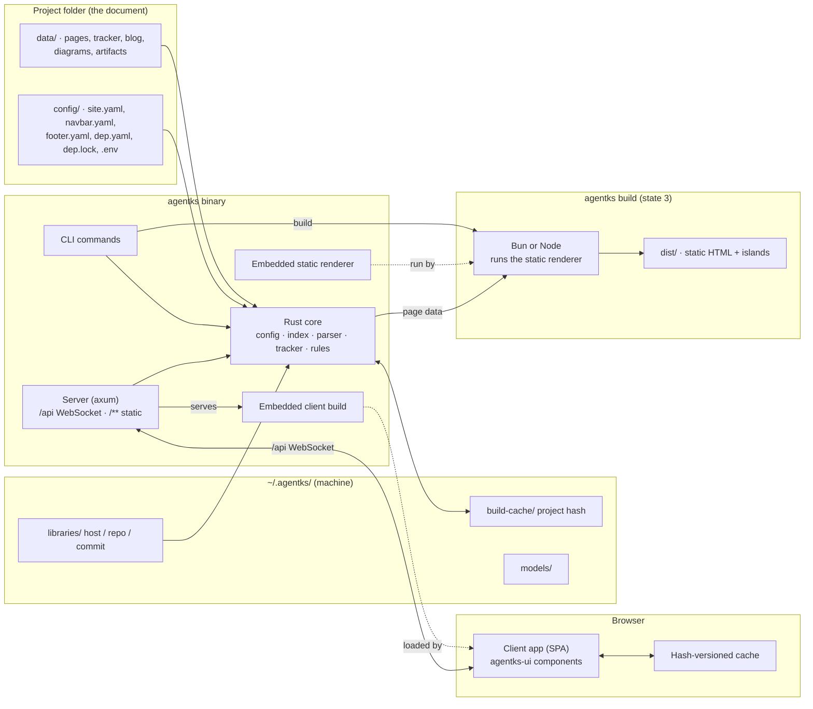
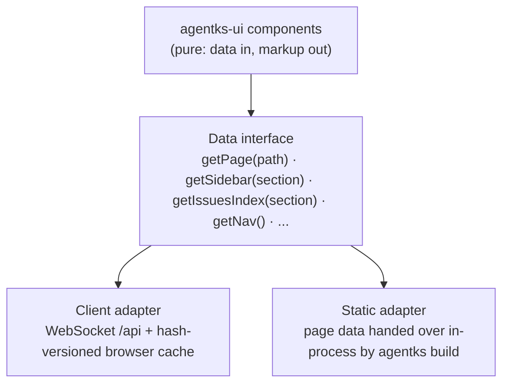

agentks is **one Rust binary plus JavaScript that renders layouts**. The Rust side is the engine, the server and the CLI, sharing one core: it watches files, keeps an index of the site, parses markdown, renders page bodies to HTML and computes every derived value. The JavaScript side is one shared UI package of pure layout components, used by two builds: the client app, a single-page app that talks to the engine over one WebSocket at `/api`, and the static renderer that `agentks build` runs to write a published site. Libraries are git repositories cached once per machine. AI plugins sit outside the binary and teach agents to use it. **If a value could be wrong, Rust computes it; the frontend decides only how things look.**

# 03 References

- [01/02 System overview](./02_system-overview.md) — goals, the three states, the phases.
- [01/04 Flows](./04_flows.md) — the components in motion.
- Component notes: [02/03 Rust engine](../02_engine/03_rust-engine.md), [02/04 Sync engine and server](../02_engine/04_sync-engine-and-server.md), [02/05 Rust CLI](../02_engine/05_rust-cli.md), [03/01 Shared UI package](../03_frontend/01_shared-ui-package.md), [03/02 Client application](../03_frontend/02_client-application.md), [05/02 Publishing (SSG)](../05_delivery/02_publishing-ssg.md), [04/01 Library system](../04_ecosystem/01_library-system.md), [05/01 Repositories and layout](../05_delivery/01_repositories-and-layout.md).
- Brainstorm record: [Rust engine and Vite frontend](../../brainstorm/01_initial-discussion/03_rust-core-and-vite-frontend.md), [the architecture discussion](../../brainstorm/01_initial-discussion/17_local-spa-over-websocket.md), [server and WebSocket](../../brainstorm/01_initial-discussion/09_server-websockets-and-editing.md), [Phase 3 publishing](../../brainstorm/02_future-stages/07_phase-3-publishing.md).
- Today's code this replaces: the Astro engine's [loaders](../../../../../../agent-ks-engine/src/loaders), [parsers](../../../../../../agent-ks-engine/src/parsers), [layouts](../../../../../../agent-ks-engine/src/layouts) and [dev-tools server](../../../../../../agent-ks-engine/src/dev-tools/server); the Rust CLI's [source](../../../../../../agent-ks-cli/src), which already re-implements frontmatter, links and issue rules.

# 04 Decisions

- Decided (sidhantha, 2026-09-29): Rust owns the engine logic and the back end. Browser code stays TypeScript.
- Decided (sidhantha, 2026-09-29): the frontend is a Vite single-page app that renders every layout. Rust renders page bodies, not page layouts. No template language, no WASM, no HTMX.
- Decided (sidhantha, 2026-09-29): Rust sends derived data. No TypeScript is generated from Rust rules; the browser receives results, not rules.
- Decided (sidhantha, 2026-09-29): one server. `/api` is a WebSocket that carries pulls and pushes; `/**` serves the frontend. There is no separate HTTP data API.
- Decided (sidhantha, 2026-09-29): in dev, the Vite dev server proxies `/api` to Rust. In local use, the Rust server serves the embedded client.
- Decided (sidhantha, 2026-09-29): the client is embedded in the binary.
- Decided (sidhantha, 2026-09-29): the hybrid index: the whole site is indexed at start-up, pages are rendered on request and cached where it pays.
- Decided (sidhantha, 2026-09-29): layouts and major data are cached in the browser, versioned by content hash.
- Decided (sidhantha, 2026-09-29): Rust compiles and caches each project's theme CSS. Common assets ship in the client build; other assets are served by Rust.
- Decided (sidhantha, 2026-09-29): no Rust server in a published site.
- Decided (sidhantha, 2026-09-30): layouts live in `apps/packages/agentks-ui`, shared by `apps/agentks-client` and `apps/agentks-ssg`.
- Decided (sidhantha, 2026-09-30): publishing is SSG with islands. `agentks build` needs Bun or Node; the static renderer ships compressed inside the binary.
- Decided (sidhantha, 2026-09-30): the official repositories are built into the binary. Migration scripts and the library catalog are downloaded from them.

# 05 Notes & Analysis

## 01 The component map

| Component | Lives in (new repository) | Language | Owns |
|---|---|---|---|
| **Rust core** | `apps/agentks-engine` | Rust | Config loading, path resolution, the site index, file watching, markdown parsing and body HTML, the issue tracker, every derived value, theme CSS compilation, library resolution, the version gate |
| **CLI** | `apps/agentks-engine` (same crate set, same binary) | Rust | Every command: queries, checks, scaffolding, `move`, `start`/`stop`/`ps`, `install`, `library`, `migrate`, `build`, `docs`, `cache` |
| **Server** | `apps/agentks-engine` | Rust (axum) | The `/api` WebSocket, the embedded client, project assets, artifacts, library element files; localhost by default |
| **Shared UI package** | `apps/packages/agentks-ui` | TypeScript (framework open) | Every layout and component: data in, markup out |
| **Client app** | `apps/agentks-client` | TypeScript, Vite | Routing with real paths, the data interface over the WebSocket, the browser cache, diagram and video rendering, the Phase 2 editor and dev toolbar |
| **Static renderer** | `apps/agentks-ssg` | TypeScript | Renders every page to HTML once for `agentks build`, with islands |
| **Migration scripts** | `apps/agentks-engine/migrations/{docs,library}` | Python, run with `uv run` | Format changes between versions; downloaded, never compiled in |
| **Default library and catalog** | `neuralabshq/agent-knowledge-system-library` | files + `manifest.json` + `library.json` | Reusable elements, templates, the list `agentks library` offers |
| **AI plugins** | `plugins/` | Markdown skills | The `agentks` usage plugin and the library-development plugin |
| **Homepage** | `apps/agentks-homepage` | Next.js static export | agentks.neuralabs.org `/` |

## 02 What each side owns

The rule of thumb: **if a value could be wrong, Rust computes it.**

| Rust (core, server, CLI) | Frontend (shared package and client) |
|---|---|
| Loads config and resolves paths and aliases | Displays what it is given |
| Watches files with `notify`; one watcher for server and CLI | Routing with real URL paths and `#heading` anchors |
| Builds and updates the site index, with content hashes rolled up through folders | Places the body HTML inside a layout |
| Parses markdown, runs pre- and postprocessors, renders body HTML, highlights code into CSS classes | UI state only: open panels, scroll, tabs, theme toggle |
| Resolves every relative link and embed; outputs root-absolute hrefs | Renders Mermaid, Excalidraw, draw.io and Graphviz in the browser |
| Computes order, URLs, slugs, heading IDs, sidebar trees, outlines, issue status categories, filter option lists | Shows artifacts and `.html` library elements in sandboxed iframes |
| Loads and validates the issue tracker | The video player |
| Compiles and caches theme CSS | Loads the CSS it is served |
| Resolves, locks and installs libraries; checks element names | Caches data by content hash; refetches only what changed |
| Renders the Phase 2 live preview on request | The Phase 2 editing UI (CodeMirror 6) and the dev toolbar |
| Enforces the version gate | — |

Rules that exist today in up to three copies (the TypeScript engine, the Rust CLI and browser scripts such as the issues layout's [detail types](../../../../../../agent-ks-engine/src/layouts/issues/default/scripts/detail/types.ts) and [index filters](../../../../../../agent-ks-engine/src/layouts/issues/default/scripts/index/filters.ts)) collapse into the Rust core. The browser receives each issue with its category and each page with its order and URL, so no browser copy remains.

## 03 Boundaries and contracts

Four contracts hold the system together. Each one is owned by one component note.

| Contract | Between | Shape | Owner note |
|---|---|---|---|
| **The content format** | Files on disk and the Rust core | Markdown with frontmatter `title`; `[text](./path)` links and `[[./path]]` embeds, relative; `NN_` prefixes; `settings.json` per folder; first-class `.mmd`, `.dot`, `.excalidraw`, `.drawio`, `.html` pages with `.meta.json` sidecars | [02/01 Content format](../02_engine/01_content-format.md) |
| **The project config** | The project and the Rust core | Required `config/` with `site.yaml`, `navbar.yaml`, `footer.yaml`, `dep.yaml` (even empty), `dep.lock`, and `.env` holding overrides such as ports | [02/02 Project config](../02_engine/02_project-config.md) |
| **The `/api` protocol** | The Rust server and the client | One WebSocket. Pulls: manifest, page, sidebar, issues index, render-this-markdown. Pushes: changed hashes, later editing and presence. Every response carries the content hash it was built from | [02/04 Sync engine and server](../02_engine/04_sync-engine-and-server.md) |
| **The page data model** | The Rust core and the shared UI package | Typed JSON per page kind (docs, blog index and post, issues index and detail, custom pages, navbar, footer). The same objects feed the client over the WebSocket and the static renderer directly | [02/03 Rust engine](../02_engine/03_rust-engine.md), [03/01 Shared UI package](../03_frontend/01_shared-ui-package.md) |

Two smaller contracts:

- **The theme contract.** Theme variables plus stable class or `data-part` hooks on layouts. CSS is the only branding tool, so renaming a hook needs a migration. `agentks theme css` prints them for the installed version ([03/04 Theming and layouts](../03_frontend/04_theming-and-layouts.md)).
- **The library manifest.** `manifest.json` with `name`, `version` (x.y.z), `description`, a required `engine` range and `elements` (`file`, `description`, `tags`) ([04/01 Library system](../04_ecosystem/01_library-system.md)).

## 04 The one data interface

The client and the static renderer share components, and the components never know where data comes from. One small module sits between them:

- In states 1 and 2 the client adapter answers through the WebSocket and the browser cache.
- In state 3 the static adapter answers from the page data Rust computed for the build. Nothing is written out as JSON for the browser to fetch.
- A component that reaches past this interface (a direct WebSocket call, `window` during render) breaks the Phase 3 build. The shared package forbids it.

## 05 The process model

**State 2, local use.** `agentks start` runs one process per project:

1. The CLI resolves the project (`./config`, or `--config-dir`, or `AGENTKS_CONFIG_FOLDER`), checks the version gate, and installs any locked library missing from the cache.
2. The core builds the site index: every file's path, frontmatter, content hash and folder roll-up hashes. Cached, expensive results (git-derived dates, highlighted code, compiled CSS) come from `~/.agentks/build-cache/<project hash>/`.
3. The server binds to localhost and serves the embedded client at `/**` and the WebSocket at `/api`. Network access is off unless the owner opts in with an access key.
4. The watcher reacts to file changes: re-hash the file and its parent chain, invalidate dependent cache entries (including pages that embed the file), and push the changed hashes to every connected client.
5. Page bodies are rendered on request and cached by content hash, in Rust and in the browser.

`agentks ps` lists running servers across projects; `agentks stop` stops them. Each project has its own port, from `site.yaml` with an optional `config/.env` override.

**State 1, development.** The engine runs from the working tree (built into `data/builds/`, selected by mise). The Vite dev server serves the client with hot reload and proxies `/api` to the engine.

**State 3, publishing.** `agentks build` runs once and exits. The core computes every page's data. The binary unpacks the static renderer and runs it with Bun or Node. The output is plain files in `dist/`. No agentks process runs in production.

**The CLI outside the server.** Most commands (`find`, `issue ...`, `check ...`, `move`, `library ...`) load the core directly, read files, and exit. They need no server and no JavaScript runtime.

## 06 What lives where on a machine

| Place | Holds | Written by |
|---|---|---|
| The binary | CLI, core, server, the compressed client build and the compressed static renderer | The installer |
| `~/.agentks/settings.json`, other config | Machine-wide settings | The user or the CLI |
| `~/.agentks/build-cache/<project hash>/` | One project's cached output; metadata in `build-cache.json` | The engine |
| `~/.agentks/libraries/<host>/<repo path>/<commit>/` | One library repository at one commit, shared by every project | `agentks install` or `start` |
| `~/.agentks/models/<model>-<version>/` | Optional downloads, such as the narration voice | The CLI on request |
| The project's `config/` | Config, `dep.yaml`, `dep.lock`, `.env` | The user; `dep.lock` by agentks |
| The project's content folders | The documents | The user and agents |

Nothing is cleaned automatically. `agentks cache clean <root>` scans for projects and removes what none of them needs, after a report ([02/06 Machine home and build cache](../02_engine/06_machine-home-and-build-cache.md)).

## 07 What is downloaded, and from where

The binary stays lean because four things are fetched, not bundled. Every fetch goes to an address built into the binary or named by the user in `dep.yaml`.

| Thing | From | When |
|---|---|---|
| Libraries | Their git source in `dep.yaml`, pinned by commit in `dep.lock`; fetched shallow through a Rust git library | `agentks start`, `install`, `build` |
| The library catalog `library.json` | The official library repository | `agentks library`, `agentks init --template <id>` |
| Templates | The official library repository, or any git URL | `agentks init` |
| Migration scripts | The official main repository, at the binary's own release tag | `agentks migrate` |
| The voice model | Its own download | On request, for video narration |
| The docs | Not fetched; hosted at agentks.neuralabs.org/docs | `agentks docs` opens the browser |

## 08 Security boundaries

- **Localhost only.** The local server binds to localhost by default from Phase 1. Network access is an explicit opt-in that needs an access key.
- **The `.html` MIME boundary.** Which files the server serves as HTML is a security decision. Artifacts and `.html` library elements run in sandboxed iframes, on the reserved `/artifacts` and `/_lib/<alias>/<element>` routes.
- **Trusted sources.** Migration scripts come only from the official repository at the binary's tag. Libraries arrive only through `dep.yaml`, fetched through git, which verifies content against the pinned commit.
- **No secrets in published output.** The static build is public. Tokens, such as the later GitHub sign-in, stay in the Rust process and never reach the browser.

## 09 Why this shape

- **One core, not two copies.** The CLI and the server share every rule, and the browser receives results.
- **No templates.** A layout is one frontend component, not split across Rust and TypeScript.
- **One WebSocket.** The audience is one or two people on localhost, so HTTP caching is not needed; one channel carries pulls and pushes.
- **SSG from the same components.** The published site and the local tool share one implementation of every layout, and the published site needs no server.

The rejected options (templates, WASM, HTMX, SSR, a JSON API in production, Rust writing HTML) stay in [the brainstorm record](../../brainstorm/01_initial-discussion/17_local-spa-over-websocket.md).

## 10 Open

The UI framework for the shared package (question 12) and the index data structure (question 07) shape this architecture's internals. See [01/05 Open questions and risks](./05_open-questions-and-risks.md).
