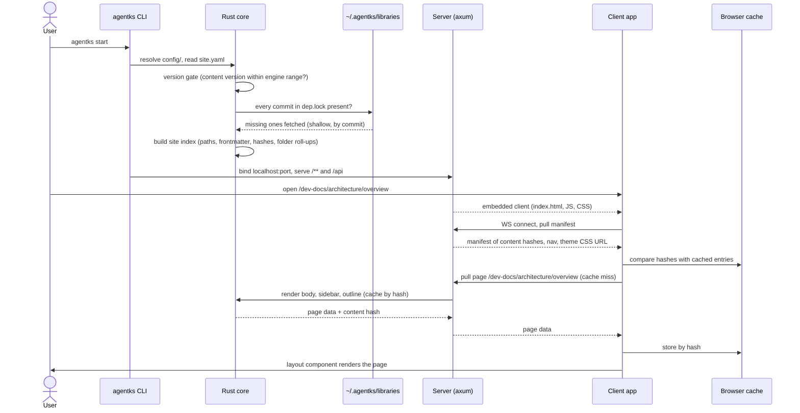

This note follows eight things a user or an agent does, from the first command to the result: installing agentks, starting it and opening a page, a file change reaching the browser, an in-place edit, adding and locking a library, upgrading across a breaking version, publishing with `agentks build`, and opening the docs. Each flow names the component that does each step, so a builder can see where every responsibility sits. The component notes hold the detail; this note shows how they connect.

# 03 References

- [01/03 Architecture](./03_architecture.md) — the components named below.
- [02/03 Rust engine](../02_engine/03_rust-engine.md), [02/04 Sync engine and server](../02_engine/04_sync-engine-and-server.md), [02/05 Rust CLI](../02_engine/05_rust-cli.md), [02/06 Machine home and build cache](../02_engine/06_machine-home-and-build-cache.md)
- [03/02 Client application](../03_frontend/02_client-application.md), [03/03 Editor engines](../03_frontend/03_editor-engines.md), [03/05 Dev toolbar](../03_frontend/05_dev-toolbar.md)
- [04/01 Library system](../04_ecosystem/01_library-system.md), [04/04 Templates and init](../04_ecosystem/04_templates-and-init.md)
- [05/02 Publishing (SSG)](../05_delivery/02_publishing-ssg.md), [05/03 Versioning and migrations](../05_delivery/03_versioning-and-migrations.md), [05/04 Distribution and install](../05_delivery/04_distribution-and-install.md), [05/06 Deployment and hosting](../05_delivery/06_deployment-and-hosting.md)
- Brainstorm record: [the architecture discussion](../../brainstorm/01_initial-discussion/17_local-spa-over-websocket.md), [libraries](../../brainstorm/02_future-stages/09_libraries-and-dependencies.md), [editing mode](../../brainstorm/02_future-stages/02_editing-mode.md), [versioning](../../brainstorm/01_initial-discussion/12_versioning-and-forced-migrations.md).
- Today: the CLI's viewer lifecycle in [viewer.rs](../../../../../../agent-ks-cli/src/viewer.rs) and its [viewer folder](../../../../../../agent-ks-cli/src/viewer); the version gate in [engine-version.ts](../../../../../../agent-ks-engine/src/loaders/engine-version.ts); save and sync in [editor-store.ts](../../../../../../agent-ks-engine/src/dev-tools/server/editor-store.ts) and [yjs-sync.ts](../../../../../../agent-ks-engine/src/dev-tools/server/yjs-sync.ts).

# 04 Decisions

- Decided (sidhantha, 2026-09-29): one WebSocket carries pulls and pushes; the browser caches data by content hash.
- Decided (sidhantha, 2026-09-29): the Phase 2 live preview is rendered by Rust over the WebSocket. No WASM.
- Decided (sidhantha, 2026-09-30): editing happens in place, switched on by the dev toolbar's Edit option; raw and live preview are the two modes.
- Decided (sidhantha, 2026-09-30): starting agentks installs missing locked libraries and never moves a pin; `agentks build` installs exactly the lock.
- Decided (sidhantha, 2026-09-30): migration scripts are downloaded from the official repository at the binary's tag. No hash list.
- Decided (sidhantha, 2026-09-30): `agentks docs` opens agentks.neuralabs.org/docs.
- Decided (sidhantha, 2026-09-30): the install URL on agentks.neuralabs.org passes the request on to the GitHub release.
- Proposed (claude, 2026-09-30): the step-by-step orders below, where the brainstorm left the order implicit. The component notes may refine them.

# 05 Notes & Analysis

## 01 Install and create a project

1. The user runs the install command. Its URL is on agentks.neuralabs.org or the GitHub release; the agentks.neuralabs.org one redirects to the GitHub release, so GitHub serves the file and its checksums.
2. The installer downloads the one compressed release asset for the platform: the `agentks` binary with the client build and the static renderer inside. It puts the binary on the PATH and creates `~/.agentks/`.
3. The user runs `agentks init --template <id or url> <path>`. Both are optional: the template defaults to `agentks-default` and the path to `docs`.
4. The CLI looks a template id up in `library.json` from the official library repository, or treats a URL as a git source. It fetches the template and copies it once into the path. It refuses a folder that already holds a `config/`.
5. The project now has `config/` with `site.yaml`, an empty `dep.yaml`, starter pages, and the basic Dockerfile for publishing.

Details: [05/04 Distribution and install](../05_delivery/04_distribution-and-install.md), [04/04 Templates and init](../04_ecosystem/04_templates-and-init.md).

## 02 Start agentks and open a page



1. **Resolve and gate.** The CLI finds `config/` (`--config-dir` > `AGENTKS_CONFIG_FOLDER` > `./config`). The core loads the config and stops if the content version is outside the engine's supported range, naming `agentks migrate` or a mise pin as the fix. It also stops if `config/dep.yaml` is missing.
2. **Libraries.** Every commit in `dep.lock` missing from the cache is fetched. New `dep.yaml` entries are resolved and reported. No pin moves. Offline with a missing library is an error naming the library; a page never renders with blanks. Each library's `engine` range is checked.
3. **Index.** The core builds the site index. Expensive derived results come from the per-project build cache.
4. **Serve.** The server binds to localhost on the project's port, serves the embedded client and the `/api` WebSocket.
5. **First load.** The client connects, pulls the manifest of hashes and fetches only pages whose hashes it has not cached. Rust renders a page body on request and caches it by hash. Rust has already resolved every link to a root-absolute href.
6. **Display.** The layout named in config renders the data. Diagrams, artifacts (in iframes) and video players render in the browser.

## 03 A file changes on disk

An agent edits a markdown file, or the user saves in their own editor.

1. **Watch.** The `notify` watcher sees the change. It handles write-then-rename saves and WSL timestamp quirks.
2. **Re-hash.** The core re-hashes the file and rolls the new hash up through its parent folders. A page that embeds this file (`[[../assets/flow.mmd]]`) gets a new hash too, because a page's hash covers every file it inlines.
3. **Invalidate.** Cache entries keyed by the old hashes stop being used. Derived views that depend on the folder, such as a sidebar or an issues index, are rebuilt on next request.
4. **Push.** The server pushes the changed hashes to every connected client.
5. **Refetch.** Each client refetches only the pages and folders it is showing whose hashes changed. The page updates in place, keeping scroll and UI state.

A save made through the editor is not pushed back to the client that made it as an outside change (echo suppression, section 04).

## 04 Edit a page in place (Phase 2)

```mermaid
sequenceDiagram
  actor U as User
  participant Bar as Dev toolbar
  participant Ed as Editor (CodeMirror 6)
  participant Srv as Server
  participant Core as Rust core
  participant FS as File on disk

  U->>Bar: choose Edit
  Bar->>Ed: make the content area editable (live preview)
  Ed->>Srv: pull raw source of the page
  Srv->>FS: read
  Srv-->>Ed: markdown + hash
  U->>Ed: type in a block
  Ed->>Srv: render this markdown (preview request)
  Srv->>Core: same renderer as every page
  Core-->>Ed: HTML for the block
  Ed->>Srv: save (text, base hash)
  Srv->>FS: write file
  Srv->>Core: re-hash; mark this write as ours
  Core-->>Srv: new hash
  Srv-->>Ed: saved, new hash
  Note over Srv: watcher event for this write is not echoed back as an outside change
```

1. **Switch on.** The user chooses Edit in the dev toolbar. It is offered only on pages that can be edited: existing files that agentks renders from markdown. Reading is the default.
2. **Mode.** Live preview is the default mode: the block being edited shows as markdown; everything else stays rendered, diagrams included. Raw mode shows the whole file as markdown. Turning Edit off returns to reading.
3. **Preview.** The editor asks Rust to render changed markdown over the WebSocket, so the preview equals the real page.
4. **Save.** The editor sends the text with the hash it started from. The server writes the file, records that this write is its own, and returns the new hash. If the file changed on disk meanwhile, the server reports a conflict instead of overwriting (claude, proposed).
5. **No echo.** The watcher sees the write, recognises it, and does not tell the saving client to reload. Other clients get the normal push.

Humans edit existing files only: there is no new-file command and no separate navigation. Phase 2 is single-user. Multi-user presence is the next stage ([03/03 Editor engines](../03_frontend/03_editor-engines.md)).

## 05 Add a library and lock it (Phase 2)

1. The user or an agent runs `agentks library add acme/design-kit --tag ^1.4` (or edits `config/dep.yaml` by hand, or picks from the `agentks library` TUI).
2. The CLI writes the entry to `dep.yaml` under an alias.
3. It resolves the selector: a range to the newest matching x.y.z tag, a tag or branch to its commit, no selector to the newest version tag. A repository with no x.y.z tags and no selector is an error asking for a branch or a commit.
4. It fetches that commit shallow, by running the `git` program, into `~/.agentks/libraries/<host>/<repo path>/<commit>/`. Git verifies the content against the commit.
5. It reads `manifest.json` at the library's `path`, checks `version` and the `engine` range, and prints the source and a manifest summary.
6. It writes `config/dep.lock` with the requested selector, the commit and the manifest version. The user commits both files.
7. From now on, `agentks library find <words>` returns the library's elements, and the skills tell agents to reuse them. Video files name them in typed fields (`frame:`, `icon:`, `in:` …) and artifact pages load them from `/_lib/<alias>/<element>`, both as `alias:element`. Markdown pages never name them.

A teammate who clones the project gets the same commits: `agentks start` or `agentks install` fetches exactly the lock. Only `agentks install --update [alias]` moves branch, range and latest entries.

## 06 Upgrade across a breaking version

1. The user updates the binary (automatic updates, or `agentks update`).
2. `agentks start` hits the version gate: the content's `engine_version` is below the new floor. The error names `agentks migrate`, and the mise pin for staying on the old version. The gate never needs a download.
3. The user runs `agentks migrate`. It refuses to run on a git tree with uncommitted changes.
4. The runner reads the content version and its own, lists the docs migrations in that range, and downloads them from the official repository at the binary's own release tag. It checks that uv, the scripts' runtime, is present, and prints how to get it if not.
5. For each script, in version order: detect, dry run, show the result, migrate, re-detect. A zero-hit detect is a passed check.
6. It checks every pinned library's `engine` range at once and lists every mismatch, suggesting `agentks install --update` or a mise pin.
7. It bumps `engine_version` in `site.yaml` only after the whole chain passes, and reports anything left.

The 0.x to 1.0.0 migration also creates the files 1.0.0 requires, such as an empty `config/dep.yaml`, moves `.env` into `config/`, and moves custom layouts to a built-in style plus CSS or to an artifact. Library owners run the `library/` migrations on their own libraries; library users only update a pin.

Details: [05/03 Versioning and migrations](../05_delivery/03_versioning-and-migrations.md).

## 07 Publish with agentks build (Phase 3)

```mermaid
sequenceDiagram
  actor U as User or CI
  participant CLI as agentks build
  participant Core as Rust core
  participant Lib as Library cache
  participant R as Bun or Node
  participant SSG as Static renderer
  participant Out as dist/

  U->>CLI: agentks build --out dist
  CLI->>CLI: dep.lock present? JS runtime present?
  CLI->>Lib: install exactly the locked commits
  CLI->>Core: compute every page's data (bodies, sidebars, outlines, resolved links)
  CLI->>R: unpack the embedded renderer, run it
  Core-->>SSG: page data, handed over directly (no JSON for the browser)
  SSG->>SSG: render each page with agentks-ui; diagrams to SVG
  SSG->>Out: HTML, island JS, hashed assets, per-page .md, llms.txt
  U->>Out: serve with nginx, a static host or a CDN
```

1. `agentks build` checks for `config/dep.lock` (a missing lock fails, naming `agentks install`) and for Bun or Node.
2. It installs exactly the locked commits, like `npm ci`. It never resolves `dep.yaml` afresh.
3. The core computes every page's data exactly as it does for the WebSocket, and applies the hosting path prefix to every root-absolute href.
4. The binary unpacks the static renderer and runs it. The renderer renders each page with the same `agentks-ui` components the client uses. Diagrams can render to SVG.
5. The output is plain files: finished HTML, JavaScript only for islands (theme toggle, search, issue filters, artifact frames, the video player), assets with content hashes in their names, each page's raw markdown and an `llms.txt` index. A project with videos also gets a standalone page per video under `artifacts/<path>.video/` and each video's audio stream under `_audio/`.
6. A host serves the files. In Docker, the user's Dockerfile runs these steps in a build stage and copies the output into an nginx stage.

## 08 Open the docs

1. The user runs `agentks docs`, or `agentks docs <page>` for one page.
2. The CLI opens agentks.neuralabs.org/docs (or the page) in the default browser.
3. Offline, it prints the URL and says it could not be reached.

Agents read the same docs without a browser, from each page's raw markdown and the `llms.txt` index. The skills stay the agent's main manual. The command ships at the launch's hosting step, when the site exists.

## 09 Clean the machine cache

1. The user, or an agent the user asked, runs `agentks cache clean ~/projects`.
2. The CLI walks the root for `config/dep.yaml`, skipping `.git`, `node_modules` and similar folders.
3. It collects every commit named in a found project's `dep.lock`, and build caches whose recorded project folder still exists.
4. It reports the projects found, what would go and how much space it frees, and waits for `--yes` or a confirmation.
5. It removes library commits no found project needs and build caches whose project folder is gone. A mistaken removal is safe: the next start fetches it again from the lock.

`agentks cache status` shows sizes without changing anything. Nothing runs on a schedule.

## 10 Open

The exact `/api` message names and the conflict rule on save belong to [02/04 Sync engine and server](../02_engine/04_sync-engine-and-server.md). The script runtime for migrations is still open. See [01/05 Open questions and risks](./05_open-questions-and-risks.md).
