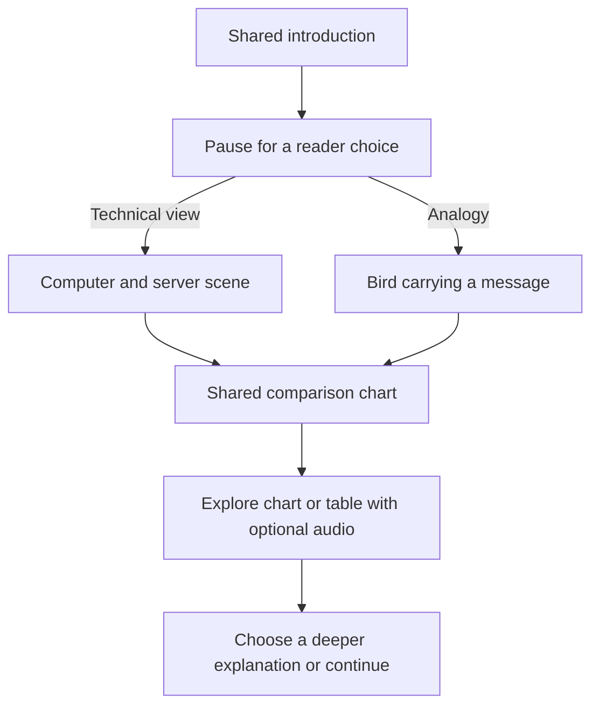

## Divergent paths: the Bandersnatch analogy

The owner explicitly referenced **Black Mirror: Bandersnatch** as an analogy for a narrative that changes according to the viewer's choices. Netflix's [official title page](https://www.netflix.com/title/80988062) describes its multiple endings; Netflix's [interactive-storytelling explanation](https://about.netflix.com/en/news/interactive-storytelling-on-netflix-choose-what-happens-next) describes viewers choosing how a story proceeds.

Here the proposed application is educational and component-driven: live TSX/SVG/chart scenes with narration, choice points and alternate paths. The reference is about interaction and branching, not a request to copy the film's content or make a conventional rendered movie.

For example, an explanation might introduce a computer request and ask:

- “Show the technical server explanation.”
- “Explain it with a bird carrying a message.”

The selected branch can use different objects, narration and interactions, then return to the same chart or recap. Another choice could emphasize cost versus speed, or open an account/table view for closer inspection.

A later design should specify entry points, stable scene IDs, selectable options, conditions, choice history, alternate outcomes and rejoining paths. Choices might affect later scenes as well as the immediate next scene; the desired degree of persistence will be scoped.

**Runtime considerations:** keep timeline/audio progress separate from answers and selections. Define pause, seek, replay and back navigation after a branch. A hover should not silently persist an answer or redirect the story. State transitions and branching must have an explicit runtime contract even when authored naturally in TSX.

The current linear player is not evidence that these conditional paths are already implemented.

## Related ideas

- [Interactive artifact kinds](./03_interactive-artifact-kinds.md)
- [Shared TSX artifact elements](./02_shared-tsx-artifact-elements.md)

## References

- [Brainstorm index](./01_authoring-and-runtime-options.md)
- [The issue](../issue.md)
