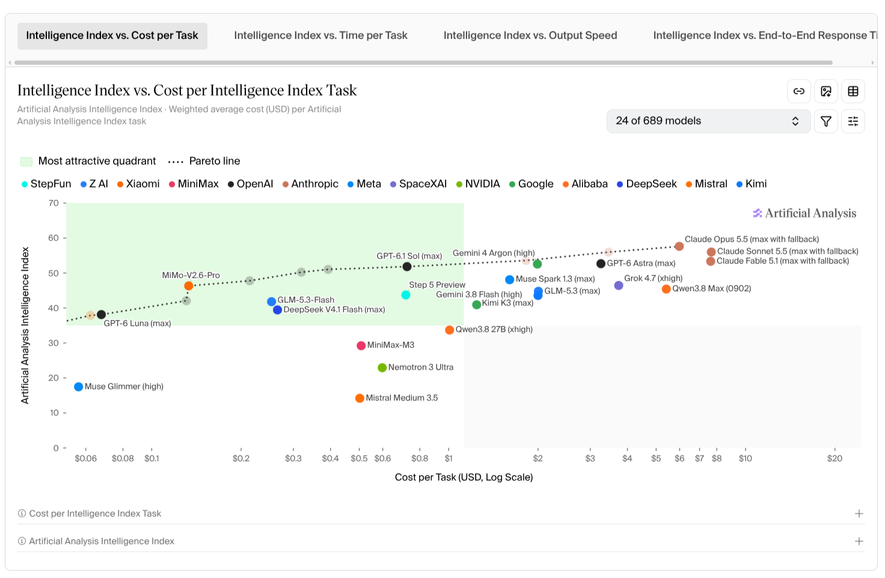

## More charts for Agent KS Default

The owner requested substantially more chart coverage, especially:

- More line-chart forms and multiple-series views.
- Numeric scatter plots.
- Combined scatter and line plots.
- Four-quadrant divisions with two axes and meaningful favorable/unfavorable regions.
- Regions that can be green/red according to what placement means.
- Possible 3D charts.
- Interactive details while the explanation is playing or paused.

The supplied example shows a labeled scatter comparison with a logarithmic cost axis, grouped points, a favorable region and a dotted frontier/reference line. It also suggests tabs, filtering, model/series selection and switching between chart and table views.

The image is a visual reference supplied by the user. Its model names and plotted values are not a verified dataset to ship with the library.

**Implementation considerations:** support numeric and categorical scales, linear/log axes, declared domains, point labels, overlays, legends and empty/error states. A quadrant's desirability must come from the author; the chart should not invent which direction is good. Distinguish an authored reference line from a computed frontier.

Optional 3D needs actual renderer/camera behavior, data mapping, interaction and a useful 2D/table alternative. It is an exploration item, with costs and scope to resolve; TSX alone does not supply it.

## More table formats and linked data views

Tables are an important first-class visual surface, not merely static slide decoration. The owner called out table views, accounts and books alongside richer chart formats.

The desired library can include comparative tables, structured row/column views, account-style tables and other reusable formats. HTML consumers and narrated scenes should use the same table components.

**Examples to explore:** selecting a chart point highlights its table row and opens an inspector; filtering a table changes the chart; sorting a table preserves the selected item by identity. Source data should be shared rather than duplicated inside each view.

Exact table families and behavior will be scoped later. The goal is broad useful coverage, not a claim that these examples already exist.

## References

- [Brainstorm index](./01_authoring-and-runtime-options.md)
- [The issue](../issue.md)
