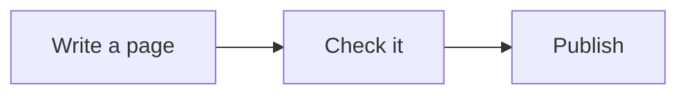
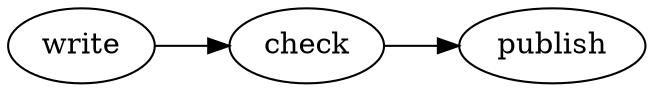

# Diagrams in a page

agentks draws four kinds of diagram inside a page: Mermaid, Graphviz, Excalidraw and draw.io. You write Mermaid and Graphviz as text in a code block. You draw Excalidraw and draw.io in their own editors and show the file with image syntax. In every case the diagram's source stays a plain file, so it diffs, greps and moves like the rest of your content.

This page covers diagrams that sit inside a page as figures. When the diagram is the whole page, make it a [diagram page](./45_diagram-pages.md) instead.

## Mermaid and Graphviz

Write the diagram in a fenced code block tagged `mermaid`, or `dot` (also `graphviz`) for Graphviz:

````markdown

````

The result:


A Graphviz block works the same way:

````markdown

````

### Keep the source in its own file

A diagram longer than a few lines reads better as its own file. Save it as `assets/flow.mmd` (or `.dot`) beside the page and embed it inside the fence:

~~~markdown
```mermaid
\[[./assets/flow.mmd]]
```
~~~

The page always draws the current file. [Embeds](./20_embeds.md) explains the embed rules.

## Excalidraw and draw.io

Save the drawing beside the page, in `assets/`, and show it with image syntax:

```markdown


```

agentks draws the file in place, read-only. The alt text becomes the diagram's title. With no alt text, the title comes from the file name: `20_system-architecture.drawio` gives "System Architecture".

A plain link to the same file does not draw it. It points at the file itself, so a reader can open it in its own editor:

```markdown
Edit [the topology file](./assets/topology.drawio) in draw.io.
```

Never paste Excalidraw scene JSON or draw.io XML into the page. The file is the only source of the drawing.

### Save draw.io files uncompressed

draw.io can save a file as plain XML or as a compressed blob. Both draw. Choose plain XML (in draw.io, *File → Properties*, then turn off *Compressed*), so the file diffs and greps like the rest of your content.

## Reading a diagram

- **Pan and zoom.** A drawn diagram can be panned and zoomed, and opened full screen.
- **Light and dark.** Diagrams follow the reader's light or dark mode. draw.io keeps its own dark palette, so its raster icons and logos are never inverted.
- **Colours.** Pick colours that keep their meaning on a light and on a dark background. Uncoloured shapes take care of themselves.

## When something is wrong

| Problem | What happens |
|---|---|
| The file named in an image or an embed does not exist | A content error with the page and the line. An Excalidraw or draw.io image shows an error box in its place |
| The diagram's source has a syntax error | agentks does not check diagram syntax. The browser finds the error when it draws the diagram |

So open the page after you change a diagram. agentks reports a missing file, but only drawing the diagram finds a mistake inside it.

## Figure or page?

- **A figure** explains the text around it. Keep its file in `assets/` and show it from the page, as above.
- **A page** is a diagram that stands on its own, such as an architecture map. Give the file an `NN_` prefix outside `assets/`, and it becomes a page in the sidebar. See [diagram pages](./45_diagram-pages.md).
