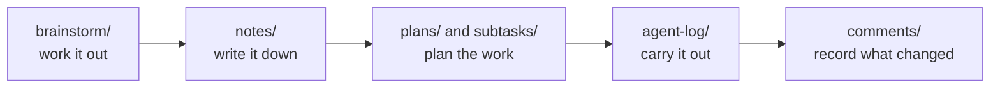

The tracker gives you and your AI agents one place to record a piece of work, from the first idea to the finished result. Each issue is a folder of plain markdown and JSON files. agentks shows the tracker in the local app, and the `agentks issue` commands query and update it from the terminal. This page explains what an issue is, why it is a folder, and which page to read next.

## A memory of the work, not a ticket queue

Most trackers answer one question: what is left to do? The agentks tracker records more than that. An issue keeps why the work exists, what was considered, what was decided, what was done and how it went. The list of open work falls out of that record.

The tracker is built for a small team of one to four people. AI agents do most of the implementation, and the people steer and review. [Why the tracker is shaped this way](./05_design-philosophy.md) explains the choices that follow from that.

## An issue is a folder

An issue is a folder named `YYYY-MM-DD-<slug>`, for example `2026-10-01-search-index/`. The date is the day the issue was created. The slug is lowercase letters, digits and hyphens.

A folder, rather than one file, because a record of weeks of work does not fit in one file. The folder gives each kind of content its own place:

```
2026-10-01-search-index/
├── settings.json      metadata: title, status, priority, component, labels
├── issue.md           the goal
├── subtasks/          one file per work item, each with its own status
├── notes/             settled decisions
└── comments/          a short log of what changed
```

This has three practical effects:

- An agent reads only the part it needs, such as one subtask, instead of a long page.
- Two agents can work on two subtasks without editing the same file.
- Git keeps the history of every file, so each status change is a commit you can look up.

An issue needs only `settings.json` and `issue.md`. You add the other folders when the work needs them. [Inside an issue folder](./10_the-issue-folder.md) lists all of them.

## The flow inside an issue

Work in an issue tends to move from thinking to doing. Each step has its own folder.



The order is not required. Each folder holds one kind of content, and you use it when the work needs it. When you are unsure where something goes, ask two questions: is it thinking or doing, and is it still moving or settled?

| | Still moving | Settled |
|---|---|---|
| **Thinking** | `brainstorm/` | `notes/` |
| **Doing** | `subtasks/` and `plans/` | `agent-log/` |

Comments sit outside this grid. They log events in the issue itself, such as a status change or a hand-off.

## How an issue differs from a docs page

| | Docs page or blog post | Issue |
|---|---|---|
| Purpose | Reading material | A record of work |
| Storage | One file | One folder |
| Metadata | Frontmatter | `settings.json` |
| Lifecycle | Published or draft | Eight statuses in four categories |
| Readers | Users of what you build | Your team and its AI agents |

## Where a tracker lives

A tracker is a folder with a root settings file and one folder per issue. `config/site.yaml` declares it under `pages:` with `type: issues`, which gives it a URL. A project created from the default template already has one. A project may have more than one tracker, each with its own values for priority, component and labels. [Tracker settings and vocabulary](./25_tracker-vocabulary.md) shows how to set one up.

## Read next

| Page | What it covers |
|---|---|
| [Why the tracker is shaped this way](./05_design-philosophy.md) | The team it is built for, and the choices that follow |
| [Inside an issue folder](./10_the-issue-folder.md) | Every file and folder, what each holds and never holds |
| [Statuses, categories and review](./15_statuses-and-review.md) | The eight statuses and who may set each one |
| [Issue settings](./20_issue-settings.md) | The fields of an issue's `settings.json` |
| [Tracker settings and vocabulary](./25_tracker-vocabulary.md) | The root settings file, and adding a second tracker |
| [The issue body, comments and glossary](./30_issue-comments-glossary.md) | `issue.md`, `comments/` and `glossary.md` |
| [Brainstorm and notes](./35_brainstorm-and-notes.md) | Deliberation, and the conclusions it produces |
| [Subtasks](./40_subtasks.md) | Work items, groups and the subtask template |
| [Plans and stages](./45_plans-and-stages.md) | The order of work |
| [Agent logs](./50_agent-logs.md) | The record of one agent run |
| [Agent memory](./55_agent-memory.md) | The facts an agent must not rediscover |
| [The tracker in the app](./60_the-tracker-in-the-app.md) | The issue list and the issue page |
| [Tracker commands](./65_tracker-commands.md) | Every `agentks issue` command, by job |
| [Create and work an issue](./70_create-and-work-an-issue.md) | From an idea to a hand-off |
| [Review and close](./75_review-and-close.md) | Signing off on work |
| [Working with AI agents](./80_working-with-ai-agents.md) | The skills, and the rules an agent follows |
