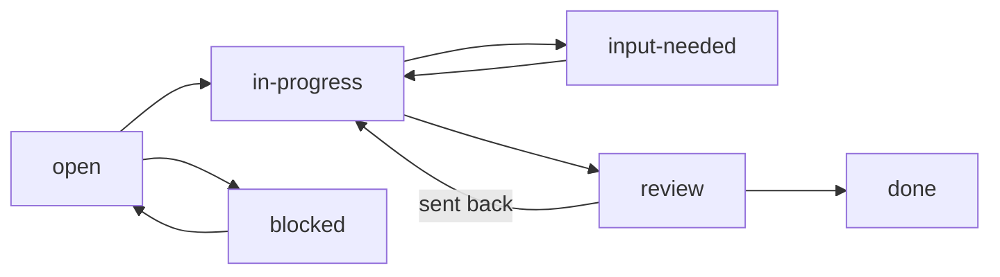

Every issue, subtask, plan and plan stage carries one `status`, taken from a fixed list of eight. This page lists the statuses, says who may set each one, and shows how work reaches a person for review. Agent logs use a shorter list of five, covered at the end.

## The eight statuses

| Category | Status | Meaning |
|---|---|---|
| Not Started | `open` | No work has started. The default |
| Not Started | `blocked` | Waits on another issue or subtask. The text of the item names it |
| In Progress | `in-progress` | Work is running. Set it when you start |
| Review | `input-needed` | Stuck on a question only a person can answer. The question is written in the item |
| Review | `review` | The work is done and waits for sign-off |
| Closed | `done` | Shipped and accepted |
| Closed | `dropped` | Abandoned on purpose. A comment says why |
| Closed | `superseded` | Closed because the scope moved elsewhere. An arrow line says where |

The app filters by **category** and shows the **status** as a badge on each row. The statuses and categories are fixed in agentks. A tracker cannot add or rename one, and a status outside the eight is an error. agentks never guesses what an unknown status meant.

Nothing enforces an order of moves. Any status may change to any other. The usual path looks like this:



## Who may set each status

| The status is on | Who may set `done` or `dropped` | Why |
|---|---|---|
| An issue or a subtask | A person only | Closing signs off the work. A person looks at the result first |
| A plan or a stage | Anyone, agents included | Closing ends a schedule, not a piece of work |
| An agent log | The agent that ran it | Only the agent knows whether its run finished |

Every other status on an issue or subtask may be set by anyone. So an agent's ceiling on work items is the Review category: `review` when the work is done, or `input-needed` with the question written down. An agent may also set `superseded`, with its arrow line.

`blocked` and `input-needed` are different. `blocked` means the item waits on another item, and the text names it. `input-needed` means the item waits on a person's answer.

## The three ways to close

The three Closed statuses make three different claims. Pick one by what a reader should do next.

| Status | The claim | What the reader does next |
|---|---|---|
| `done` | The work shipped | Opens the result: a diff, a page, a test run |
| `dropped` | The idea was abandoned | Reads the comment that says why, and stops |
| `superseded` | The scope moved somewhere else | Follows the arrow to where it went |

A `superseded` item names its destination in a line of its own text that starts with an arrow. For an issue, the line goes in `issue.md`. For a subtask or a stage, it goes in that file.

```markdown
→ absorbed into the search plan, stage 30
```

Both `→` and `->` work, and the line may be a list item or a quote. `agentks check issues` warns when a `superseded` item has no such line.

## The review queue

The review queue is everything that waits for a person. An issue is in it when:

- its own status is in the Review category, or
- it is not closed and at least one of its subtasks is in the Review category.

The second rule means an issue that is still `in-progress` shows up for review as soon as one of its subtasks reaches `review` or `input-needed`. The issue's stored status does not change. A `blocked` subtask does not put its issue in the queue, because it needs no action from a person.

See the queue with:

```bash
agentks issue review-queue
```

[Review and close](./75_review-and-close.md) explains what to do with them.

## Subtasks carry their own status

Each subtask has its own `status` in its frontmatter, using the same eight values. So an issue can stay `open` while three of its five subtasks are `done` and one is in `review`. This lets an agent finish subtasks one at a time and hand each to review, without ever closing the issue.

A subtask with no `status` reads as `open`, and `agentks check issues` warns about it.

## Agent logs use five statuses

An agent log records one run, so its status answers one question: did the agent finish? It takes one of five values:

| Status | Meaning |
|---|---|
| `open` | The run has not started |
| `in-progress` | The run is going |
| `input-needed` | The run stopped for a person's answer |
| `done` | The run finished, whatever it found |
| `dropped` | The run did not deliver: it crashed, was refused, or its scope moved |

An audit that ran to the end and found fifty defects is `done`. A log's `done` says nothing about whether the subtask it served is done. [Agent logs](./50_agent-logs.md) covers the rest.

## Status colours

Each status has a colour variable in the theme, named `--status-<name>`, such as `--status-review`. Change a colour in your theme's CSS, never in the tracker's settings. [Themes and layouts](../45_themes-and-layouts/01_overview.md) shows how to override a theme variable.
