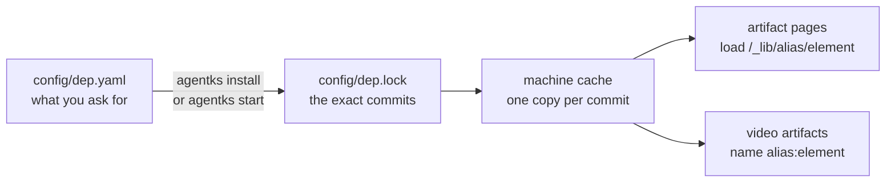

A library gives your project ready-made pieces: icons, device frames, small interactive widgets and more. You name the library once in `config/dep.yaml`. agentks then fetches it, pins the exact version and keeps one copy per machine. Your artifact pages and video artifacts use its pieces without copying them into the project.

## What a library holds

A library is a folder of reusable files. It lives in a git repository, or in a folder of your own project. Each file it offers is an **element**: an SVG icon, a device frame, an image, an HTML widget, a font or a piece of video data. The library's `manifest.json` lists every element with a description and tags, so you and your AI agent can search them.

| Term | Meaning |
|---|---|
| **Library** | A folder with a `manifest.json` at its root, in a git repository or in your project |
| **Element** | One file the library offers, such as an icon or a widget |
| **Category** | The kind of element, and also the folder it sits in: `components/icons/`, `components/widgets/` and so on. Every library uses the same fifteen categories |
| **Alias** | The name your project gives a library in `dep.yaml`. You name an element as `alias:element`, for example `default:server` |
| **Pin** | The exact git commit your project uses. `config/dep.lock` records it |
| **Catalog** | The list of libraries and templates that agentks offers for quick install |
| **Machine cache** | `~/.agentks/libraries/`: one read-only copy of each pinned commit, shared by every project on the machine |

## How the pieces fit

1. You list a library in `config/dep.yaml`. Every project has this file, even when it lists nothing.
2. `agentks install` or `agentks start` turns each entry into one commit and writes it to `config/dep.lock`. You commit both files, so every machine uses the same commits.
3. agentks fetches each pinned commit once into the machine cache. Every project on the machine shares that copy.
4. An artifact page loads an element from the address `/_lib/<alias>/<element>`. A video artifact names it as `alias:element`.

## Where you can use elements

You use elements in **artifact pages** (self-contained HTML pages) and in **video artifacts**. A markdown page never names a library element. Markdown stays plain, so a folder of agentks pages still opens cleanly in Obsidian, an editor or `cat`. When a page needs an icon grid or a widget, build that part as an artifact page.

## The default library

The agentks team keeps a default library in the `NeuraLabsHQ/agent-knowledge-system-library` repository. It offers icons for technical docs together with the full Lucide icon set, device views such as a phone or a browser window, and small data widgets. It is in the catalog as `agentks-default`. After you add it, `agentks library show <alias>` lists every element it has.

agentks itself does not depend on the default library. A project that removes it still works.

## Trust

A library can hold HTML that runs in your local viewer and on a published site. agentks keeps that safe in three ways:

- **Nothing arrives unseen.** agentks installs only what `dep.yaml` lists. `agentks library add` prints the source and a summary of the library before it installs. `agentks start` never adds a library on its own.
- **Git checks the content.** Every fetched file is checked against the pinned commit.
- **Library HTML runs sandboxed.** The browser gives each library HTML or SVG file its own origin, so it cannot read your pages, your cookies or your browser storage. Your project's own artifact pages are not sandboxed, because they are your own code.

## In this section

| Page | Read it to |
|---|---|
| [Declaring libraries in dep.yaml](./05_dep-yaml.md) | Write `dep.yaml` entries and choose a version |
| [Installing, updating and removing](./10_installing-and-updating.md) | Add a library, understand `dep.lock`, update and remove libraries |
| [Finding elements](./15_finding-elements.md) | Search your libraries and the catalog |
| [Using elements in artifacts](./20_using-elements.md) | Load icons, images and widgets from `/_lib/` |
| [HTML elements](./25_html-elements.md) | Pass inputs and messages to a widget, and write one |
| [Templates and agentks init](./30_templates.md) | Start a new project from a template |
| [Building a library](./35_building-a-library.md) | Lay out a library and write its manifest |
| [Testing a library](./37_testing-a-library.md) | Try a library in a project and run its checks |
| [Releasing a library](./40_releasing-a-library.md) | Tag versions, host a library and migrate it |

How agentks implements libraries is in the developer docs: [libraries internals](../../dev-docs-2/35_libraries/01_overview.md).
