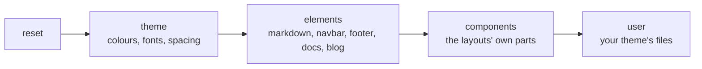

This section shows how to change the way your site looks without writing layout code. agentks draws every page with a built-in **layout**, and styles it with a **theme**. You pick the layouts, pick or write a theme, and add CSS for anything else. CSS is the only branding tool, and it is enough for colours, fonts, spacing, widths and the look of each part of a page.

## The three levels

| Level | What you change | Where |
|---|---|---|
| **1. Layouts** | Which built-in layout draws each section, the navbar and the footer | `layout:` keys in `config/site.yaml`, `navbar.yaml` and `footer.yaml` |
| **2. Theme variables** | Colours, fonts, text sizes, spacing, widths, for light and dark mode | A theme folder, usually `config/themes/<name>/` |
| **3. CSS on hooks** | The look of one part, such as the sidebar or the navbar brand | CSS files in the same theme folder |

Most sites stop at level 2. Changing a handful of theme variables re-colours the whole site, and every layout follows, because every layout reads only those variables.

## Terms

| Term | Meaning |
|---|---|
| **Layout** | A built-in design for one kind of page, such as `@docs/default`. You choose it by name. You cannot add your own |
| **Theme** | A folder with a `theme.yaml` and CSS files. The built-in theme is called `default`. Your theme usually extends it and changes a few things |
| **Theme variable** | A CSS custom property such as `--color-brand-primary`. Layouts read variables instead of fixed values, so a theme can change them |
| **Theme contract** | The list of variables every theme must provide, because the layouts read them |
| **Hook** | A stable class name or `data-part` attribute on a part of a layout, which your CSS may target |

## How the CSS fits together

agentks compiles one stylesheet per project: the built-in theme, then your theme's files, placed in **cascade layers**. A cascade layer is a CSS feature that decides which rules win by layer order instead of by selector strength. The layers run in this order, and a later layer wins:

Your theme's files sit in the last layer, `user`. So your rule for a property beats the built-in rule for it, without `!important`. [Overriding CSS](./20_overriding-css.md) explains the details.

## Why there are no custom layouts

A built-in layout gets its data ready-made from agentks: the sidebar order, links, dates and statuses. That keeps every rule in one place, and it keeps the local viewer and the published site identical. So you style layouts but do not write them. When one page truly needs its own structure, build it as an artifact page, a self-contained HTML page: see [writing content](../10_writing-content/01_overview.md).

## In this section

| Page | Read it to |
|---|---|
| [Built-in layouts](./05_layouts.md) | See every layout and choose one for each section |
| [Themes](./10_themes.md) | Choose a theme, write one, and extend the built-in theme |
| [The theme contract](./15_theme-contract.md) | See every required variable and the text-size tokens |
| [Overriding CSS](./20_overriding-css.md) | Find the hooks and restyle a part of a layout |
| [Dark mode](./25_dark-mode.md) | Give your theme dark values and understand the toggle |

How agentks builds its layouts is in the developer docs: [the frontend](../../dev-docs-2/25_frontend/01_overview.md).
