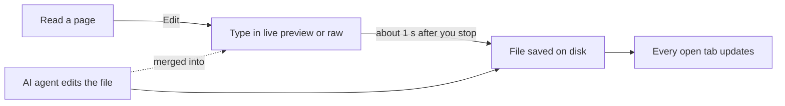

This section shows you how to change a page in the browser, and how to let other people read or edit your project with you. You read a page, choose **Edit**, and type. agentks saves the file for you. To bring someone else in, you give them an access key.

Everything here happens in the **local app**: the site that `agentks start` serves in your browser. A published site has no editing and no sharing. It is read-only HTML ([publishing](../55_publishing/01_overview.md)).

## How editing works

- **Reading is the default.** The local app shows every page read-only. Nothing on the page suggests editing until you ask for it.
- **Editing is one switch away.** The dev toolbar at the bottom of the screen holds an **Edit** option. It turns the page you are reading into its own editor, in the same place. The navbar, sidebar and outline stay where they are.
- **Two modes.** *Live preview* keeps the page rendered and shows markdown only where your cursor is. *Raw* shows the whole file as markdown.
- **Saving is automatic.** agentks writes the file about a second after you stop typing.
- **The file on disk is the truth.** Every save writes the markdown file itself, so the change is visible to `git`, your editor and your AI agent at once.

In an agentks project, an AI agent writes most of the content. People review it and make small fixes. So editing in the browser changes **existing files only**. Creating, renaming, moving and deleting files is the agent's job, through the CLI. For example, `agentks move` moves a page and rewrites every link to it ([the CLI reference](../65_cli-reference/01_overview.md)).

An agent often edits a file while you have it open. agentks merges the agent's change into your editor, so neither of you loses work.

## How sharing works

- **Private by default.** A plain `agentks start` serves your project to this machine only.
- **Access keys, no accounts.** `agentks share create` makes a key with a role: `read` or `edit`. There is no sign-in. The key is the whole permission.
- **Share mode.** `agentks start --share` lets other machines reach the server. Every visitor then needs a key.
- **Editing together.** Several people can edit one page at once. Each person sees the others' names and cursors, and every change lands in the same file.
- **Credit in git.** agentks records who edited which file. When you commit with `agentks git commit`, it names those people in the commit.

## Pages in this section

| Page | Read it when you want to |
|---|---|
| [The dev toolbar](./05_dev-toolbar.md) | Find the Edit switch and the Problems, Cache, System and Theme preview tools |
| [Editing a page](./10_editing-a-page.md) | Change text, understand saving, and know what happens when the file changes on disk |
| [Editing diagrams](./15_editing-diagrams.md) | Change a Mermaid, Graphviz, Excalidraw or draw.io diagram in place |
| [Sharing a project](./20_sharing-a-project.md) | Create a key, start share mode and send someone a link |
| [Editing together](./25_editing-together.md) | See who is on a page, how edits merge, and how git credits each person |
| [Security for owners](./30_security-for-owners.md) | Know who can reach your server, what each key allows, and what to do when a key leaks |
