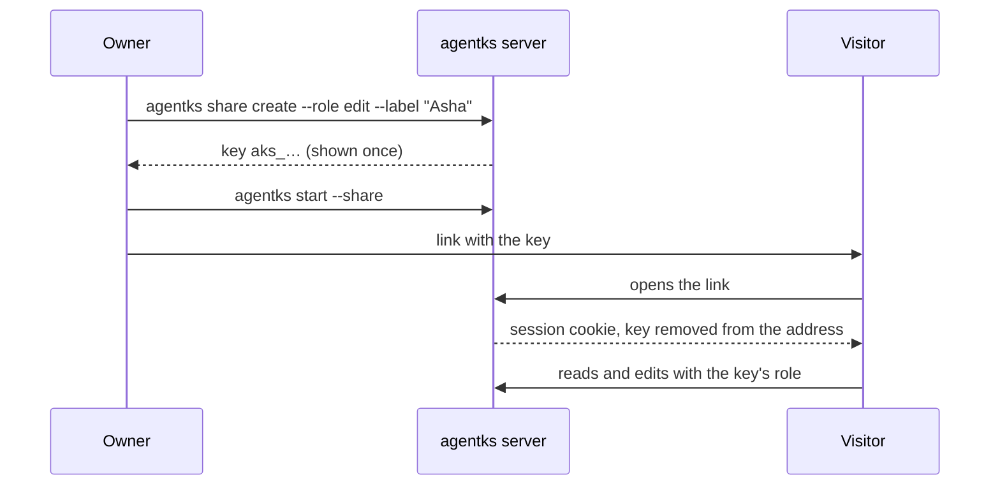

This page shows you how to let another person into your running project: create an access key, start the server in share mode, and send them a link. There is no sign-in and no account. The key is the whole permission, and you can revoke it at any time.

## Access keys

An **access key** is a long random secret that starts with `aks_`. The prefix makes a key easy to spot if it is ever pasted somewhere it should not be.

Each key has a **role** and a **label**:

| Role | The visitor can |
|---|---|
| `read` | Read every page, see who else is on it, and watch edits appear live |
| `edit` | Everything `read` can, and also edit pages and diagrams, change an issue's status, labels and priority, and add comments |

The label is a name you choose, such as the person's name or their team. agentks uses it to credit that person's edits in git ([Editing together](./25_editing-together.md)).

agentks shows you a key's secret once, when you create it. It stores only a fingerprint of the key (a hash) in your machine home, `~/.agentks/`, and never in the project.

## Share your project, step by step

**1. Create a key** for the person you are inviting:

```bash
agentks share create --role edit --label "Asha"
```

The key is printed once. Copy it now. When a share-mode server is already running, the command also prints a ready link.

**2. Start the server in share mode:**

```bash
agentks start --share
```

In share mode the server listens beyond this machine, and every request needs a key, yours included. agentks prints an **owner link** for you in the terminal. Open it to get in.

Share mode is chosen when the server starts. If the project's server is already running, stop it first with `agentks stop`, then start it again with `--share`.

**3. Send the visitor the link.** It carries the key, like `http://<your-address>:<port>/?key=aks_…`. The visitor can also open the address without the key and paste the key into the prompt the page shows.

**4. The visitor opens it.** On the first visit, agentks swaps the key for a session cookie in their browser and removes the key from the address bar, so it does not linger in their history. The visitor then types a display name, which other people see next to their cursor.

A session survives a server restart. It ends when you revoke its key.

> [!NOTE]
> A visitor who already has a session may see the key prompt once when they open your site from a link in another website, such as a chat app. Pasting the key again fixes it.



## Where the server listens

| Flag | What it does |
|---|---|
| `--share` | Listen on every network interface of this machine. Every request needs a key |
| `--bind ADDR` | Listen on one address only, for example the machine's address on a private network such as Tailscale. Works only with `--share` |
| `--public-url URL` | The address people use to reach the server through a tunnel or a reverse proxy. agentks accepts requests for that address, and marks the session cookie as secure when the address starts with `https` |
| `--port N` | Use another port for this run only |

## Use a tunnel beyond a trusted network

agentks serves plain HTTP. It does not encrypt traffic itself. On a network you trust, such as your home or office network, that may be enough, and agentks warns you at start that keys and pages travel unencrypted.

Anywhere else, put a tunnel or a reverse proxy that provides HTTPS in front of the server, and tell agentks the address people will use:

```bash
agentks start --share --public-url https://docs.example.ts.net
```

Common choices are Tailscale's `tailscale serve`, Cloudflare Tunnel and a Caddy reverse proxy. Set up the tunnel with its own documentation, pointing it at the port agentks prints. agentks never opens router ports, never signs up to a tunnel service and never sends anything to a third party.

## Manage keys

```bash
agentks share list            # every key: id, label, role, created, last used, revoked
agentks share revoke <id>     # asks first; add --yes to skip the question
agentks share revoke --all    # revoke every key of this project
```

`share list` never shows a key's secret. Revoking a key ends its sessions and disconnects its visitors within about a second, even while they are on a page. Every command here takes `--json` for scripts and agents.

## Stop sharing

Restart the server without `--share`:

```bash
agentks stop
agentks start
```

The server then listens on this machine only, and nobody needs a key. Revoke the keys you no longer need, so an old link cannot be used the next time you share.

Before you share, read [Security for owners](./30_security-for-owners.md). It says exactly what an `edit` key allows.
