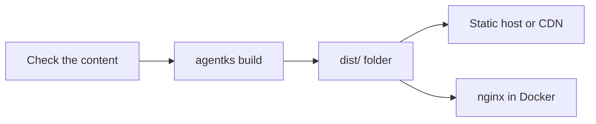

Publishing turns your project into a static website: a folder of plain HTML files that any static host, a CDN or an nginx container can serve. You run `agentks build`, then upload or serve the folder it writes. No agentks server runs on the host, and nothing is computed when a reader opens a page.

> [!NOTE]
> Publishing ships in a 1.x release after 1.0.0. A 1.0.0 binary cannot publish. A project that must publish before that release stays on the last 0.x release, pinned with mise. [The upgrading guide](../60_upgrading/01_overview.md) says how to keep a 0.x project working.

## What a published site is

- **Built once, ahead of time.** `agentks build` renders every page to HTML with the same layouts the local app uses. A reader's browser receives finished pages.
- **The same URLs as the local app.** A page at `/user-guide/getting-started` locally is at the same path on the published site, with your hosting prefix in front if you set one.
- **Very little JavaScript.** Only the interactive parts of a page carry JavaScript: the light and dark switch, search, the issue filters, the controls around an artifact, and diagrams that need to be interactive. A page with none of these ships no JavaScript at all.
- **Diagrams drawn in advance** where possible, so they show without JavaScript and search engines can read their text.
- **Ready for search engines.** Every page carries its title and description in its HTML head. Give the build your site's public address, and it adds each page's canonical address and writes a sitemap.

## The local app and the published site

| | Local app | Published site |
|---|---|---|
| Started by | `agentks start` | `agentks build`, then any web server |
| Runs on | Your machine, through the agentks server | Any static host, CDN or nginx |
| Updates | Live, as files change | When you build and upload again |
| Dev toolbar and editing | Yes | No. Their code is not in the build at all |
| Sharing with access keys | Yes | No. There is no agentks server to share |
| Draft pages and unpublished sections | Shown, with a "not published" badge | Left out |

## From project to website

1. **Check** the content with `agentks check`, so the build does not stop on a broken link.
2. **Build** with `agentks build`. It writes the site into `dist/`, beside `config/`.
3. **Serve** the folder: upload it to a static host or a CDN, or build a container with the Dockerfile your project ships with.

## What you need

- The `agentks` binary, on your machine or in CI.
- **Bun or Node** on the build machine. `agentks build` uses one of them to render the pages. It never downloads a JavaScript runtime by itself.
- `config/dep.lock`, when your project uses libraries. The build installs exactly the library versions it names ([libraries](../40_libraries/01_overview.md)).

## Pages in this section

| Page | Read it when you want to |
|---|---|
| [Building the site](./05_building-the-site.md) | Run `agentks build`, choose its flags, and understand why a build fails |
| [What the build writes](./10_what-the-build-writes.md) | Know what is in the output folder, including the sitemap and search |
| [Serving under a path](./15_serving-under-a-path.md) | Host the site at an address such as `example.com/docs/` |
| [Leaving content out](./20_leaving-content-out.md) | Keep drafts, a section or a navbar link off the published site |
| [Hosting](./25_hosting.md) | Choose a static host, a CDN or GitHub Pages, and set the right cache rules |
| [Docker](./30_docker.md) | Build and serve the site in a container with the Dockerfile your project ships with |
