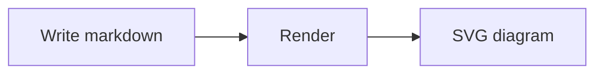
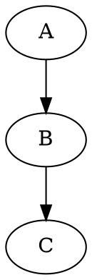

# Markdown Basics

Every content type in the system is authored in plain markdown. Only `.md` files are supported — no MDX, no JSX, no React components.

## Basic Syntax

### Headings

```markdown
# Page Title (H1)
## Main Section (H2)
### Subsection (H3)
#### Minor Heading (H4)
```

**Rule:** Only one H1 per page, and it should match your frontmatter `title`.

### Emphasis

```markdown
*italic* or _italic_
**bold** or __bold__
***bold italic***
~~strikethrough~~
```

### Code

Inline code with backticks:

```markdown
Use the `console.log()` function to print output.
```

Fenced code blocks with language:

````markdown
```javascript
const greeting = "Hello";
console.log(greeting);
```
````

### Fenced Code Block Delimiters

Both backticks (` ``` `) and tildes (`~~~`) create code blocks:

| Delimiter | Name | Usage |
|-----------|------|-------|
| ` ``` ` | Backtick fence | Most common |
| `~~~` | Tilde fence | Alternative |

**They are functionally identical** — the difference matters for nesting.

#### Nesting Code Blocks

Use tildes to wrap content containing backticks (or vice versa):

~~~markdown
```python
print("hello")
```
~~~

This is written as:

````markdown
~~~markdown
```python
print("hello")
```
~~~
````

#### Rules

1. **Closing must match opening** — same character, same or more count
2. **3+ characters required** — ` ``` `, ` ```` `, `~~~`, `~~~~` all work
3. **Use outer fence** — when documenting code blocks, wrap with a different delimiter

**Best practice:** Use `~~~` as the outer fence when showing code block syntax in documentation.

### Links

```markdown
[Internal Link](/user-guide/getting-started/overview)
[External Link](https://github.com)
[Anchor Link](#headings)
```

### Lists

```markdown
- Item one
- Item two
  - Nested item

1. First step
2. Second step
   1. Sub-step A
```

### Tables

```markdown
| Column 1 | Column 2 |
|----------|----------|
| Cell 1   | Cell 2   |
```

### Blockquotes

```markdown
> This is a blockquote.

> **Note:** Important information.
```

## Callouts

Callouts are **GFM alert** blockquotes — a blockquote whose first line is `[!TYPE]`. They render as coloured, labelled panels. Because they're just blockquotes, they degrade gracefully anywhere GFM alerts aren't understood.

```markdown
> [!NOTE]
> Useful context the reader should know but can skip.

> [!TIP]
> A helpful suggestion or shortcut.

> [!IMPORTANT]
> Key information the reader must not miss.

> [!WARNING]
> A caveat that needs immediate attention to avoid a problem.

> [!CAUTION]
> Warns about a risky action or its consequences.
```

The five types and what they're for:

| Type | Use it for |
|------|------------|
| `[!NOTE]` | Neutral context, asides, background |
| `[!TIP]` | Advice, shortcuts, best-practice nudges |
| `[!IMPORTANT]` | Information the reader must not miss |
| `[!WARNING]` | Caveats that need attention to avoid trouble |
| `[!CAUTION]` | Risky actions and their consequences |

**Rules:** the marker (`> [!NOTE]`) goes on its own first line; every following body line stays inside the blockquote with `>`. The type is case-insensitive. Content spans multiple lines and supports normal markdown:

```markdown
> [!TIP]
> You can use **bold**, `code`, and [links](/user-guide) inside a callout.
>
> Even multiple paragraphs.
```

## Collapsible Sections

Use the native HTML `<details>` / `<summary>` elements for expandable content — no special syntax:

```markdown
<details>
<summary>Click to expand</summary>

Hidden content goes here. Markdown inside works — leave a blank line after
`</summary>` so the body is parsed as markdown.

</details>
```

Add the `open` attribute to have it expanded by default:

```markdown
<details open>
<summary>Shown expanded</summary>

Visible until the reader collapses it.

</details>
```

## Diagrams

Diagrams are authored as fenced code blocks with a `mermaid` or `graphviz` language tag. They render to SVG in the browser:

````markdown

````

````markdown

````

Keep the diagram source in the fenced block itself, or embed it from a file with the `[[path]]` syntax — see [Asset Embedding](./asset-embedding).

## Extended Features

Beyond standard markdown, the system provides:

| Feature | Description | Section |
|---------|-------------|---------|
| Callouts | `> [!NOTE]` GFM alert blockquotes | [above](#callouts) |
| Collapsible | Native `<details><summary>` | [above](#collapsible-sections) |
| Diagrams | Fenced ` ```mermaid ` / ` ```graphviz ` blocks | [above](#diagrams) |
| Asset Embedding | `[[path]]` syntax for file inclusion | [Asset Embedding](./asset-embedding) |
| Page Outline | Auto-generated table of contents | [Outline](./outline) |
| Diagram Pages | `.mmd` / `.dot` / `.excalidraw` files as pages | [Diagram Pages](./diagram-pages) |

Markdown isn't the only page format: a diagram file with an `XX_` prefix
renders as a first-class page in the sidebar — see
[Diagram Pages](./diagram-pages).

## Best Practices

1. **One H1 per page** — match your frontmatter title
2. **Use semantic headings** — don't skip levels (H2 → H4)
3. **Keep paragraphs short** — improve readability
4. **Use code blocks** — for any code, commands, or file paths
5. **Add alt text** — for all images
6. **Link generously** — help users navigate
