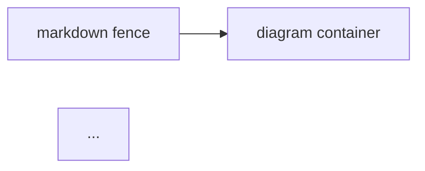
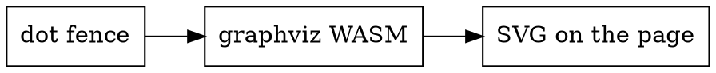

# Diagram Showcase

Every diagram type the framework renders, live on one page. The source for
each example is shown right below it. See
[Markdown Basics](./markdown-basics) for fence syntax,
[Asset Embedding](./asset-embedding) for by-reference embeds, and
[Diagram Pages](./diagram-pages) for diagrams as standalone pages.

## Mermaid


Source:

~~~markdown

~~~

## Graphviz



Source:

~~~markdown

~~~

## Excalidraw


Source — image syntax embeds the scene read-only (click to zoom; the caption
links to the raw file):

```markdown

```

A plain link deliberately stays a link instead of embedding:
[the same scene as a link](./assets/diagram-showcase.excalidraw).

## Keeping diagram source in its own file

Mermaid and Graphviz source can live in `assets/` too — embed it by
reference inside the fence, and the file stays the single source of truth:

~~~markdown
```mermaid
[[./assets/flow.mmd]]
```
~~~

Dark mode inverts all of the above automatically. Diagrams that fail to
render show an error box in place; a missing referenced file fails the
build with an `asset-missing` error.
