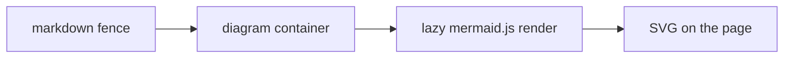
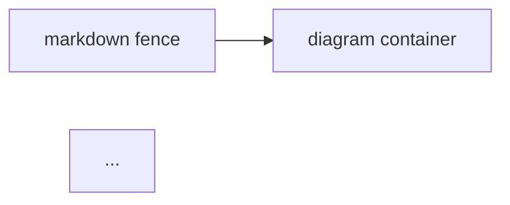
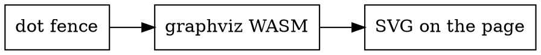
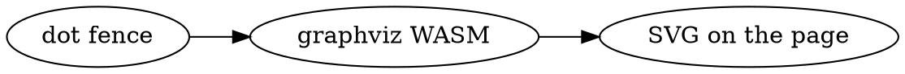

# Diagram Showcase

Every diagram type the framework renders, live on one page. The source for
each example is shown right below it. See
[Markdown Basics](../02_markdown-basics.md) for fence syntax,
[Asset Embedding](../03_asset-embedding.md) for by-reference embeds, and
[Diagram Pages](../06_diagram-pages.md) for diagrams as standalone pages.

## Mermaid



Source:

~~~markdown

~~~

## Graphviz



Source:

~~~markdown

~~~

## Excalidraw


Source — image syntax embeds the scene read-only (click to open the viewer;
the caption links to the raw file):

```markdown

```

A plain link deliberately stays a link instead of embedding:
[the same scene as a link](../assets/diagram-showcase.excalidraw).

## draw.io


Source — the same image syntax embeds a `.drawio` file read-only:

```markdown

```

draw.io is the one format that is **not** colour-inverted in dark mode: its
viewer resolves a real dark palette instead, so the green node above stays
green (darker, still green) while the plain ones follow the theme. Toggle the
theme and watch.

## Keeping diagram source in its own file

Mermaid and Graphviz source can live in `assets/` too — embed it by
reference inside the fence, and the file stays the single source of truth:

~~~markdown
```mermaid
[[./assets/flow.mmd]]
```
~~~

## Interacting with diagrams

Every rendered diagram (and every image) on this page is interactive:

- **Click** a diagram or image to open it in a full-screen viewer — mouse
  wheel or pinch to zoom, drag to pan, double-click to zoom in, `+`/`-`/`0`
  for keyboard zoom, `Escape` to close.
- **Hover** a diagram to reveal its toolbar: expand, plus a copy button —
  click copies the diagram as a PNG, and its ▾ menu offers copy as PNG
  (light or dark), copy source, and download as PNG / SVG / source file.
- **Diagram text is real text** — select and copy it inline or in the
  viewer; in the viewer, clicking a label copies it to the clipboard.
- The viewer toolbar carries the same **copy menu** and can open the
  original file.

**draw.io is the exception on PNG.** It renders its labels as
`<foreignObject>`, which taints the canvas a PNG would be drawn on, so the
PNG entries are withheld from its toolbar rather than offered and failed.
*Download SVG*, *copy source* and *download source* all work — and the SVG
you get carries whichever theme you were viewing in.

Dark mode adapts all of the above automatically — by colour inversion for
Mermaid, Graphviz and Excalidraw, and by a native dark palette for draw.io.
Diagrams that fail to render show an error box in place; a missing referenced
file fails the build with an `asset-missing` error.
