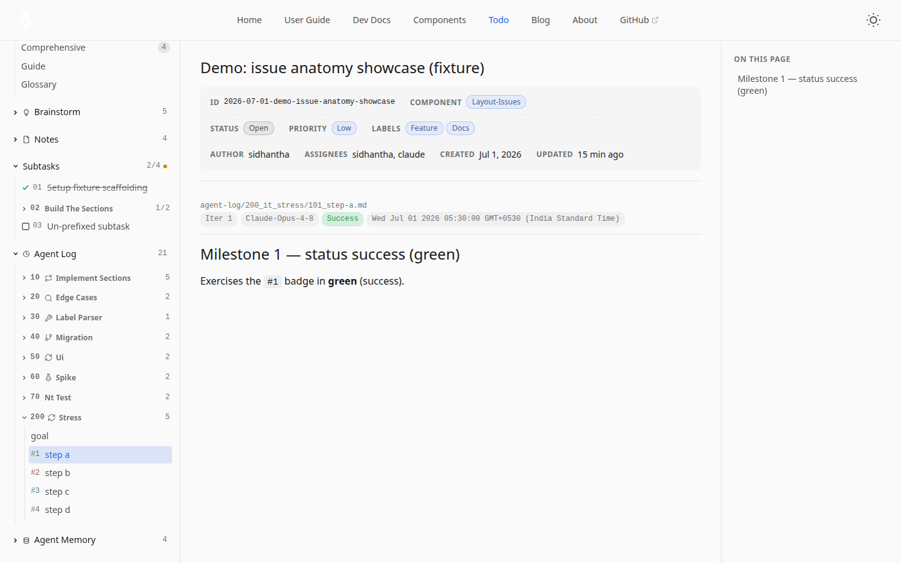

# Agent Log

The `agent-log/` folder is the **execution record** of an issue — how autonomous loops and workflows actually ran. It exists for **long-running work**: each activity gets its own folder, holding pinned meta files and one file per **milestone**. Failed milestones are kept — they're as informative as successes. When a human reviews a `review`-flagged issue, the agent log is the first thing they read.

This is the *how*; `subtasks/` is the *what* (the plan). That boundary is what keeps the two from merging.



## The ideal structure — activity folders

```
agent-log/
├── 010_lp_implement-limiter/    ← activity folder: NNN_<code>_<name>/
│   ├── 00_goal.md               ← pinned meta file — what this run is trying to achieve
│   ├── 01_summary.md            ← outcome TL;DR (written when the run wraps)
│   ├── 02_task_list.md          ← the run's live checklist
│   ├── 101_token-bucket.md      ← milestone: MNN_<name>, M ≥ 1 → shown "#<iteration>"
│   └── 102_redis-backing.md
├── 020_au_edge-cases/
│   └── 101_findings.md          ← meta files are omittable — milestones-only is valid
└── 030_rf_extract-helper/       ← every entry is an activity folder (the norm)
```

- **`NNN`** — ordering prefix, 2–5 digits, sorted by numeric value (same shared grammar as the rest of the tracker).
- **`<code>`** — a 2-letter **kind code** (below). Rendered as a symbol on the folder row and stripped from the label.
- **`<name>`** — kebab-case, describes the run.

A flat `NNN_<name>.md` at the `agent-log/` root still parses and renders (**backward compatibility**), but it is *not* the going-forward convention — agent-logs are for long-running work, so reach for the folder shape by default.

## Kinds

The code in the folder name says *what sort* of run it was. Five framework defaults:

| Code | Kind | Icon | Use for |
|---|---|---|---|
| `lp` | loop | `repeat` | Autonomous multi-iteration runs toward one goal. |
| `au` | audit | `search` | Systematic review / inspection sweeps. |
| `rf` | refactor | `wrench` | Structural rework with no behaviour change. |
| `it` | iteration | `refresh-cw` | Rapid ad-hoc change bursts. |
| `wf` | workflow | `git-branch` | Multi-stage orchestrated pipelines. |

### Custom kinds — `agentLogKinds` in the issue's `settings.json`

Declare only your *custom* codes; the defaults are always available (**merge** semantics — the dictionary adds / overrides). Per-issue only — there's no tracker-root layer.

```jsonc
{
  "title": "…", "status": "open",
  "agentLogKinds": {
    "ex": { "name": "experiment", "icon": "flask", "desc": "One-off exploratory spikes." },
    "hf": "hotfix"                    // shorthand string → generic tag icon
  }
}
```

- `icon` picks from the framework's curated symbol palette (`agent-log-icons.ts`, ~15–20 icons); unset/unknown → a generic tag icon.
- `desc` is optional — it fills the "use for" cell in the **Guide panel's generated kinds table**, which always shows the issue's *effective* set (defaults + additions).
- An unknown code in a folder name degrades gracefully: no symbol, the label keeps the code, the count still renders.

### Sidebar rendering

An activity folder renders as **`NN  <symbol>  <name>  …  <count>`** — numeric prefix, kind symbol up front (hover shows the kind name via the fast tooltip), the code-stripped name, and the file count on the right.

## Meta files — pinned, badge-less

`0NN_`-prefixed files (no `iteration` frontmatter) pin to the top of the folder, badge-less. The standard trio:

- `00_goal.md` — what the run is trying to achieve (generic name — the kind is already on the folder).
- `01_summary.md` — outcome TL;DR, written when the run wraps.
- `02_task_list.md` — the run's live checklist. *This is the working checklist for one run, **not** the issue's durable `subtasks/` plan.*

The set is **standard but open**: the user *or the agent* can add more (`03_references.md`, …), and any of them can be omitted — a folder with only milestones is valid.

## Milestones

`MNN_<name>.md` with `M ≥ 1` (`1NN`, `2NN`, …) — the leading digit ≥ 1 is what separates milestones from `0NN` meta files. A milestone is a **substantial completed chunk** (~3–6 per activity), not a step and not synced to subtask count.

```markdown
---
iteration: 1            # → shown as "#1"; independent of the 101_ filename prefix
agent: claude-opus-4-8
status: success         # not-started | in-progress | success | failed
date: 2026-06-30
---

# Token-bucket limiter

## Goal
…
## Approach
…
## Result
…  (evidence: commits, test counts, file paths)
## Next
…
```

| Field | Type | Purpose |
|---|---|---|
| `iteration` | int | Drives the **`#N` badge** and the iteration sort bucket — independent of the filename prefix. |
| `status` | string | Tints the `#N` badge: grey `not-started` · blue `in-progress` · green `success` · red `failed`. |
| `agent` | string | Which agent / model ran it (`claude-opus-4-8`, `human:sidhantha`, …). |
| `date` | ISO date | When it landed. |
| `color` | CSS color | Optional label tint — issue-defined meaning; document it in the issue's `glossary.md`. |

The Goal / Approach / Result / Next body shape isn't enforced, but it's what makes the log reviewable in order.

### Ordering

Within a level, entries sort by: **bucket** (non-iteration files first — meta files and folders) → **iteration number** → **numeric prefix value** (mixed widths sort by value, so `70_` before `200_`) → filename. So meta files pin up top and milestones follow as `#1, #2, …` regardless of prefix widths.

## Rules of the road

- **Keep failed milestones.** A failed run with a clear Result + Next tells the next agent what not to do — and the red `#N` badge makes it visible at a glance.
- **One file per milestone, not per minute.** Three files a minute are thoughts, not milestones — consolidate.
- **New milestone = new file, not an edit.** Git history then tells a clean story.
- **Read the log before starting work.** Pick up where the last run left off; don't repeat failed approaches.
- **Close out on `closed`.** When the issue ships, write a final summary milestone (commit hash, what landed).
- **Fast bursts:** low-nuance mechanical changes can live as a running checklist in one **subtask** instead; changes that carry reasoning belong in an `it` (iteration) activity. When ambiguous, ask which mode is wanted.

## What does NOT belong here

- **Human discussion** — `comments/` (the flat evolution log).
- **Deliberation / options-weighing** — `brainstorm/`.
- **Durable facts the agent learns** — `agent-memory/` (see [Agent Memory](./agent-memory)); the log records *what happened*, memory holds *what's still true*.
- **Micro-progress pings** — batch into the next meaningful milestone.

## Rendering

- **Detail-page sidebar** — the Agent log section lists activity folders (`NN <symbol> <name> <count>`) with meta files and `#N` milestones inside; each file is a link to its own page.
- **Own URLs** — `/<tracker>/<issue>/agent-log/<folder>/<file>` (sub-doc pages with their own TOC rail).
- **Guide panel** — the generated kinds table documents this issue's effective kind set.

## See also

- [Agent Memory](./agent-memory) — the AI's mutable working state (what's still true)
- [Subtasks](./subtasks) — the plan the log executes against
- [Lifecycle and Review](../lifecycle-and-review) — how the log feeds the review handoff
- [Using with AI](../using-with-ai) — agent discipline
