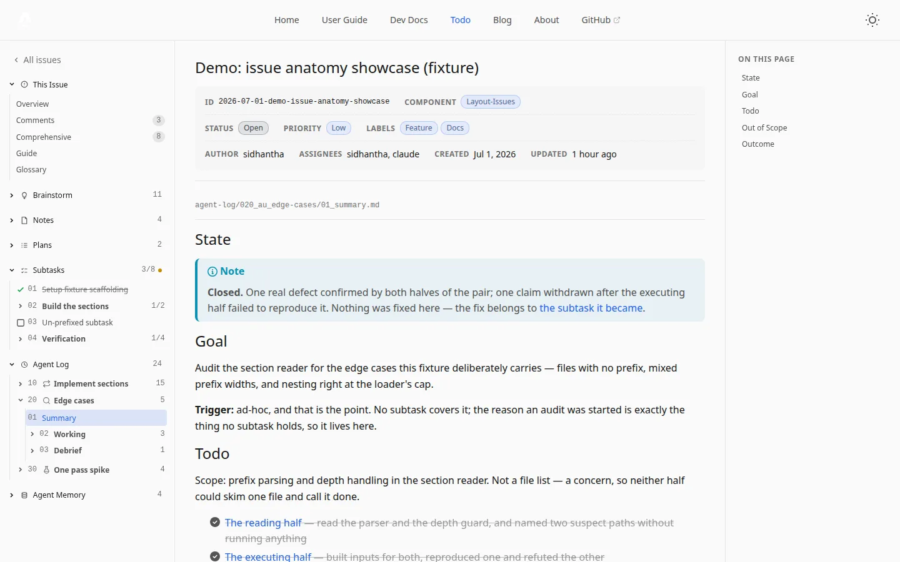

# Agent Log

The `agent-log/` folder is where a run is **carried out**, and where its **outcome** is
recorded. Two things, in sequence: the execution, made visible round by round while it
happens, and the outcome written when it lands. It is also the agent's own workspace —
somewhere to organise, and to continue an iterative loop across rounds.

When a human reviews a `review`-flagged issue, the agent log is the first thing they
read.



## What it holds — and what it does not

| Holds | Does not hold |
|---|---|
| The **concern** — what this run is trying to solve | **The scope.** That is the subtask's |
| The **reason it was started** — essential for ad-hoc work like an audit, which no subtask covers | The subtask's details, re-typed |
| The **execution** — each round, what it did, visible while it runs | The **order** of rounds as a schedule — that is the plan's |
| **What is solved**, and what is not | How the code was edited, step by step |
| **What broke as a result**, and what problems now exist | Twenty lines explaining two lines of code |
| **New todos** the run generated | Its own list of micro-steps |

**The line: a subtask defines the work, the agent log carries it out.** Scope in one,
execution in the other. And the order the rounds run in belongs to [Plans](./09_plans.md) — an
agent log that lists its rounds as a schedule is re-deriving the plan.

## When an agent log opens at all

**A log exists so a finding can be withdrawn.** A finding nobody wrote down cannot be
retracted — it just quietly keeps being believed. So one question decides it:

> ### Is there something here that the finished work does not show?
>
> **TRIGGER — any one, and it earns a log:**
> 1. a later step changed course because of what an earlier step **returned** —
>    executing a plan always does, so open the log **before the first stage**
> 2. something was **tried and discarded**: a rejected approach, a wrong diagnosis, a
>    measurement that came back other than expected
> 3. **you asked** for a record
>
> **FLOOR — any one, and it does not:**
> 1. the log would **restate the subtask**
> 2. **one** self-contained pass with **nothing discarded** — *one* is literal, so a
>    loop or a fan-out over several items is not covered by it
>
> The floor beats triggers 1 and 2. It never beats trigger 3.

**Never file count, never time spent.** A thirty-file rename has no path worth keeping; a
four-line fix after three wrong diagnoses has nothing *but* path. Scale answers a
different question — *does the setup cost more than the work* — and that one is asked
second, after this one has already said yes.

**And a verify is not a stage.** *Did I break it* — a typecheck, a build, one curl
against the fixed URL — has an expected answer of "no" and changes nothing about what you
did. Only an **audit**, whose answer you cannot predict and which redirects the work,
is a stage.

Then, separately: **a run already open? append to it, even one line** — never open a
second for work belonging to the first.

## The structure

```
agent-log/
└── 010_lp_implement-limiter/    ← an agent log: NNN_<code>_<name>/ — one run, one goal
    ├── settings.json            ← optional {"status": "…"} — colours the kind symbol
    ├── 01_summary.md            ← REQUIRED. The one conclusive file.
    ├── 02_working/              ← one file per iteration, plus producers'
    │   ├── 010_token-bucket.md  ←   iteration 01 — the orchestrator's file
    │   ├── 011_audit-bytes.md   ←   a producer within it
    │   └── 020_redis-backing.md ←   iteration 02
    ├── 03_debrief/              ← what leaves this run
    │   └── 01_handover.md
    └── 100_wf_cache-layer/      ← a child agent log — same shape, recursively
```

- **`NNN`** — ordering prefix, 2–5 digits, sorted by numeric value.
- **`<code>`** — a 2-letter **kind code** (below), rendered as a symbol on the folder
  row and stripped from the label.
- **`<name>`** — kebab-case, describes the run.

### The prefix says which is which

The three slots are numbered, and the number is the whole rule for telling a slot from a
child agent log:

| Prefix on a folder inside an agent log | What it is |
|---|---|
| **below `100`** — `02_`, `03_` | one of the run's **own slots** |
| **`100` and above** — `100_`, `210_` | a **child agent log** |
| **no prefix at all** | a slot. It is not a run, and treating it as one would invent a run that never happened |

Two things follow, and both are the reason the slots carry numbers at all.

**The prefix states the read order where every other section states it — in the
filename.** Summary, then working, then debrief is the order the run is meant to be read
in. That order used to be enforced by a hand-written rule in the sidebar that pinned a
file called `summary.md` to the top; now it falls out of the same numeric sort every
other content section uses, and the special case is gone.

**Slot-or-child is arithmetic, not a name list.** The old rule was that a folder was a
slot if it was *named* `working` or `debrief`, and a child agent log otherwise — a fact
the code carried and the filesystem did not. Two consequences disappear with it: a fourth
slot now costs `04_` rather than teaching the loader a fourth name, and a child agent log
may be called anything at all, including `working`, which the name list quietly forbade.

### Iteration file, or child agent log?

> **Does it have its own goal?**
> Yes → **child agent log**, with its own `01_summary.md`.
> No, it is work done toward the parent's goal → **iteration file** in `02_working/`.

That is the whole nesting rule, and it deliberately never mentions plans. A ten-stage
plan gives ten child agent logs; a loop with four named goals gives four; the agents
running inside any of them give iteration files.

**Nesting may mirror a structure that exists; it may never invent one.** A child agent
log with no goal of its own is an iteration file wearing a folder — which is how trees
like `09_rf_memory/122_wf_stage-6.10/113_slice3-build/` happen, with *when* the work ran
encoded in the depth.

**Depth budget.** The loader caps nesting at **5 levels** below `agent-log/` and
silently drops anything deeper, so two levels of child agent log is the working ceiling:

| Segment | Level |
|---|---|
| agent log — `030_lp_overnight/` | 1 |
| child agent log — `110_wf_decoder-swap/` | 2 |
| `02_working/` | 3 |
| a producer's artifact folder — `061_research-codecs/` | 4 |

## Kinds

The code in the folder name says *what sort* of run it was. Five framework defaults:

| Code | Kind | Icon | Use for |
|---|---|---|---|
| `lp` | loop | `repeat` | Autonomous multi-iteration runs toward one goal. |
| `au` | audit | `search` | Systematic review / inspection sweeps. |
| `rf` | refactor | `wrench` | Structural rework with no behaviour change. |
| `it` | iteration | `refresh-cw` | Rapid ad-hoc change bursts. |
| `wf` | workflow | `git-branch` | Multi-stage orchestrated pipelines. |

### Custom kinds — `agentLogKinds` in the issue's `settings.json`

Declare only your *custom* codes; the defaults are always available (**merge**
semantics). Per-issue only — there is no tracker-root layer.

```jsonc
{
  "title": "…", "status": "open",
  "agentLogKinds": {
    "ex": { "name": "experiment", "icon": "flask", "desc": "One-off exploratory spikes." },
    "hf": "hotfix"                    // shorthand string → generic tag icon
  }
}
```

- `icon` picks from the framework's curated symbol palette (`agent-log-icons.ts`);
  unset or unknown → a generic tag icon.
- `desc` fills the "use for" cell in the **Guide panel's generated kinds table**, which
  always shows the issue's *effective* set.
- An unknown code degrades gracefully: no symbol, the label keeps the code, the count
  still renders.

## `settings.json` — status as data

Optional, per agent log **and** per child agent log.

```json
{ "status": "in-progress" }
```

- **Vocabulary:** the canonical seven **minus `blocked` and `review`**, which mean
  nothing for a run. So `open`, `in-progress`, `input-needed`, `done`, `dropped`.
- **Not inherited.** Each folder's status is set independently — a child may be `done`
  inside a parent that is still `in-progress`.
- **Optional.** Absent renders a defined grey, visibly distinct from `open`.
- **Status only.** The kind is the code in the folder name, which draws the symbol;
  `settings.json` gives that symbol a **colour**.

**Two carriers, no overlap:** `settings.json` is per **folder**, frontmatter is per
**file**. Neither duplicates the other, and neither repeats what the name already says.

### Where each one shows up

| Carrier | Renders as |
|---|---|
| Folder `settings.json` | a **dot** beside the folder's kind symbol — how the whole run went |
| File frontmatter | tints that file's **prefix number** — how that round went |

Genuinely different facts: a run can finish `done` with its second round having failed,
and before the number was tinted, that had nowhere to show. A file with no `status` keeps
the default number colour — untinted means *said nothing*, which has to stay
distinguishable from any status it might have declared.

### A dropped round needs a callout as well as a status

```markdown
---
status: dropped
---

# Outcome

> [!WARNING]
> **This round did not land.** The benchmark half was never run — the prototype
> settled the question first, so the numbers do not exist.
```

The status is the **scannable** half; the callout is the **readable** half. A bare
`dropped` compresses what failed, what it cost and what was learned into one word that
reads as though it already told you them — and you have to open the file anyway.

`agent-ks check issues` warns on `status: dropped` with no callout. Not the reverse: a
callout on a round that succeeded is just a caveat.

:::note
`done` on an **agent log** means the run finished, and an agent may set it. `done` on a
**subtask** is human-only and means the work is signed off. Same word, same vocabulary,
opposite authority.
:::

## `01_summary.md` — the one conclusive file

Always present, and the one file a reader opens first — so it is the one file allowed
to be detailed. **Five `#` sections, in this order. Nothing else.** Four are required;
*Out of Scope* is optional.

```markdown
---
title: "Summary"
---

# State

> [!NOTE]
> Where the run is right now, and what happens next.

# Goal

# Todo

# Out of Scope

# Outcome
```

| Section | Holds | Shape | Changes |
|---|---|---|---|
| **State** | Where this run is right now and what happens next. Not a status token — that lives in `settings.json` | **A callout.** `> [!NOTE]` normally; `> [!WARNING]` / `> [!IMPORTANT]` when the run is stuck, reopened or failed | **Live** — the only section rewritten during the run |
| **Goal** | Purpose in plain language, context, expected outcome, **and the trigger** — who asked, when, in what words | Prose | Written once |
| **Todo** | The run's checklist, **headed by its references** — the plan stage and subtask this executes against, plus the scoping notes | **A linked list with a line of detail per item, or a table** | Ticked as work lands |
| **Out of Scope** | What this run deliberately does not touch. **Optional** — omit it rather than writing "nothing" | List | Written once |
| **Outcome** | What the run produced, what it cost, what it found, which gates it passed — with numbers | **A detail area**, as long as the run warrants | Written at close |

**State comes first, deliberately** — opening `01_summary.md` and knowing where things are
without scrolling is the whole point of having one conclusive file. **It is a callout**
because plain prose under a heading reads as introduction and gets skimmed; the callout
*type* carries meaning too, so a reopened or blocked run says so with `> [!WARNING]`
rather than only in the words.

### Every Todo item is a link, and says what it did

```markdown
- [x] `010` — the plans section                                     ← WRONG, twice
- [x] [The plans section](../../subtasks/040_execution/010_code-the-plans-section.md)
      — framework, CLI and validator; four new scaffolders           ← RIGHT
```

- **A link, never a bare number.** `agent-ks move` rewrites markdown links when files
  move; a backticked `` `010` `` is prose to every tool that exists, so it breaks
  silently. This is a repo-wide rule, not an agent-log one.
- **A line of what it actually did**, not just a title. A reader should not have to
  open ten subtasks to learn what the run accomplished.

Use `[~]` for an item that shipped and then reopened, with the reason on the item.

**`01_summary.md` IS the brief.** Goal + Todo + Out of Scope already *are* the brief a
delegated agent needs: point it at the file and spend the prompt on the delta. A
run-specific brief never gets its own file.

**No notes section.** If it is worth writing, it goes in `03_debrief/`.

**`# Outcome` is detailed, and that is deliberate.** The rule it obeys is *point at
detail rather than copying it* — link the iteration file that holds the working rather
than re-narrating it. Length is not the constraint; restatement is.

**The Todo list is run-local and disposable.** An item that outlives the run becomes a
subtask.

## `02_working/` — one file per iteration

**An iteration is a GROUP** — of subtasks, of executions, of agents. It is not one agent
and not one subtask. The orchestrator writes the iteration file from what the round
produced.

**A file per agent is not created.** An agent that produced something substantial — an
audit, a research survey, a measured comparison — gets its own file, because that output
has to live somewhere and re-typing it is pure duplication. An agent that did a small
piece of work returns, and the orchestrator records the outcome in the iteration file.

> **File count scales with what was produced, not with how many agents ran.**

Concurrent producers each write their own file, and the iteration file has exactly one
writer — so nothing is lost to two agents editing at once.

### Numbering — `NNN_<task-name>.md`

**First two digits = the iteration. Last digit = which file within it** — `0` for the
iteration file itself, `1`…`9` for a producer's own file.

```
02_working/
├── 010_audit-round.md              ← iteration 01 — the orchestrator's file
├── 011_scope-a-byte-surface.md     ←   producer: an audit report
├── 012_scope-b-blast-radius.md     ←   producer: an audit report
├── 020_fix-round.md                ← iteration 02 — no producer files needed
└── 030_battery.md                  ← iteration 03
```

**`02_working/` is flat.** The numbering already expresses "this iteration produced
several files" — a folder per iteration would be a second way to say the same thing. Add
a folder only when a **single producer** makes several artifacts, and then it is
`NNN_<name>/` holding them.

If a round needs so many agents that a flat `02_working/` becomes unreadable, that is
evidence the **goal** should be two child agent logs — not that `02_working/` should grow
a tree.

### The iteration-file head

Every iteration file opens with four `#` sections. Everything after them is free-form.

```markdown
---
title: "Scope A — the byte surface"
status: done           # the canonical seven
agent: sol             # who wrote it
---

# Goal
The problem this agent was given, in one or two lines. Stands alone — a reader who
has opened nothing else understands what was being solved.

# Inputs
What to read first, as paths. `none` when there are none.

# Expected Outcome
What "done" looks like for this kind of work.

# Outcome
What actually came back.
```

**The head is written by the orchestrator** — Goal, Inputs and Expected Outcome are the
work order, filled in when the file is created; Outcome is filled when the round lands.
On a **producer file** the producing agent writes Outcome and below, so the file is the
assignment *and* the result, and nothing has to be restated in a prompt or a return
value.

**`# Inputs` closes a real gap.** Without it, "read `031`–`034` before writing the
verdict" lives only in a prompt, where it can be forgotten and leaves no trace it was
ever said. A review that never read one half of a pair is invisible after the fact
unless the inputs are on the file.

| Field | Type | Purpose |
|---|---|---|
| `title` | string | Display title. |
| `status` | string | The canonical seven — see below. |
| `agent` | string | Which agent, model or tool produced it. |
| `date` | ISO date | Optional — when it landed. |
| `color` | CSS color | Optional label tint; document it in the issue's `glossary.md`. |

**The iteration number is the filename (`011_`) and is never repeated in frontmatter.**

#### `status` means "did the agent finish" — not what it concluded

| Value | On an iteration file |
|---|---|
| `open` | created and assigned, not started |
| `in-progress` | running |
| `input-needed` | the agent stopped to ask; the question is in the body |
| `done` | the agent **finished its assignment** |
| `dropped` | the agent did **not** finish — crashed, refused, superseded |

**What the run found goes in `# Outcome`.** An audit that finished and found two real
defects is `status: done` — the agent did its job. An audit refused mid-flight is
`status: dropped`, with the reason in `# Outcome`.

This is the distinction that used to make a separate `success | failed` vocabulary look
necessary: it conflated *did the agent deliver* with *was the news good*. Splitting them
removes the need for a second set of words, and leaves the tracker with **exactly one
status vocabulary**.

#### What each kind of work unit is expected to produce

| Work unit | Expected Outcome |
|---|---|
| **planning** | the ordered task list the later units execute against |
| **execution** | the change, and what it touched |
| **audit / review-by-reading** | findings — each with `file:line`, the failure scenario, and whether it was reproduced |
| **decide** | a verdict per finding: fix / reject / defer / not-ready |
| **fix** | the fix, and which finding it closes |
| **research** | findings and a recommendation |
| **benchmark** | before-and-after numbers, with units |
| **test / battery** | survivors and kills, the exact command, the collected count |

State it even when it is obvious — it is the line that makes a half-finished file
legible as half-finished.

### What the body holds

**Thin but complete: essentials plus references.**

- What it did.
- The outcome in the broad sense, plus benchmark numbers if it produced any.
- **Issues found: one line each, plus a pointer.** *"Found a refusal path that deletes
  before the user has the bytes — detail in `03_debrief/02_recovery-gaps.md`."* Never the
  full write-up in place.

> An iteration file is complete because of what it points at, not because of what it
> repeats. A reader can follow it; a reader is never made to read the same thing twice.

## `03_debrief/` — what leaves the run

```
03_debrief/
├── 01_handover.md          ← conventional landing file
├── 02_questions-for-sid.md
└── 03_findings.md
```

| Content | Example |
|---|---|
| **Handover** | what the next run must know to pick this up |
| **Questions for the user** | a decision the run could not take |
| **Findings and analysis** | what the run learned, including finished analysis files |
| **What is fixed and what is not** | the honest state of the change |
| **Lessons** | what failed and should not be retried |
| **Mid-run observations** | something noticed while working that matters later, but not now |
| **Caveats, dead ends, out-of-scope discoveries** | anything deliberately not done |

**Written during the run, not only at the end** — a mid-run observation goes in when it
is noticed, which is why the folder is not called `handover/`.

`01_handover.md` is a **convention, not a mandate**. **No slot is required to exist**,
and nothing is kept present-but-blank.

**Anything actionable leaves the log** and becomes a subtask or a dump entry; the
debrief keeps the pointer. A bug recorded only as log prose dies in the log.

**`03_debrief/` or the issue's `notes/`?** The test is **audience**:

| Question | Home |
|---|---|
| Does the next run of *this* work need it? | the agent log's `03_debrief/` |
| Does anyone touching *this issue* need it, ever? | the issue's `notes/` |

## Four cases stated explicitly

These are the biggest content categories by volume, and each one used to grow a slot of
its own.

**An audit report is an iteration file.** One auditor, one file in `02_working/`, bound
by *thin but complete* like any other: findings with `file:line` and the reproduction,
one line each, detail pointed at rather than inlined. There is no separate `audit/`
folder.

**A pair is two files, never one.** Two reviewers on one concern share the iteration
digits — `011_scope-a-reader.md` and `012_scope-a-executor.md`. Findings merge as a
**union, not a vote**: one half reproducing a crash is not outvoted by the other half
finding nothing, and that comparison needs both files to survive.

**An external tool gets a named owner who writes its file.** Where one half cannot write
into the tracker itself — a separate CLI, a hosted model — a named agent owns the job,
waits for it to reach a terminal state, and writes the iteration file from the returned
result. `agent:` names the **tool**, because the finding is the tool's; the owner is
accountable for the file existing. A finding that lives only in a job record dies with
the run.

**Benchmarks split by weight.** The *numbers* go in the iteration file that produced
them. The *drivers, traces and raw dumps* go to the code repo's gitignored benchmark
directory — never the tracker.

## Where research, analysis and diagrams live

| Output | Home |
|---|---|
| One producer, several artifacts | `02_working/NNN_<name>/` — the folder form |
| A diagram supporting one iteration | `02_working/NNN_<name>.mmd` beside the iteration file |
| Analysis the run passes forward | the agent log's `03_debrief/` |
| Decision-bearing analysis another run will cite | the issue's `notes/` — the iteration file keeps a one-line pointer |
| An HTML dashboard or report | the issue's `notes/` — agent-log will not render it |
| Raw drivers, traces, dumps | the code repo's gitignored benchmark directory |

**The discriminator is audience, not size.** If only this agent needs it, it stays in
`02_working/`. If the run wants to pass it forward, `03_debrief/`. If a later run or a reader
of the issue needs it, the issue's `notes/`.

`agent-log/` renders `.md` plus `.mmd` `.mermaid` `.dot` `.gv` `.excalidraw` as log
entries. `.html` artifacts render only in `notes/` and `brainstorm/`, so a run that
produces a dashboard graduates it to the issue's `notes/`.

## Decision routing

| Scope of the decision | Home |
|---|---|
| Within a single iteration — *"pick A, B, C or D here"* | the iteration file |
| Affects the rest of this run | the agent log's `03_debrief/` |
| Affects more than one run | the issue's `notes/` |

Decisions spread across iteration files are unfindable, which is how findings get lost.

## Worked example — a plan, an overnight loop, five workflows

The scenario: a plan with 8 stages, 4–5 subtasks each. An overnight loop covering stages
3–5. The loop runs 5 workflows. Each workflow has planning, execution, audit, review,
fix and benchmark units inside it.

**The mapping decision comes first, because it is the whole answer:**

- **The plan and its 8 stages do not appear in `agent-log/` at all.** A plan is a
  schedule; `agent-log/` is execution.
- **The overnight loop is one agent log** — one run, one starting state, one outcome.
- **Each workflow is a child agent log** — it has its own goal.
- **The workflow's stages are NOT folders.** They are the iteration digits.

```
data/todo/2026-08-02-nsd-phase-2/
├── plans/
│   └── 020_decoder-and-retention/      # the 8 stages: order + what blocks what
├── subtasks/                           # the 4-5 per stage — filed by CATEGORY, not order
├── notes/                              # analysis that outlives the run
└── agent-log/
    └── 030_lp_overnight-stages-3-5/    # ── the loop: one run, one goal
        ├── settings.json               #    {"status": "done"}
        ├── 01_summary.md               #    State tells you where it got to
        ├── 02_working/                 #    the LOOP's own files — 1 or 2, no more
        │   └── 010_round-ledger.md     #      which workflow ran when, why order changed
        ├── 03_debrief/
        │   ├── 01_handover.md
        │   └── 02_questions-for-sid.md
        │
        ├── 100_wf_s3-decoder-swap/     # ── workflow 1 (serves plan stage 3). 100+ = a
        │   ├── settings.json           #    child agent log, not one of the loop's slots
        │   ├── 01_summary.md           #    this IS the brief the agents were pointed at
        │   ├── 02_working/             #    FLAT. first 2 digits = iteration, last = file
        │   │   ├── 010_plan-the-slice.md     # iteration 01
        │   │   ├── 020_execution.md          # iteration 02 — two executors ran; they
        │   │   │                             #   produced CODE, so no files of their own
        │   │   ├── 030_audit-round.md        # iteration 03 — concern + merged verdict
        │   │   ├── 031_audit-bytes.md        #   producer: the byte-surface report
        │   │   ├── 032_audit-blast.md        #   producer: the blast-radius report
        │   │   ├── 040_fix-round.md          # iteration 04
        │   │   ├── 050_bench-before-after.md # iteration 05 — the numbers
        │   │   └── 060_research-codecs/      # one producer, several artifacts → a folder
        │   │       ├── 01_findings.md
        │   │       └── 02_decision-tree.mmd  #   mermaid renders as a log entry
        │   └── 03_debrief/
        │       └── 01_handover.md
        │
        ├── 110_wf_s3-journal-compat/   # ── workflow 2, same shape. Gap of TEN, like
        ├── 120_wf_s4-retention/        #    every other prefix in the tracker — a sixth
        ├── 130_wf_s4-cleanup-accounting/ #  workflow inserted between two others gets 115
        └── 140_wf_s5-concurrency/
```

**The plan stage survives as a label, not a folder** — in the workflow's name (`s3`,
`s4`, `s5`) and in the loop's Todo. A folder would be a second place storing what
the plan already owns, and it would cost a nesting level the depth budget cannot spare.

What the example teaches:

1. A schedule never becomes a folder tree.
2. Iterations are digits, not directories.
3. A file exists because something was **produced**, not because an agent ran. Two
   executors writing code produce one iteration file between them; two auditors writing
   reports produce two, plus the iteration's own.
4. One producer making several artifacts is the only reason to nest inside `02_working/`.
5. Depth stops at four.

## Worked example — the small end

One round, one executor, nothing produced but the change itself. **Three files** — the two the scaffolder writes, plus the round.

```
agent-log/
└── 040_it_reject-empty-refs/
    ├── settings.json                   {"status": "done"}
    ├── 01_summary.md
    └── 02_working/
        └── 010_add-the-rule.md
```

**No `03_debrief/`** — nothing left the run. That is the correct shape, not an unfinished
one. **Slots are omitted, never left blank**, and the numbers do not close up: a run with
no debrief still calls its working folder `02_working/`.

Two examples, deliberately: one alone sets a floor as much as a ceiling.

## Rules of the road

- **Read the log before starting work.** Don't repeat an approach that already failed.
- **Keep failed rounds.** `status: dropped` with the reason in `# Outcome` is exactly
  the signal the next round needs.
- **Never rewrite history.** Iteration files are write-once by nature; `# State` in
  `01_summary.md` is the only live text in an agent log.
- **Persist as you produce, not at wrap-up.** A run that dies must not take its
  reasoning with it.
- **When in doubt, persist — and the doubt is about *where*, not *how much*.**

## What does NOT belong here

- **The scope of the work** — that is the [subtask](./03_subtasks.md).
- **The order the rounds run in** — that is the [plan](./09_plans.md).
- **Human discussion** — `comments/`, the flat evolution log.
- **Deliberation and options-weighing** — `brainstorm/`.
- **Durable facts the agent learns** — [Agent Memory](./07_agent-memory.md); the log records
  *what happened*, memory holds *what is still true*.
- **Micro-progress pings** — they belong in the next iteration file, or nowhere.

## Rendering

- **Detail-page sidebar** — the Agent log section lists agent logs
  (`NN <symbol> <name> <count>` — the NUMBER leads. An activity is referred to by its number everywhere else ("run 020"), so that is what a reader is looking for; its kind is a property of the run, not its name. The subtask and plan rows still lead with their status icon, because those are read for state rather than identity). Inside one, entries sort by prefix value like every
  other section, which puts `01_summary.md`, `02_working/` and `03_debrief/` in reading
  order and any child agent logs (`100_` and up) after them. **There is no pinning rule**
  — the numbers do that job, which is why they exist. The kind symbol is tinted by the
  folder's `settings.json` status; a folder without one renders a defined grey.
- **Own URLs** — `/<tracker>/<issue>/agent-log/<folder>/<file>`, sub-doc pages with
  their own TOC rail.
- **Guide panel** — the generated kinds table documents this issue's effective kind set.

## See also

- [Plans](./09_plans.md) — where order lives
- [Subtasks](./03_subtasks.md) — the scope the log executes against
- [Agent Memory](./07_agent-memory.md) — what is still true, across runs
- [Lifecycle and Review](../04_setup/06_lifecycle-and-review.md) — how the log feeds the review handoff
- [Using with AI](../09_using-with-ai.md) — agent discipline
