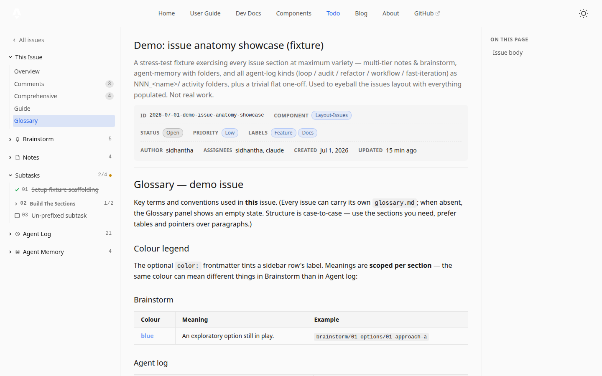

# Glossary (`glossary.md`)

An issue may carry a root-level `glossary.md` — rendered **as-is** on the **Glossary**
panel. It is **pure author markdown, never generated**: the issue-specific vocabulary,
semantics, and conventions a newcomer needs to read the issue.

- **Location:** the issue folder root, next to `issue.md` (it is *not* a sub-folder
  section — no `NN_` prefix, no sidebar entry of its own).
- **Panel:** "This issue" group, right after Guide; hash-addressable via `#glossary`.
- **When absent:** a themed blank-state prompts for one (and shows the suggested
  skeleton below). The loader never warns about it — `glossary.md` is one of the two
  legal root-level markdown files.

## Guide vs Glossary

The two panels split cleanly — don't blur them:

| | Guide | Glossary |
|---|---|---|
| Content | Mechanical reference — section anatomy, effective agent-log kinds | The author's voice — what terms/colours mean *in this issue* |
| Source | Framework template + generated islands | Hand-written `glossary.md` |
| Varies per issue | Only where `settings.json` customizes | Entirely |

Custom agent-log **kind mappings** (`code → name/icon/desc`) belong in `settings.json`
and surface on the Guide — the glossary may explain a kind's *semantics* in prose
("what counts as an experiment here"), never the mapping itself.

## Suggested skeleton

Structure is case-to-case — use only the sections the issue needs, add custom ones
freely. Prefer **tables and pointers over paragraphs**:

```markdown
# Glossary

## Colour legend            ← if the issue uses color: frontmatter
### Brainstorm              ← scope by anatomy section — the same colour can
| Colour | Meaning | Example |     mean different things in different sections
|---|---|---|
| blue   | option still in play | brainstorm/01_options/01_approach-a |
### Agent log
| Colour | Meaning | Example |
|---|---|---|
| amber  | milestone to eyeball | agent-log/050_it_ui/101_sizing-tweaks |

## Key terms
| Term | Meaning |
|---|---|

## Conventions              ← naming schemes, custom-kind semantics, …
| Pattern | Meaning |
|---|---|
```

- **Colour legend** — near-mandatory *if* the issue tints sidebar labels: `color:`
  frontmatter has no framework meaning, so the legend is what makes it legible. An
  **Example** column pointing at a real file keeps it honest. Prefer theme tokens
  (`var(--color-success)`, …) so tints survive dark/light mode.
- **Scope tables per anatomy section** (`###` sub-headings: Brainstorm / Agent log /
  Notes / …) whenever a meaning differs by section — blue on a brainstorm row and blue
  on a milestone are *different vocabularies*. Issue-wide meanings can keep one flat
  table. The same scoping applies to any glossary section.
- **Key terms** — issue-specific vocabulary.
- **Conventions** — badge semantics, naming patterns, prose meaning of custom kinds.

The demo issue (`2026-07-01-demo-issue-anatomy-showcase`) ships a populated glossary
following this shape:


